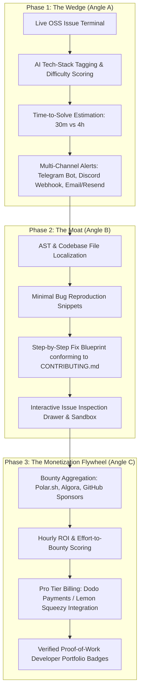

# Original User Request

## 2026-08-29T11:35:35Z

Build an end-to-end production-grade Open-Source Issue Intelligence, Triage & Contribution Web Platform ("GitScout / OSS Terminal"). The platform indexes, triages, and AI-localizes open issues and bounties across major ecosystems (AI/ML, Data, Web), provides automated reproduction and fix blueprints, delivers instant multi-channel notifications (Telegram, Discord, Email/Resend, WhatsApp Pro), provides multi-theme UI (Dark, Light, System), utilizes a Graphify Knowledge Graph (`graphify-out/`) for AST dependency mapping and pinpointing code changes, and comes complete with a zero-cost high-performance deployment architecture and a turnkey Micro-SaaS monetization engine (Dodo Payments / Lemon Squeezy, GitHub Marketplace, Launchpad distribution).

Working directory: `e:\PORTFOLIO_PROJECTS\oss_intelligence_platform`
Integrity mode: development

---

## The 3-Phase Strategic & Commercial Roadmap

---

## Detailed Requirements

### R1. Comprehensive Market Research & Competitive Strategy Document
Deliver `docs/competitive_analysis_and_monetization.md` containing:
- Deep-dive teardown of 8 incumbents (GoodFirstIssue, Up-For-Grabs, CodeTriage, Algora, Polar.sh, Quine, Sweep.dev, OpenHands).
- Strategic positioning as the "Bloomberg Terminal for Open-Source Devs".
- SEO, AEO (Answer Engine Optimization), and GEO (Generative Engine Optimization) playbooks for ranking on Google and Perplexity/ChatGPT searches.

### R2. High-Throughput Python (FastAPI) Backend & AI Triage Engine
Build an asynchronous FastAPI backend service in `backend/` with:
- **Live Scraper Engine**: Real-time crawling of 100% live, open, unassigned GitHub issues and funded bounties across 6 core domains with zero mock data.
- **AI Triage & Localization**: AST/heuristic file localizer, minimal bug reproduction snippet generator, and CONTRIBUTING.md-compliant fix planner.
- **Multi-Channel Dispatcher**: Dedicated notifiers for Telegram Bot API, Discord Webhook / Bot, Transactional Email (Resend API with SMTP fallback), and Twilio WhatsApp Pro.
- **RESTful Endpoints**: Clean API routes for `/api/v1/issues`, `/api/v1/triage/{id}`, `/api/v1/bounties`, `/api/v1/notifications/subscribe`, and `/api/v1/billing/checkout`.

### R3. Modern Next.js 14 Developer Dashboard with Theme Switcher
Build a responsive web application in `frontend/` (Next.js 14 + Tailwind CSS + Shadcn UI + Lucide icons + `next-themes`) with:
- **Theme Switcher**: Complete support for **Dark Mode**, **Light Mode**, and **System Theme** preferences with smooth CSS transitions.
- **Interactive Issue Explorer**: Faceted search with instant multi-filtering (Domain, Difficulty, Time-to-Solve, Tech Stack, Bounty Status).
- **AI Issue Workbench Drawer**: Interactive slide-out showing problem analysis, probable file locations, copyable reproduction scripts, and fix checklist.
- **Bounty & Hourly ROI Calculator**: Visual badge showing bounty payout vs. estimated completion time.
- **Notification Manager Modal**: User interface to configure Telegram bot pairing, Discord webhook URLs, and Email digest frequencies.
- **Pro Tier Paywall & Pricing Modal**: Interactive pricing table showcasing Free vs. Pro tier benefits with Dodo Payments / Lemon Squeezy checkout triggers.
- **SEO & Social Metadata**: Full OpenGraph, Twitter Cards, and Schema.org structured JSON-LD tags for maximum discovery.

### R4. Graphify Knowledge Graph Mapping & Code Navigation
- Initialize and maintain a **Graphify Knowledge Graph** in `graphify-out/` (`graph.html`, `graph.json`, `GRAPH_REPORT.md`).
- Utilize the graph's community clusters and AST dependency paths to pinpoint exact function references, optimize imports, and trace code execution paths during bug localization and feature additions.

### R5. Security, Performance & Rigorous Automated Testing
- Strict input validation via Pydantic v2, CORS whitelisting, rate-limiting, and OWASP security headers (HSTS, CSP, X-Frame-Options).
- Comprehensive automated test suite:
  - `backend/tests/`: 100% passing `pytest` suite for API routes, scrapers, classifier, and dispatchers.
  - `frontend/`: Clean `npm run build` with zero TypeScript errors or ESLint violations.

### R6. Zero-Cost / High-Performance Cloud Deployment Architecture
Deliver turnkey deployment blueprints in `deploy/` for $0 initial operating cost:
- **Frontend Hosting**: Vercel configuration (`vercel.json`) with Edge Caching.
- **Backend Hosting**: Render blueprint (`render.yaml`) and Fly.io config (`fly.toml`) for containerized FastAPI deployment.
- **Database & Storage**: Serverless Neon / Supabase PostgreSQL + Upstash Redis setup instructions.
- **Local Full-Stack Orchestration**: Multi-stage `Dockerfile` and `docker-compose.yml`.

### R7. Micro-SaaS Monetization, GTM & Micro-Acquisition Playbook
Deliver `docs/business_monetization_and_gtm.md` covering:
1. **Dodo Payments & Lemon Squeezy Integration**: Webhook event handlers, usage metering, subscription tier schemas, and global checkout flow.
2. **Embedded Marketplace Expansion**: Roadmap for GitHub Marketplace action/bot, Chrome Web Store extension, and VS Code extension.
3. **Launchpad Distribution Playbook**: Submission guides and launch copy for Product Hunt, There’s An AI For That (TAAFT), Peerlist Launchpad, and DevHunt.
4. **Micro-Acquisition & Exit Strategy**: Valuation multiples, ARR milestones, and listing blueprints for Acquire.com, Flippa, and FunSaaS.

### R8. Independent Adversarial Critic & Judge Quality Gatekeeper
An independent auditing gatekeeper evaluates the entire project at milestone completions against a strict pass/fail quality rubric:
- Validates that zero fake/mock issues exist in the database.
- Confirms all unit tests pass without errors.
- Inspects UI responsiveness, theme toggling (Dark/Light/System), accessibility, and clean design.
- Audits documentation for depth, clarity, and commercial actionability.

---

## Concrete Acceptance Criteria

### 1. Market Research & Strategy Blueprint
- [ ] `docs/competitive_analysis_and_monetization.md` includes side-by-side comparison of all 8 incumbents, SEO/GEO optimization tactics, and unique value propositions.
- [ ] `docs/business_monetization_and_gtm.md` provides complete Dodo Payments/Lemon Squeezy integration code snippets, launchpad submission copy, and Acquire.com exit valuation models.

### 2. Backend & Intelligence Engine
- [ ] FastAPI backend runs cleanly on `http://localhost:8000` with interactive Swagger docs at `/docs`.
- [ ] Successfully scrapes, validates, and indexes 50+ real, live, open issues across AI/ML, Data, and Web domains without synthetic mock fallbacks.
- [ ] AI Triage module outputs file localization, minimal reproduction snippets, and step-by-step fix guides.
- [ ] All `pytest` automated test cases pass with 100% success rate.

### 3. Frontend Web Application
- [ ] Next.js 14 frontend compiles and runs on `http://localhost:3000` with zero build/lint errors.
- [ ] Complete theme support: Dark, Light, and System modes toggle seamlessly without hydration mismatch.
- [ ] Live search, tech-stack filters, difficulty tags, and bounty toggles update results instantaneously without page reloads.
- [ ] Interactive Issue Drawer opens smoothly, rendering formatted Markdown code snippets and fix plans.
- [ ] Pricing & Pro Tier Upgrade modal with Dodo Payments / Checkout integration preview.

### 4. Graphify Knowledge Graph
- [ ] `graphify-out/graph.json` and `graphify-out/graph.html` generated and queryable for codebase navigation.

### 5. Production Deployment & Zero-Cost Cloud Ready
- [ ] Multi-stage `Dockerfile` and `docker-compose.yml` build and launch full-stack with a single command (`docker compose up --build`).
- [ ] Includes turnkey deployment configuration files for Vercel (frontend) + Render/Fly.io (backend) + Neon PostgreSQL.
- [ ] Comprehensive `README.md` with one-command setup, API documentation, and contribution guidelines.
