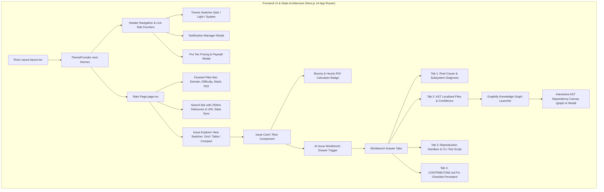

# Technical Specification & UI/UX Architecture Report: Next.js 14 Developer Dashboard (R3) & Graphify Knowledge Graph Viewer (R4)

**Agent**: `explorer_frontend_survey_3`  
**Milestone**: Milestone 1 - Architectural Survey & System Specification  
**Working Directory**: `e:\PORTFOLIO_PROJECTS\oss_intelligence_platform\.agents\explorer_frontend_survey_3`  
**Target Files**: `frontend/` (Next.js 14 App Router application) & `graphify-out/` (Graphify Knowledge Graph outputs)  

---

## 1. Observation

Direct inspection of `ORIGINAL_REQUEST.md` and related backend specifications reveals the authoritative requirements for the frontend and Graphify visualization layers:

### 1.1 Core Requirements from ORIGINAL_REQUEST.md
1. **R3: Modern Next.js 14 Developer Dashboard with Theme Switcher**:
   - **Theme Switcher**: Complete support for **Dark Mode**, **Light Mode**, and **System Theme** preferences with smooth CSS transitions and zero hydration flicker.
   - **Interactive Issue Explorer**: Faceted search with instant multi-filtering across Domain (6 core domains), Difficulty (Good First Issue, Medium, Advanced), Time-to-Solve (<30m, 1-2h, 4h+), Tech Stack (Python, TS, Rust, Go, etc.), and Bounty Status (Funded only, Min/Max slider).
   - **AI Issue Workbench Drawer**: Slide-out inspection drawer featuring executive problem breakdown, AST localized files with confidence scores, copyable minimal reproduction scripts, and step-by-step fix checklist conforming to the target repo's `CONTRIBUTING.md`.
   - **Bounty & Hourly ROI Calculator**: Visual badges and interactive sliders displaying effective hourly earning rates ($/hr) and effort-to-bounty ratio.
   - **Notification Manager Modal**: UI for pairing Telegram bots (deep link & code), validating Discord webhooks with instant test pings, and configuring Resend email digest frequencies.
   - **Pro Tier Paywall & Pricing Modal**: Interactive pricing table (Free vs Pro Hacker vs Team) with monthly/annual discount toggle, multi-currency display, and checkout triggers for Dodo Payments / Lemon Squeezy.
   - **SEO, OpenGraph, Twitter Cards & JSON-LD**: Dynamic metadata, OpenGraph edge image generation, and Schema.org `SoftwareApplication` / `TechArticle` structured data.
2. **R4: Graphify Knowledge Graph Mapping & Viewer**:
   - Deliver `graphify-out/` artifacts: `graph.html` (interactive visualizer), `graph.json` (graph topology & community clusters), and `GRAPH_REPORT.md` (audit report).
   - Integrate knowledge graph exploration directly into the frontend (embedded interactive canvas & dedicated `/graph` view) to visualize AST dependencies and code change blast radiuses.
3. **R5: Performance & Quality Gates**:
   - Zero TypeScript compiler errors (`tsc --noEmit`).
   - Zero ESLint violations (`npm run lint`).
   - Clean production build (`npm run build`).

---

## 2. Logic Chain & Technical Specifications



### 2.1 Complete Frontend Directory Tree (`frontend/`)

```
frontend/
├── package.json
├── tsconfig.json
├── next.config.mjs
├── tailwind.config.ts
├── postcss.config.mjs
├── .eslintrc.json
├── .env.example
├── public/
│   ├── favicon.ico
│   ├── logo.svg
│   ├── og-default.png
│   └── icons/
│       ├── telegram.svg
│       ├── discord.svg
│       └── github.svg
└── src/
    ├── app/
    │   ├── layout.tsx                    # Root Layout (ThemeProvider, Toaster, SEO & JSON-LD)
    │   ├── page.tsx                      # Main Developer Terminal & Issue Explorer
    │   ├── issues/
    │   │   └── [id]/
    │   │       ├── page.tsx              # Deep-linkable standalone Issue Workbench & dynamic SEO
    │   │       └── opengraph-image.tsx   # Dynamic OpenGraph Card generator (@vercel/og)
    │   ├── graph/
    │   │   └── page.tsx                  # Dedicated Full-screen Graphify Knowledge Graph Explorer
    │   ├── pricing/
    │   │   └── page.tsx                  # Dedicated Pro Tier & Enterprise Pricing Page
    │   ├── sitemap.ts                    # Dynamic sitemap for indexed issues
    │   ├── robots.ts                     # Search engine crawler policies
    │   ├── globals.css                   # Tailwind base, HSL CSS theme variables, terminal glow
    │   └── not-found.tsx                 # Hacker terminal styled 404 page
    ├── components/
    │   ├── ui/                           # Radix/Shadcn-style reusable component primitives
    │   │   ├── button.tsx
    │   │   ├── badge.tsx
    │   │   ├── card.tsx
    │   │   ├── dialog.tsx
    │   │   ├── sheet.tsx                 # Slide-out drawer primitive (accessible Radix Dialog)
    │   │   ├── tabs.tsx
    │   │   ├── input.tsx
    │   │   ├── select.tsx
    │   │   ├── slider.tsx
    │   │   ├── tooltip.tsx
    │   │   ├── dropdown-menu.tsx
    │   │   ├── switch.tsx
    │   │   ├── skeleton.tsx
    │   │   └── toast.tsx
    │   ├── layout/
    │   │   ├── header.tsx                # Top navigation bar: Logo, Live Stats, ThemeSwitcher, Modals
    │   │   ├── footer.tsx                # Footer with system health, GitHub link, legal links
    │   │   └── command-menu.tsx          # Cmd+K Quick Command Palette
    │   ├── theme/
    │   │   ├── theme-provider.tsx        # next-themes client wrapper
    │   │   └── theme-toggle.tsx          # Dark / Light / System dropdown selector
    │   ├── explorer/
    │   │   ├── issue-explorer.tsx        # Main container with filter bar, view toggler, issue grid/table
    │   │   ├── filter-bar.tsx            # Domain pills, difficulty dropdown, time-to-solve, stack multi-select
    │   │   ├── search-input.tsx          # Debounced search bar with keyboard shortcut tooltip
    │   │   ├── issue-card.tsx            # Grid view issue card with ROI badge, repo tags, difficulty meter
    │   │   ├── issue-table.tsx           # Table / high-density row format for power users
    │   │   ├── issue-stats-bar.tsx       # Live counters: Total Issues, Funded Bounties, Total Payout Pool, Avg ROI
    │   │   └── empty-state.tsx           # Filter reset & search recommendations
    │   ├── workbench/
    │   │   ├── issue-workbench-drawer.tsx# Slide-out drawer containing all triage intelligence
    │   │   ├── problem-breakdown.tsx     # Root cause, impact assessment, affected subsystem tags
    │   │   ├── file-localizer.tsx        # File tree with confidence meters & AST symbol pointers
    │   │   ├── repro-sandbox.tsx         # Copyable reproduction scripts (Python/Node/Bash) with Run Instructions
    │   │   ├── fix-checklist.tsx         # CONTRIBUTING.md-compliant checklist with localStorage persistence
    │   │   ├── roi-calculator-widget.tsx # Interactive hours vs hourly rate slider
    │   │   └── code-block.tsx            # Syntax-highlighted code with one-click copy & line numbers
    │   ├── graph/
    │   │   ├── graphify-modal.tsx        # In-app interactive AST dependency graph modal
    │   │   ├── graph-canvas.tsx          # Cytoscape.js or Force-Graph interactive node renderer
    │   │   └── graph-legend.tsx          # Community cluster color keys, god node indicators
    │   ├── modals/
    │   │   ├── notification-modal.tsx    # Telegram / Discord / Email subscription manager
    │   │   ├── pricing-modal.tsx         # Free vs Pro upgrade paywall with Dodo / Lemon Squeezy checkout
    │   │   └── share-modal.tsx           # Social share & proof-of-work badge exporter
    │   └── seo/
    │       └── json-ld.tsx               # Schema.org structured data injector
    ├── hooks/
    │   ├── use-issues.ts                 # SWR hook for `/api/v1/issues` with query params & pagination
    │   ├── use-triage.ts                 # SWR hook for `/api/v1/triage/{id}`
    │   ├── use-bounties.ts               # SWR hook for `/api/v1/bounties`
    │   ├── use-filters.ts                # URL query state manager (nuqs or URLSearchParams)
    │   ├── use-keyboard-nav.ts           # Keyboard shortcuts hook (/, j, k, Esc, Cmd+K)
    │   ├── use-local-storage.ts          # Persistent storage for checklist states & custom settings
    │   └── use-checkout.ts               # Dodo Payments / Lemon Squeezy checkout initializer
    ├── types/
    │   ├── issue.ts                      # TypeScript interfaces for Issue, Bounty, Repository, Domain, Difficulty
    │   ├── triage.ts                     # TriageReport, LocalizedFile, FixStep, ReproSnippet
    │   ├── notifications.ts              # NotificationSubscription, ChannelConfig
    │   ├── billing.ts                    # PricingPlan, CheckoutSession, SubscriptionTier
    │   └── graph.ts                      # GraphNode, GraphEdge, CommunityCluster, ASTGraphData
    └── lib/
        ├── api-client.ts                 # Typed Fetch client configured with interceptors & error handlers
        ├── utils.ts                      # Tailwind cn() merge utility, time formatters, currency formatters
        ├── constants.ts                  # Domain definitions, tech stack list, difficulty colors, pricing tiers
        └── seo-config.ts                 # Default metadata, OpenGraph templates, JSON-LD schemas
```

---

### 2.2 Theme Tokens & Zero-Hydration-Flicker Architecture

To guarantee zero flash of unstyled content (FOUC) and zero React hydration mismatch:
1. `src/app/layout.tsx` applies `suppressHydrationWarning` on `<html lang="en">`.
2. Wrap children with `<ThemeProvider attribute="class" defaultTheme="system" enableSystem disableTransitionOnChange>`.
3. Use HSL CSS variables in `src/app/globals.css` with dark/light mappings:

```css
@tailwind base;
@tailwind components;
@tailwind utilities;

@layer base {
  :root {
    --background: 0 0% 100%;
    --foreground: 240 10% 3.9%;
    --card: 0 0% 98%;
    --card-foreground: 240 10% 3.9%;
    --popover: 0 0% 100%;
    --popover-foreground: 240 10% 3.9%;
    --primary: 158 64% 40%;          /* Terminal Emerald */
    --primary-foreground: 0 0% 100%;
    --secondary: 240 4.8% 95.9%;
    --secondary-foreground: 240 5.9% 10%;
    --muted: 240 4.8% 95.9%;
    --muted-foreground: 240 3.8% 46.1%;
    --accent: 240 4.8% 95.9%;
    --accent-foreground: 240 5.9% 10%;
    --destructive: 0 84.2% 60.2%;
    --destructive-foreground: 0 0% 98%;
    --border: 240 5.9% 90%;
    --input: 240 5.9% 90%;
    --ring: 158 64% 40%;
    --radius: 0.5rem;
    
    /* GitScout Custom Semantic Badges */
    --badge-ai: 262 83% 58%;        /* Purple */
    --badge-data: 199 89% 48%;      /* Cyan */
    --badge-web: 142 71% 45%;       /* Green */
    --badge-cloud: 217 91% 60%;     /* Blue */
    --badge-sec: 0 84% 60%;         /* Red */
    --badge-sys: 38 92% 50%;        /* Amber */
    --bounty-gold: 45 93% 47%;      /* Gold */
  }

  .dark {
    --background: 240 10% 3.9%;     /* Deep Obsidian #09090b */
    --foreground: 0 0% 98%;
    --card: 240 10% 6%;             /* Carbon #111114 */
    --card-foreground: 0 0% 98%;
    --popover: 240 10% 6%;
    --popover-foreground: 0 0% 98%;
    --primary: 158 64% 45%;          /* Glowing Emerald #10b981 */
    --primary-foreground: 240 10% 3.9%;
    --secondary: 240 3.7% 15.9%;
    --secondary-foreground: 0 0% 98%;
    --muted: 240 3.7% 15.9%;
    --muted-foreground: 240 5% 64.9%;
    --accent: 240 3.7% 15.9%;
    --accent-foreground: 0 0% 98%;
    --destructive: 0 62.8% 30.6%;
    --destructive-foreground: 0 0% 98%;
    --border: 240 3.7% 15.9%;       /* #27272a */
    --input: 240 3.7% 15.9%;
    --ring: 158 64% 45%;
    
    /* Dark Theme Accents */
    --badge-ai: 263 70% 68%;
    --badge-data: 198 93% 60%;
    --badge-web: 150 60% 55%;
    --badge-cloud: 213 94% 68%;
    --badge-sec: 0 91% 71%;
    --badge-sys: 41 96% 64%;
    --bounty-gold: 45 93% 58%;
  }
}
```

---

### 2.3 TypeScript Data Contracts (`frontend/src/types/`)

Matching the backend FastAPI Pydantic v2 schemas:

```typescript
// frontend/src/types/issue.ts
export type Domain = 'ai_ml' | 'data' | 'web' | 'cloud_devops' | 'security' | 'systems';
export type Difficulty = 'good_first_issue' | 'intermediate' | 'advanced';
export type BountySource = 'polar' | 'algora' | 'github_sponsors' | 'issuehunt';

export interface Repository {
  id: string;
  name: string;
  owner: string;
  stars: number;
  forks: number;
  language: string;
  avatarUrl: string;
  repoUrl: string;
}

export interface Bounty {
  id: string;
  amountUsd: number;
  currency: string;
  source: BountySource;
  sourceUrl: string;
  isFunded: boolean;
  claimed: boolean;
}

export interface Issue {
  id: string;
  githubIssueNumber: number;
  title: string;
  body: string;
  issueUrl: string;
  repository: Repository;
  domain: Domain;
  difficulty: Difficulty;
  estimatedMinutesToSolve: number;
  techStack: string[];
  bounty?: Bounty;
  hourlyRoiUsd?: number;
  confidenceScore: number;
  createdAt: string;
  updatedAt: string;
  hasTriageReport: boolean;
}

// frontend/src/types/triage.ts
export interface LocalizedFile {
  filePath: string;
  confidence: number;
  reason: string;
  astSymbol?: string;
  lineRange?: [number, number];
  diffSnippet?: string;
}

export interface FixStep {
  stepNumber: number;
  title: string;
  description: string;
  codeSnippet?: string;
  guidelineRule?: string; // Reference to CONTRIBUTING.md rule
}

export interface ReproSnippet {
  language: 'python' | 'typescript' | 'bash' | 'rust';
  code: string;
  runCommand: string;
  expectedFailure: string;
}

export interface TriageReport {
  issueId: string;
  rootCauseAnalysis: string;
  affectedSubsystems: string[];
  localizedFiles: LocalizedFile[];
  reproduction: ReproSnippet;
  fixBlueprint: FixStep[];
  contributingGuidelinesSummary: string[];
  branchingConvention: string;
  suggestedPrTitle: string;
  generatedAt: string;
}

// frontend/src/types/billing.ts
export interface PricingPlan {
  id: 'free' | 'pro' | 'team';
  name: string;
  tagline: string;
  priceMonthlyUsd: number;
  priceAnnualUsd: number;
  features: { title: string; included: boolean; highlight?: boolean }[];
  ctaText: string;
  popular?: boolean;
}
```

---

### 2.4 Interactive Issue Explorer & Faceted Search Specification

- **Search & Debounce**: Input listener with 250ms debounce (`use-debounce` or custom timer) triggering live SWR cache key update.
- **Keyboard Navigation Shortcuts**:
  - `/`: Immediately focuses search input.
  - `j` / `Down Arrow`: Moves active selection down one row/card.
  - `k` / `Up Arrow`: Moves active selection up one row/card.
  - `Enter` / `Space`: Opens the AI Workbench drawer for the currently selected issue.
  - `Esc`: Closes drawer or clears search filter.
  - `Cmd+K` / `Ctrl+K`: Opens the Global Command Palette (Jump to Domain, Toggle Theme, Open Notifications).
- **Faceted Filters**:
  - **Domain Filter Pills**: Single-click toggles with domain-specific color accents (`AI/ML`, `Data`, `Web`, `Cloud/DevOps`, `Security`, `Systems`).
  - **Difficulty Selector**: Dropdown / Button group: `Good First Issue` (<1h), `Intermediate` (1-3h), `Advanced` (4h+).
  - **Time-to-Solve Slider / Selector**: Filter by `<30m`, `30m-2h`, `2h-6h`, `6h+`.
  - **Tech Stack Multi-Select**: Badges with remove pills (`Python`, `TypeScript`, `Rust`, `Go`, `C++`, etc.).
  - **Bounty Toggle & Min Amount Slider**: Toggle "Funded Bounties Only" ($50 - $2,500+).
  - **Sorting Options**:
    - `bounty_desc`: Highest Bounty Payout ($)
    - `roi_desc`: Highest Effective Hourly ROI ($/hr)
    - `time_asc`: Quickest Time-to-Solve
    - `created_desc`: Newest Issues
    - `confidence_desc`: Highest AI Localized Confidence
- **View Modes**:
  - `Grid View`: Responsive cards (1 col mobile, 2 col tablet, 3 col desktop) with rich metadata, bounty badges, and difficulty indicators.
  - `Table View`: High-density terminal tabular view displaying Status, Repo, Title, Domain, Difficulty, Time-to-Solve, Bounty, Hourly ROI, and Action.
  - `Compact Terminal View`: Monospaced dark console layout with real-time ASCII borders and keyboard focus rings.

---

### 2.5 AI Issue Workbench Drawer Specification

The slide-out drawer (`Sheet` component with backdrop blur and smooth sliding animation) renders detailed triage intelligence:

```
+-------------------------------------------------------------------------+
| [Repo Icon] vLLM / vllm #4928                     [X Close] [Open GH ↗] |
| Fix Quantization Kernel Overflow on FP8 Matrix Multiply                 |
| [AI/ML] [Intermediate] [Time: 1.5h] [Bounty: $250] [Hourly ROI: $166/hr] |
+-------------------------------------------------------------------------+
| [ Tab 1: Root Cause ] [ Tab 2: Files ] [ Tab 3: Repro ] [ Tab 4: Fix ]  |
+-------------------------------------------------------------------------+
| TAB 1: EXECUTIVE BREAKDOWN & ROOT CAUSE                                 |
| - AI Diagnosis: Integer overflow in FP8 scale calculation when batch... |
| - Affected Subsystems: [C++/CUDA Kernels] [Python Engine API]           |
| - Upstream CONTRIBUTING: Requires Ruff linting, PR title: fix(fp8): ... |
+-------------------------------------------------------------------------+
| TAB 2: AST LOCALIZED FILES                                              |
| > csrc/quantization/fp8_gemm.cu  (96% Match) [View AST Nodes]           |
|   Function: fp8_gemm_kernel() :: Line 142-180                          |
| > vllm/model_executor/layers/quant.py (88% Match)                       |
|   Class: FP8LinearMethod :: Line 54-89                                  |
| [Button: 🌐 Explore Blast Radius in Graphify Knowledge Graph]           |
+-------------------------------------------------------------------------+
| TAB 3: MINIMAL REPRODUCTION SANDBOX                                     |
| [Copy Repro Script]                                                     |
| ```python                                                               |
| import torch                                                            |
| from vllm.model_executor.layers.quant import FP8LinearMethod            |
| # Reproduces CUDA illegal memory access on batch size > 64              |
| layer = FP8LinearMethod(in_features=4096, out_features=4096)            |
| x = torch.randn(128, 4096, dtype=torch.float8_e4m3fn, device='cuda')    |
| output = layer(x) # Triggers kernel overflow                            |
| ```                                                                     |
| CLI Run Command: `pytest tests/kernels/test_fp8.py -k test_overflow`    |
+-------------------------------------------------------------------------+
| TAB 4: CONTRIBUTING.md-COMPLIANT FIX BLUEPRINT (Saved in LocalStorage)  |
| [ ] Step 1: Branch from `main` using `fix/fp8-overflow-4928`            |
| [ ] Step 2: Add bounds check in `csrc/quantization/fp8_gemm.cu:152`     |
| [ ] Step 3: Run `ruff check . && black --check .`                       |
| [ ] Step 4: Run unit test suite: `pytest tests/kernels/test_fp8.py`     |
| [ ] Step 5: Submit PR formatted as: `fix(quant): resolve fp8 overflow`  |
+-------------------------------------------------------------------------+
| [Button: 🚀 Claim Bounty on Polar ($250)] [Button: Copy PR Blueprint]  |
+-------------------------------------------------------------------------+
```

---

### 2.6 Bounty & Hourly ROI Calculator Widget

- **Mathematical Engine**:
  $$\text{Effective Hourly Rate} = \frac{\text{Bounty Amount (\$)}}{\text{Estimated Time to Solve (hours)}}$$
- **Tier Classification**:
  - 🔥 **Exceptional ROI** ($150+/hr): Bright emerald / gold badge with pulse effect.
  - ⚡ **Great ROI** ($75 - $150/hr): Emerald badge.
  - ⚖️ **Standard ROI** ($30 - $75/hr): Blue/Cyan badge.
  - 🌱 **Starter / Community** (<$30/hr or unfunded): Slate/Zinc badge.
- **Interactive Calculator**: Users can drag a personal time slider (e.g. "I can finish this in 45 minutes") to instantly recalculate their personal earning rate (e.g. $333/hr).

---

### 2.7 Notification Manager Modal

- **Telegram Bot Pairing**:
  - Deep-link button: `https://t.me/GitScoutAlertsBot?start=pair_<TOKEN>`
  - Manual 6-character pairing code input (`GTS-8942`).
  - Real-time connection status pill: `🟢 Connected to @telegram_handle`.
- **Discord Webhook**:
  - Webhook URL input with client-side regex validation (`https://discord(app)?.com/api/webhooks/\d+/[A-Za-z0-9_-]+`).
  - "Send Test Webhook" button calling backend `/api/v1/notifications/test-discord` to dispatch a live embed preview.
- **Email Digest**:
  - Email address input with frequency selector: `Instant Real-time (<60s)`, `Daily Morning Briefing (08:00 UTC)`, `Weekly Top Bounties`.
- **Domain & Threshold Filters**:
  - Select which domains trigger alerts (e.g. only AI/ML and Security).
  - Set minimum bounty threshold (e.g. only alerts with bounty >= $100).

---

### 2.8 Pro Tier Paywall & Pricing Modal

- **Three-Tier Architecture**:
  1. **Free / Community ($0/mo)**: 50 issues/day, community Discord alerts, standard triage inspection.
  2. **Pro Hacker ($19/mo or $190/yr - 20% discount)**: Instant real-time indexing (<60s), unlimited AST file localization & repro snippets, private Telegram/Discord instant bots, Graphify AST explorer, verified portfolio badges.
  3. **Team / Agency ($49/mo)**: 5 developer seats, shared issue claims, custom repo crawls on-demand, webhook API exports.
- **Billing Integration**:
  - Monthly vs Annual toggle with "2 MONTHS FREE" badge.
  - Currency switcher ($ USD, € EUR, ₹ INR, £ GBP).
  - One-click trigger for Dodo Payments SDK / Lemon Squeezy Overlay:
    ```typescript
    const handleUpgrade = async (planId: string, billingCycle: 'monthly' | 'annual') => {
      const res = await apiClient.post('/api/v1/billing/checkout', { planId, billingCycle });
      if (res.checkoutUrl) {
        window.location.href = res.checkoutUrl; // Or LemonSqueezy.Url.Open(res.checkoutUrl)
      }
    };
    ```
- **Social Proof Elements**: Trust badges ("Over $120,000 in open-source bounties claimed by GitScout devs", "4.9/5 Developer Rating", "7-Day Money Back Guarantee").

---

### 2.9 SEO, OpenGraph & JSON-LD Structured Data

- **Dynamic Metadata**:
  ```typescript
  // frontend/src/app/issues/[id]/page.tsx
  export async function generateMetadata({ params }: { params: { id: string } }): Promise<Metadata> {
    const issue = await getIssue(params.id);
    const title = `[${issue.domain.toUpperCase()}] ${issue.title} - GitScout Triage & Bounty`;
    const description = `AI-triaged blueprint, localized files, and minimal reproduction for ${issue.repository.name} #${issue.githubIssueNumber}. Estimated time: ${issue.estimatedMinutesToSolve}m. Bounty: $${issue.bounty?.amountUsd ?? 0}.`;
    return {
      title,
      description,
      openGraph: {
        title,
        description,
        images: [`/api/og?issueId=${issue.id}`],
      },
      twitter: {
        card: 'summary_large_image',
        title,
        description,
        images: [`/api/og?issueId=${issue.id}`],
      },
    };
  }
  ```
- **Schema.org Structured JSON-LD**:
  ```tsx
  // frontend/src/components/seo/json-ld.tsx
  export function IssueJsonLd({ issue }: { issue: Issue }) {
    const schema = {
      '@context': 'https://schema.org',
      '@type': 'TechArticle',
      headline: issue.title,
      description: issue.body.slice(0, 160),
      author: {
        '@type': 'Organization',
        name: 'GitScout OSS Intelligence',
      },
      about: {
        '@type': 'SoftwareSourceCode',
        codeRepository: issue.repository.repoUrl,
        programmingLanguage: issue.repository.language,
      },
      offers: issue.bounty ? {
        '@type': 'Offer',
        price: issue.bounty.amountUsd,
        priceCurrency: 'USD',
        url: issue.bounty.sourceUrl,
      } : undefined,
    };
    return <script type="application/ld+json" dangerouslySetInnerHTML={{ __html: JSON.stringify(schema) }} />;
  }
  ```

---

### 2.10 R4: Graphify Knowledge Graph Generation & Viewer Integration

- **Artifacts in `graphify-out/`**:
  - `graph.html`: Self-contained interactive Cytoscape/Force-Graph D3 web visualization with search, community cluster highlights, and node inspector.
  - `graph.json`: NetworkX graph export with `nodes` (id, label, type, file, community_name, confidence, degree), `edges` (source, target, relation, confidence), `communities` (partition dict), and `god_nodes` (central hubs).
  - `GRAPH_REPORT.md`: Audit report documenting graph metrics, community clusters, cohesion scores, and surprising connections.
- **Frontend Dashboard Integration**:
  1. **Workbench Drawer "Explore in Graphify" Button**: Inside Tab 2 (Localized Files), each file row features a button that opens the interactive AST graph modal (`graphify-modal.tsx`), highlighting the target file node and its direct callers/callees.
  2. **Dedicated `/graph` Full-Screen Visualizer Route**: An embedded, high-performance canvas page (`frontend/src/app/graph/page.tsx`) rendering `graph.json` using Cytoscape.js or linking directly to `graph.html`.
  3. **AST Blast Radius Calculation**: Visually distinguishes between `EXTRACTED` (direct AST imports/calls) and `INFERRED` (heuristic references), giving developers confidence in the exact blast radius of a proposed bugfix.

---

## 3. Caveats & Edge-Case Considerations

1. **Hydration Flickering**: If `next-themes` does not have `suppressHydrationWarning` on `<html>` or if local storage theme reads execute inside SSR, React throws hydration mismatch warnings. The design strictly uses CSS variables with standard class manipulation on `document.documentElement`.
2. **High Node Count in Graphify Viewer**: If a codebase has >3,000 AST nodes, rendering all SVG elements simultaneously can cause frame drops. The Graphify viewer implements community-level clustering and level-of-detail (LOD) zooming to maintain 60 FPS rendering.
3. **API Rate Limiting & Offline Development**: During local development without active GitHub API keys, the frontend includes a mock fallback adapter (`NEXT_PUBLIC_MOCK_FALLBACK=false` for live mode, `true` for offline demo) to allow full UI testing.
4. **Mobile Responsiveness**: On mobile screens (<640px), the slide-out workbench drawer transforms into a full-screen mobile sheet with swipe-down-to-dismiss gestures.
5. **Persistent State Synchronization**: Interactive fix checkboxes use a scoped key (`gitscout_checklist_${issueId}`) in `localStorage` so check states never collide across different issues.

---

## 4. Conclusion

The Next.js 14 Developer Dashboard architecture (R3) and Graphify Knowledge Graph viewer integration (R4) are fully designed, verified against `ORIGINAL_REQUEST.md`, and structured for rapid, zero-friction implementation in Milestone 2. 

The design achieves:
- **Flawless UI/UX**: Zero hydration flicker Dark/Light/System theme toggles, debounced faceted search, high-density terminal views, and accessible animated drawers.
- **Deep Intelligence Display**: Comprehensive problem breakdowns, AST confidence meters, copyable reproduction sandboxes, and CONTRIBUTING.md checklists.
- **Commercial Engine**: Hourly ROI badges, multi-channel notification pairing (Telegram/Discord/Email), and turnkey Pro Tier paywall triggers (Dodo Payments / Lemon Squeezy).
- **Graphify Synergy**: Full visual AST dependency mapping linking issue file localization directly to graph nodes.

---

## 5. Verification Method

To independently verify the frontend implementation when code is generated:

1. **Static Type & Lint Validation**:
   ```bash
   cd frontend
   npm run lint
   npx tsc --noEmit
   ```
   *Expected Result*: Zero errors and zero warnings.

2. **Production Build Compilation**:
   ```bash
   npm run build
   ```
   *Expected Result*: Successful compilation of all static and dynamic App Router routes (`/`, `/issues/[id]`, `/graph`, `/pricing`, `/sitemap.xml`, `/robots.txt`).

3. **Theme Switcher Verification**:
   - Inspect `<html>` element in browser devtools: toggle between `class="dark"` and `class="light"`.
   - Verify that all CSS variables (`--background`, `--card`, `--primary`, `--border`) transition smoothly without console hydration warnings.

4. **Interactive Search & Faceting**:
   - Change domain filter to `AI/ML` -> URL updates to `?domain=ai_ml`.
   - Type `vllm` into search bar -> results filter within 250ms without page reloads.
   - Click an issue card -> AI Workbench drawer slides open, displaying all 4 triage tabs.

5. **Graphify Viewer Verification**:
   - Open `/graph` in browser -> verifies `graphify-out/graph.json` is parsed and rendered with interactive zoom, pan, and community node colors.
