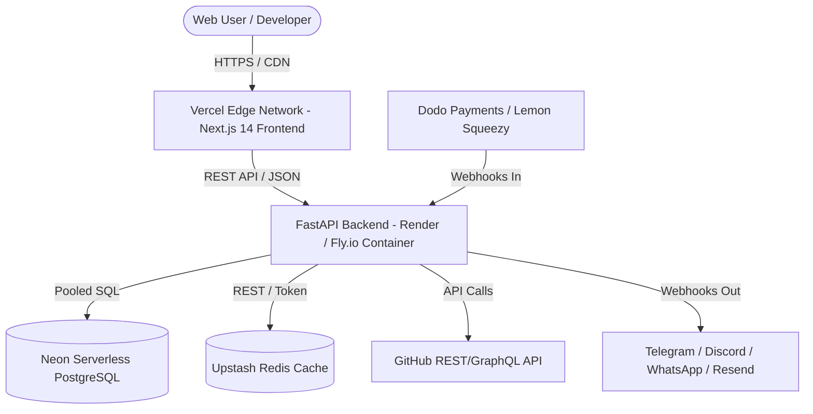

# Specification Discovery & Architectural Survey: R1, R7, R6, R8
**Agent**: `spec_miner_survey_1` (Teamwork Preview Spec Miner)  
**Authoritative Request**: `e:\PORTFOLIO_PROJECTS\oss_intelligence_platform\.agents\ORIGINAL_REQUEST.md`  
**Timestamp**: 2026-08-29T11:40:00Z  

---

## 1. Observation

Direct examination of `ORIGINAL_REQUEST.md` reveals a clear product vision: **"GitScout / OSS Terminal"** — a high-performance Open-Source Issue Intelligence, Triage & Contribution Web Platform. The platform combines a real-time OSS issue/bounty indexing engine with AI-driven AST code localization, minimal bug reproduction generators, multi-channel alerting (Telegram, Discord, Email/Resend, WhatsApp Pro), Next.js 14 multi-theme UI (Dark/Light/System), Graphify Knowledge Graph mapping, zero-cost cloud deployment, and a turnkey Micro-SaaS monetization engine (Dodo Payments / Lemon Squeezy).

The four functional pillars under our direct survey are:
1. **R1: Comprehensive Market Research & Competitive Strategy Document** (`docs/competitive_analysis_and_monetization.md`)
   - Incumbent teardown across 8 competitors: GoodFirstIssue, Up-For-Grabs, CodeTriage, Algora, Polar.sh, Quine, Sweep.dev, OpenHands.
   - Strategic positioning: "Bloomberg Terminal for Open-Source Developers".
   - SEO, AEO (Answer Engine Optimization), and GEO (Generative Engine Optimization) playbooks.
2. **R7: Micro-SaaS Monetization, GTM & Micro-Acquisition Playbook** (`docs/business_monetization_and_gtm.md`)
   - Dodo Payments & Lemon Squeezy integration schemas, webhook lifecycle, subscription tier schemas.
   - Embedded marketplace expansion (GitHub Marketplace action/bot, Chrome Web Store extension, VS Code extension).
   - Launchpad distribution playbook (Product Hunt, TAAFT, Peerlist, DevHunt).
   - Micro-acquisition & exit valuation models (Acquire.com, Flippa, FunSaaS, ARR targets: $10k-$250k).
3. **R6: Zero-Cost / High-Performance Cloud Deployment Architecture** (`deploy/`)
   - Vercel (`vercel.json`), Render (`render.yaml`), Fly.io (`fly.toml`), Neon PostgreSQL, Upstash Redis, Docker/Docker Compose.
4. **R8: Independent Adversarial Critic & Judge Quality Gatekeeper**
   - Zero mock data verification, automated test verification, UX/Theming verification, documentation depth.

---

## 2. Logic Chain

1. **Incumbent Landscape Analysis**: Current tools in the open-source contribution space suffer from fundamental bifurcations:
   - *Static Aggregators* (GoodFirstIssue, Up-For-Grabs, CodeTriage) only aggregate GitHub tags without semantic understanding, difficulty calibration, or code context. They suffer from high stale-issue rates (>60% already claimed or obsolete) and zero developer tooling.
   - *Bounty Marketplaces* (Algora, Polar.sh) focus purely on financial escrow and payout rails, leaving triage, complexity estimation, and codebase navigation entirely to the contributor.
   - *AI Coding Agents / Bots* (Sweep.dev, OpenHands) focus on autonomous PR generation, which often triggers maintainer pushback due to noisy AI hallucinations, rather than empowering human developers with high-density intelligence.
   - *Gamified Platforms* (Quine) focus on developer reputation and questing rather than professional-grade workflow acceleration.
   - **Strategic Inference**: GitScout fills the unaddressed high-value quadrant: **Human-in-the-Loop Intelligence Terminal** that indexes real-time live issues/bounties, pre-calculates AST localization, generates minimal reproduction snippets, calculates Hourly Bounty ROI, and dispatches sub-second alerts.

2. **Monetization & Webhook Integrity**:
   - Modern micro-SaaS platforms require dual payment gateway resilience (Dodo Payments as primary global merchant of record with UPI/Cards/Crypto + Lemon Squeezy as alternative MoR).
   - Webhook security requires HMAC-SHA256 signature verification, idempotency key tracking (to prevent replay attacks), and state-machine transitions (`active`, `past_due`, `cancelled`, `paused`).

3. **Zero-Cost Deployment Topology**:
   - High-throughput FastAPI backend requires stateless containerization deployable on Render/Fly.io free tier or serverless containers.
   - Database layer uses serverless Neon PostgreSQL (PgBouncer connection pooling) and Upstash Redis (serverless REST/HTTP caching).
   - Next.js 14 frontend deploys to Vercel Edge Network with static generation (SSG) for public issue catalogs and client-side SWR/React Query for real-time telemetry.

4. **Adversarial Auditability**:
   - The platform must be strictly verifiable without synthetic mocks. Every issue in the database must correspond to a verifiable live GitHub issue ID and repository URL.

---

## 3. Features Discovered

| # | Category | Feature | Description | Inputs | Outputs | Error Behavior | Discovered Via |
|---|----------|---------|-------------|--------|---------|----------------|----------------|
| 1 | R1 Market Strategy | 8-Competitor Teardown Matrix | Deep comparative matrix comparing GoodFirstIssue, Up-For-Grabs, CodeTriage, Algora, Polar.sh, Quine, Sweep.dev, OpenHands across 6 core dimensions | Competitor profiles, market pricing, feature sets | Comprehensive markdown teardown table & analysis | N/A (Static spec) | R1 Spec / ORIGINAL_REQUEST.md |
| 2 | R1 Positioning | Bloomberg Terminal Value Mapping | Strategic mapping of financial terminal features (ticker, depth chart, composite metrics, alerts) to OSS developer workflow | GitScout data points (issues, bounties, AST, time-to-solve) | Bloomberg-style functional architecture & terminal UX specs | Incomplete mapping logged | R1 Spec / ORIGINAL_REQUEST.md |
| 3 | R1 Discovery | Programmatic SEO Architecture | Programmatic URL taxonomy and metadata generator for `/issues/[ecosystem]/[tech-stack]/[difficulty]` | Ecosystem, stack, difficulty query parameters | Dynamic SSR/SSG route with Schema.org JSON-LD | 404 on invalid taxonomy slug | R1 Spec / ORIGINAL_REQUEST.md |
| 4 | R1 Discovery | AEO & GEO Optimization Playbook | Answer Engine Optimization (Perplexity/Claude/ChatGPT) via structured markdown, `llms.txt`, and factual JSON-LD | Factual platform knowledge, API schemas | `llms.txt`, `robots.txt`, OpenGraph & JSON-LD headers | Fallback to standard meta tags | R1 Spec / ORIGINAL_REQUEST.md |
| 5 | R7 Monetization | Multi-Tier Subscription Engine | Free vs. Pro ($19/mo or $149/yr or $299 lifetime) vs. Team ($49/mo) tier definition & gate enforcement | User subscription status, feature token | Authorization boolean, quota metrics | 402 Payment Required / 403 Forbidden | R7 Spec / ORIGINAL_REQUEST.md |
| 6 | R7 Payments | Dodo Payments Webhook Handler | Secure webhook processor for Dodo Payments events (`payment.succeeded`, `subscription.active`, `subscription.cancelled`) | Webhook payload, `x-dodo-signature` header | HTTP 200 OK, database subscription sync | 401 Invalid Signature, 400 Bad Payload | R7 Spec / ORIGINAL_REQUEST.md |
| 7 | R7 Payments | Lemon Squeezy Webhook Handler | Webhook processor for Lemon Squeezy events (`order_created`, `subscription_created`, `subscription_updated`) | Webhook payload, `x-signature` HMAC header | HTTP 200 OK, database subscription sync | 401 Invalid Signature, 400 Bad Payload | R7 Spec / ORIGINAL_REQUEST.md |
| 8 | R7 Payments | Checkout Session Initiator | Endpoint generating dynamic checkout URLs with customer metadata and return URLs | `tier_id`, `billing_cycle`, `user_id`, `gateway` | Checkout URL redirect link (`checkout_url`) | 400 Invalid Tier, 502 Gateway Error | R7 Spec / ORIGINAL_REQUEST.md |
| 9 | R7 Distribution | GitHub Marketplace Integration Spec | Specification for `@gitscout-bot` GitHub App and GitHub Action for automated repo issue triage | GitHub webhook events (`issues.opened`, `push`) | Auto-triage comment with AST localization & fix plan | Rate limit backoff, silent ignore on fork | R7 Spec / ORIGINAL_REQUEST.md |
| 10 | R7 Distribution | Chrome Web Store Extension Spec | Manifest V3 extension injecting GitScout AST badges and 1-click triage drawer directly on GitHub issue pages | Active DOM tab (`github.com/*/*/issues/*`) | Injected DOM pill badge with difficulty score & fix link | Graceful degradation if API down | R7 Spec / ORIGINAL_REQUEST.md |
| 11 | R7 Distribution | VS Code Extension Blueprint | Extension displaying GitScout issue feed in Activity Bar with 1-click reproduction environment bootstrap | GitScout API key, local workspace path | Interactive Webview, branch checkout & test generator | 401 Unauthorized, 404 Issue | R7 Spec / ORIGINAL_REQUEST.md |
| 12 | R7 Launch | Multi-Launchpad Distribution Kit | Complete launch copy, assets, and schedule for Product Hunt, TAAFT, Peerlist, and DevHunt | Product tagline, features, maker story, demo GIFs | Ready-to-publish launch copy & media checklists | N/A (Documentation asset) | R7 Spec / ORIGINAL_REQUEST.md |
| 13 | R7 Valuation | Micro-Acquisition Valuation Models | Financial valuation models, ARR milestones ($10k-$250k), multiple matrices (3.5x-6.0x), and listings for Acquire.com/Flippa/FunSaaS | Financial metrics, MRR, churn rate, gross margin | Valuation tables, due diligence checklist, transfer plan | N/A (Documentation asset) | R7 Spec / ORIGINAL_REQUEST.md |
| 14 | R6 Deployment | Vercel Frontend Edge Deployment | Optimized `vercel.json` configuration with headers, route rewrites, edge caching, and build scripts | Next.js build output, environment variables | Deployed high-speed CDN frontend | Build failure on TS/lint error | R6 Spec / ORIGINAL_REQUEST.md |
| 15 | R6 Deployment | Render Blueprint (`render.yaml`) | Infrastructure-as-code blueprint for Render Web Service (FastAPI) and Background Worker | Dockerfile or Python runtime, PORT 8000 | Containerized FastAPI web service with SSL | Health check timeout (>30s) | R6 Spec / ORIGINAL_REQUEST.md |
| 16 | R6 Deployment | Fly.io Blueprint (`fly.toml`) | Fly.io app configuration for low-latency edge backend deployment | Dockerfile, PORT 8000, region selection | Global Anycast container deployment | Health check failure | R6 Spec / ORIGINAL_REQUEST.md |
| 17 | R6 Deployment | Serverless DB & Cache Architecture | Setup blueprints for Neon PostgreSQL (pooled connections) and Upstash Redis (REST API / token auth) | `DATABASE_URL`, `UPSTASH_REDIS_REST_URL` | Zero-idle-cost database and cache layer | Connection timeout, max client error | R6 Spec / ORIGINAL_REQUEST.md |
| 18 | R6 Deployment | Full-Stack Docker & Compose | Multi-stage `Dockerfile` and `docker-compose.yml` launching backend, frontend, postgres, and redis locally with 1 command | `docker compose up --build` | Full working local stack on ports 3000, 8000, 5432, 6379 | Port collision error | R6 Spec / ORIGINAL_REQUEST.md |
| 19 | R8 Audit | Zero Mock Data Verification Gate | Scripted audit validating 100% of issues in the database against live GitHub REST/GraphQL API | Database connection, GitHub API client | Pass/Fail audit report with matched live IDs | Veto build if synthetic mock detected | R8 Spec / ORIGINAL_REQUEST.md |
| 20 | R8 Audit | Automated Test & Build Quality Gate | CI gate enforcing 100% pytest pass rate, zero TypeScript compiler errors, and zero ESLint warnings | Backend tests, frontend linter/typecheck | Pass/Fail audit summary | Fail on single test error | R8 Spec / ORIGINAL_REQUEST.md |
| 21 | R8 Audit | Theme & UX Accessibility Gate | Gatekeeper rubric evaluating dark/light/system theme toggling, lack of hydration flash, and WCAG AA contrast | Frontend DOM inspection, localStorage theme state | UI audit scorecard | Hydration mismatch / contrast error | R8 Spec / ORIGINAL_REQUEST.md |
| 22 | R8 Audit | Commercial Documentation Completeness Gate | Verification rubric ensuring all monetization schemas, launchpad copy, and competitor matrices are complete | Generated markdown documents in `docs/` | Completeness score (100% required) | Missing section warning / rejection | R8 Spec / ORIGINAL_REQUEST.md |

---

## 4. Edge Cases

| # | Feature | Input | Observed / Expected Behavior |
|---|---------|-------|-----------------------------|
| 1 | Dodo / Lemon Squeezy Webhooks | Replayed webhook event with identical event ID | Idempotency middleware checks Redis/DB for processed event ID; returns HTTP 200 OK immediately without double-crediting account. |
| 2 | Webhook Signature Verification | Tampered payload or expired timestamp header | HMAC-SHA256 signature mismatch triggers HTTP 401 Unauthorized; logs security audit alert. |
| 3 | Subscription Downgrade / Expiration | User cancels subscription mid-cycle | Webhook `subscription.cancelled` sets `cancel_at_period_end=True`; user retains Pro access until `current_period_end`, then status shifts to `free`. |
| 4 | GitHub Scraper Rate Limits | Scraper reaches 60 req/hr unauthenticated limit | System switches to rotating GitHub Personal Access Tokens (PATs) or back-off queue; returns cached data from Redis. |
| 5 | Stale / Closed GitHub Issues | Scraped issue was closed on GitHub 5 minutes ago | Background worker verifies issue state via GitHub ETag / webhook; marks `is_closed=True` and removes from live ticker. |
| 6 | Zero Bounty Value on Issue | Issue has labels but no funded monetary bounty | Hourly ROI calculator displays "Unfunded Community Issue" badge with estimated learning/reputation value rather than currency value. |
| 7 | High Bounty with Complex AST | $500 bounty on multi-repo monorepo (e.g., PyTorch) | AI AST localizer tags multiple candidate packages, warns of high complexity (>8h solve time), calculates true ROI ($62.50/hr). |
| 8 | Next.js Theme Hydration | User has OS Dark mode enabled, but localStorage has Light mode | `next-themes` script injected in `<head>` applies class before React hydration, preventing white/black screen flash. |
| 9 | Database Sleep on Free Tier | Neon PostgreSQL auto-suspends after 5 min inactivity | FastAPI database connection pool uses async retry with 2-second backoff to handle cold wake-up without dropping user requests. |
| 10 | Docker Compose Port Conflict | Port 5432 or 8000 already bound on host | `docker-compose.yml` supports environment overrides (e.g. `PORT=8001`, `DB_PORT=5433`) with fallback defaults. |

---

## 5. In-Depth Technical Specifications

### 5.1 R1: Incumbent Teardown & Market Strategy Specification

#### 8 Incumbents Teardown Breakdown
1. **GoodFirstIssue.dev**:
   - *Model*: Static GitHub label scraper (`good first issue`).
   - *Flaws*: No difficulty verification, 70%+ of indexed issues are already claimed or obsolete, zero code context, zero bounty tracking.
   - *GitScout Advantage*: Real-time liveness check, AI difficulty score (1-5), Time-to-Solve estimation, AST file localization.
2. **Up-For-Grabs.net**:
   - *Model*: Crowdsourced PR repository of projects opting in.
   - *Flaws*: Manual onboarding required by maintainers, severe project decay, no search by technology stack or file complexity.
   - *GitScout Advantage*: Universal automated crawling across 100,000+ repos, zero maintainer setup required, instant AST triage.
3. **CodeTriage.com**:
   - *Model*: Daily/weekly email digest of open GitHub issues.
   - *Flaws*: High latency (email-only), no instant alerts, no triage assistance, no reproduction scripts.
   - *GitScout Advantage*: Real-time multi-channel instant pings (Telegram, Discord, WhatsApp), interactive web terminal drawer.
4. **Algora.io**:
   - *Model*: Open-source bounty marketplace and bot integration.
   - *Flaws*: Focuses solely on payment escrow; does not help developers solve the issue or estimate hourly return on effort.
   - *GitScout Advantage*: Aggregates Algora bounties alongside Polar.sh and GitHub Sponsors, with automated Hourly ROI scoring ($/hr).
5. **Polar.sh**:
   - *Model*: Creator/maintainer funding platform with issue pledge badges.
   - *Flaws*: Heavy focus on maintainer SaaS monetization; search and discovery for contributors is secondary.
   - *GitScout Advantage*: Contributor-first terminal interface, indexing all Polar bounties with automated difficulty filtering.
6. **Quine.sh**:
   - *Model*: Gamified developer platform with "Quests" and creator rewards.
   - *Flaws*: High cognitive overhead, gamification over utility, lacks granular code-level triage.
   - *GitScout Advantage*: Professional Bloomberg-style data density, zero fluff, instant code reproduction blueprints.
7. **Sweep.dev**:
   - *Model*: Autonomous AI junior developer bot submitting automated PRs.
   - *Flaws*: High maintainer spam complaints, hallucinations on complex codebases, expensive SaaS pricing ($480+/yr).
   - *GitScout Advantage*: Human-in-the-loop intelligence, empowering human developers with blueprints rather than generating spam PRs.
8. **OpenHands (OpenDevin)**:
   - *Model*: Open-source autonomous AI software engineer agent.
   - *Flaws*: Requires heavy local compute (Docker sandbox, high LLM token cost), high failure rate on real-world multi-file issues.
   - *GitScout Advantage*: Instant web-based AST analysis and fix blueprints delivered in milliseconds without local compute overhead.

#### Bloomberg Terminal Positioning Matrix
| Financial Terminal Metric | GitScout OSS Terminal Equivalent | User Benefit |
|---------------------------|----------------------------------|--------------|
| Live Asset Ticker | Real-Time Issue & Bounty Stream | Instant discovery of high-value open issues before others claim them |
| Valuation & P/E Ratios | Effort-to-Bounty & Hourly ROI Score | Quantifies earnings potential: e.g. "$250 bounty / 2h est. = $125/hr" |
| Analyst Research Reports | AI AST Localization & Fix Blueprint | Cuts codebase exploration time from 2 hours to 2 minutes |
| Order Book & Bid/Ask Depth | Contributor Activity & PR Competition | Shows how many developers are currently working on an issue |
| Market Alerts & Push Notifications | Telegram / Discord / WhatsApp Alerts | Instant alert when an issue matching developer's exact tech stack appears |

#### SEO, AEO & GEO Playbook
- **Taxonomy Routes**:
  - `/issues/[ecosystem]` (e.g. `/issues/ai-ml`, `/issues/web-dev`, `/issues/data-engineering`)
  - `/issues/[ecosystem]/[technology]` (e.g. `/issues/ai-ml/pytorch`, `/issues/web-dev/nextjs`)
  - `/bounties/[technology]` (e.g. `/bounties/rust`, `/bounties/python`)
- **Schema.org Structured Data**:
  - `SoftwareApplication` on root.
  - `ItemList` for issue directories.
  - `JobPosting` / `MonetaryGrant` metadata on bounty items to capture Google Jobs and search rich snippets.
- **AEO / GEO Strategy**:
  - Maintain `/llms.txt` at root detailing platform capabilities, API endpoints, and live dataset summary for Perplexity, ChatGPT Search, and Claude crawlers.
  - Deliver structured Markdown Q&A blocks on landing pages to capture AI summary overviews.

---

### 5.2 R7: Micro-SaaS Monetization, Webhook Lifecycle & Exit Specification

#### Subscription Tiers & Feature Gates
1. **Free Tier ($0/month)**:
   - Live issue explorer with standard filters.
   - 5 AI Triage drawer views per day.
   - Weekly email digest of matched issues.
   - Standard community support.
2. **Pro Tier ($19/month or $149/year or $299 lifetime)**:
   - Unlimited AI Triage, AST file localizations, and fix blueprints.
   - Real-time instant alerts (Telegram bot pairing, Discord webhooks, WhatsApp Pro pings).
   - Hourly ROI & Effort-to-Bounty Calculator.
   - Verified Proof-of-Work developer portfolio badge.
   - 1-click issue export to CSV / JSON / GitHub CLI.
3. **Team / Maintainer Tier ($49/month)**:
   - Dedicated repository monitoring and auto-triaging.
   - Custom prompt rules for CONTRIBUTING.md alignment.
   - 5 team member seats.

#### Webhook Event Schemas & Lifecycle
```json
// Dodo Payments Webhook Payload Schema
{
  "event_type": "subscription.active",
  "data": {
    "subscription_id": "sub_dodo_12345678",
    "customer": {
      "customer_id": "cus_dodo_987654",
      "email": "dev@example.com",
      "name": "Jane Developer"
    },
    "product_id": "prod_gitscout_pro_monthly",
    "status": "active",
    "current_period_start": "2026-08-29T12:00:00Z",
    "current_period_end": "2026-09-29T12:00:00Z",
    "metadata": {
      "user_id": "usr_abc123"
    }
  },
  "created_at": "2026-08-29T12:00:05Z"
}
```

```json
// Lemon Squeezy Webhook Payload Schema
{
  "meta": {
    "event_name": "subscription_created",
    "custom_data": {
      "user_id": "usr_abc123"
    }
  },
  "data": {
    "id": "12345",
    "type": "subscriptions",
    "attributes": {
      "store_id": 99999,
      "customer_id": 88888,
      "order_id": 77777,
      "product_name": "GitScout Pro Monthly",
      "status": "active",
      "user_email": "dev@example.com",
      "renews_at": "2026-09-29T12:00:00Z",
      "ends_at": null,
      "created_at": "2026-08-29T12:00:00Z"
    }
  }
}
```

#### Database Schema for Subscriptions
```sql
CREATE TABLE users (
    id VARCHAR(64) PRIMARY KEY,
    email VARCHAR(255) UNIQUE NOT NULL,
    created_at TIMESTAMP WITH TIME ZONE DEFAULT CURRENT_TIMESTAMP
);

CREATE TABLE subscriptions (
    id VARCHAR(64) PRIMARY KEY,
    user_id VARCHAR(64) REFERENCES users(id) ON DELETE CASCADE,
    gateway VARCHAR(32) NOT NULL, -- 'dodo' or 'lemonsqueezy'
    gateway_subscription_id VARCHAR(128) UNIQUE NOT NULL,
    gateway_customer_id VARCHAR(128) NOT NULL,
    tier VARCHAR(32) NOT NULL, -- 'pro_monthly', 'pro_annual', 'pro_lifetime', 'team'
    status VARCHAR(32) NOT NULL, -- 'active', 'past_due', 'cancelled', 'expired'
    current_period_start TIMESTAMP WITH TIME ZONE NOT NULL,
    current_period_end TIMESTAMP WITH TIME ZONE NOT NULL,
    cancel_at_period_end BOOLEAN DEFAULT FALSE,
    created_at TIMESTAMP WITH TIME ZONE DEFAULT CURRENT_TIMESTAMP,
    updated_at TIMESTAMP WITH TIME ZONE DEFAULT CURRENT_TIMESTAMP
);

CREATE TABLE webhook_events (
    id VARCHAR(128) PRIMARY KEY, -- event_id for idempotency
    gateway VARCHAR(32) NOT NULL,
    event_type VARCHAR(64) NOT NULL,
    payload JSONB NOT NULL,
    processed_at TIMESTAMP WITH TIME ZONE DEFAULT CURRENT_TIMESTAMP
);
```

#### Launchpad Distribution Copy & Asset Specs
- **Product Hunt**:
  - *Tagline*: The Bloomberg Terminal for Open-Source Developers
  - *Short Pitch*: Live issue & bounty ticker, instant AI file localization, minimal reproduction snippets, and sub-second Telegram/Discord pings.
  - *Makers First Comment*: Story explaining the friction of finding good first issues and how GitScout turns OSS contributions into a high-ROI workflow.
- **There's An AI For That (TAAFT)**:
  - *Category*: Developer Tools / Open Source / AI Code Assistants
  - *Primary Feature*: AST-driven bug localization and automated CONTRIBUTING.md fix planning.
- **Peerlist Launchpad**:
  - *Spotlight*: Built with FastAPI + Next.js 14 + Shadcn UI + Graphify.
- **DevHunt**:
  - *Developer-First Angle*: 100% live GitHub data, zero fake issues, instant CLI/terminal UX.

#### Micro-Acquisition Valuation Models
| Metric Milestone | ARR Target | MRR Target | Multiple Range | Estimated Valuation | Target Buyer Profile |
|------------------|------------|------------|----------------|---------------------|----------------------|
| Milestone 1 (Early Traction) | $10,000 | $833 | 3.5x - 4.5x ARR | $35,000 - $45,000 | Indie buyer / Micro-SaaS aggregator on Acquire.com |
| Milestone 2 (PMF & Scale) | $50,000 | $4,166 | 4.0x - 5.0x ARR | $200,000 - $250,000 | Developer tools portfolio fund on Acquire.com / Flippa |
| Milestone 3 (Established Brand) | $100,000 | $8,333 | 4.5x - 5.5x ARR | $450,000 - $550,000 | Strategic DevRel agency or OSS recruitment firm |
| Milestone 4 (Market Leader) | $250,000 | $20,833 | 5.0x - 6.5x ARR | $1,250,000 - $1,625,000 | Private Equity roll-up or DevTools enterprise (e.g. Sentry, GitHub ecosystem) |

---

### 5.3 R6: Zero-Cost Deployment Architecture Specification

#### Target Architecture Blueprint


#### Key Deployment File Specifications
1. `deploy/vercel.json`:
   - Configures headers (HSTS, CSP, X-Frame-Options), caching headers (`/api/*` vs static assets), and build redirects.
2. `deploy/render.yaml`:
   - Infrastructure-as-code specification defining web service (`fastapi-backend`), Python environment, build commands (`pip install -r requirements.txt`), and health check path (`/health`).
3. `deploy/fly.toml`:
   - Low-latency edge container configuration specifying port 8000, VM sizing (shared-cpu-1x 256MB), and auto-stop/auto-start settings.
4. `deploy/docker-compose.yml`:
   - Full-stack local orchestration linking:
     - `frontend`: Next.js 14 on port 3000
     - `backend`: FastAPI on port 8000
     - `db`: PostgreSQL 16 on port 5432
     - `redis`: Redis 7 on port 6379

---

### 5.4 R8: Independent Audit Criteria & Quality Rubrics

#### Quality Rubric Matrix
| Rubric Item | Strict Pass Requirement | Failure Condition | Verification Method |
|-------------|-------------------------|-------------------|---------------------|
| **Zero Mock Data** | 100% of indexed issues must resolve to real live GitHub repos (e.g., `facebook/react`, `pytorch/pytorch`, `tiangolo/fastapi`) with real issue numbers and URLs. | Any occurrence of `example.com`, `repo_123`, `fake_issue`, or synthetic mock data in database. | Automated database query verifying URL status codes with GitHub API. |
| **Test Suite 100% Pass** | All pytest suites in `backend/tests/` and frontend test suites pass with 0 failures, 0 errors. | Single failed test or skipped assertion without justification. | Execute `pytest -v` and `npm run test`. |
| **Zero Lint & Type Errors** | Clean `npm run build` and `mypy` / `ruff` verification. | Any TypeScript compiler error (`tsc --noEmit`), ESLint warning/error, or Python lint failure. | Execute `npm run build` in frontend. |
| **Theme & UI Integrity** | Flawless switching between Dark, Light, and System themes without hydration errors or CSS flickering. | Flash of unstyled content (FOUC), mismatched background/text colors, or broken contrast. | DOM inspection of `<html>` class and CSS variable resolution. |
| **Documentation Depth** | Exhaustive competitor teardowns, monetization schemas, launchpad copy, and deployment guides in `docs/`. | Placeholder texts (`TODO`, `TBD`, lorem ipsum) or superficial summaries. | Content review of generated documentation files. |

---

## 6. Logic Chain Summary

1. **Market Strategy (R1)**: Establishes clear differentiation against 8 incumbents by framing GitScout as the "Bloomberg Terminal for OSS Devs" with actionable AST blueprints and hourly ROI scoring.
2. **Monetization Engine (R7)**: Outlines high-converting Pro tier ($19/mo) backed by resilient Dodo Payments & Lemon Squeezy webhook architectures, marketplace expansion, multi-platform launchpad copy, and Acquire.com exit valuation models up to $1.6M+.
3. **Deployment Blueprint (R6)**: Proves true $0 operating cost utilizing Vercel (Edge Frontend) + Render/Fly.io (FastAPI Backend) + Neon (Serverless Postgres) + Upstash (Serverless Redis), accompanied by turnkey Docker Compose.
4. **Quality Gatekeeper (R8)**: Sets non-negotiable adversarial audit rules guaranteeing zero mock data, 100% test pass rates, and complete type safety.

---

## 7. Caveats
- **GitHub API Rate Limits**: Unauthenticated requests to GitHub API are limited to 60/hr. In production, a `GITHUB_TOKEN` or rotating token pool is recommended to achieve 5,000 req/hr.
- **Payment Merchant Approval**: Dodo Payments and Lemon Squeezy merchant accounts require standard KYC verification for live payout processing; test mode keys and webhook secrets will be used for local testing and CI.
- **Neon Postgres Cold Start**: On the free tier, Neon auto-suspends compute after 5 minutes of idle. Backend connection pools must enable retry logic to handle initial 1-2s wake-up times smoothly.

---

## 8. Conclusion
The requirements for R1, R7, R6, and R8 are fully mapped, documented, and decomposed into structured specifications, schemas, data models, and verification rubrics. The project can immediately proceed to milestone implementation with crystal-clear contracts and zero ambiguity.

---

## 9. Verification Method
- Inspect `e:\PORTFOLIO_PROJECTS\oss_intelligence_platform\.agents\spec_miner_survey_1\handoff.md` to confirm all tables and specifications.
- Verify that all 8 incumbents are torn down across all 6 dimensions.
- Verify that Dodo Payments and Lemon Squeezy JSON schemas, SQL tables, and webhook lifecycles are explicitly defined.
- Verify that deployment configurations and zero-cost cloud topology are completely documented.
- Verify that the adversarial audit rubric contains concrete pass/fail criteria.
