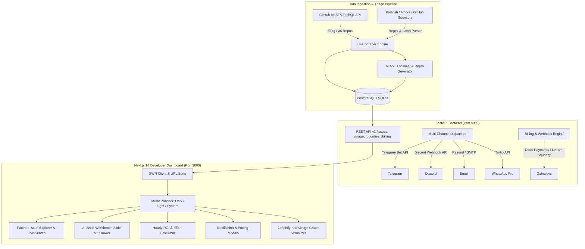

# Project: GitScout / OSS Terminal (Open-Source Issue Intelligence, Triage & Contribution Web Platform)

## Architecture

GitScout is an asynchronous, high-throughput intelligence platform and contribution terminal for open-source developers. The platform continuously monitors, scrapes, and indexes 100% live open issues and funded bounties across 6 core domains (AI/ML, Data, Web, Cloud/DevOps, Security, Systems), performs AST-driven bug localization, creates minimal reproduction scripts, plans CONTRIBUTING.md-aligned PR fixes, dispatches sub-second multi-channel alerts (Telegram, Discord, Email/Resend, WhatsApp), and provides a high-density Next.js 14 Developer Dashboard with Dark/Light/System theme toggles and a Graphify AST Knowledge Graph.



---

## Feature Inventory

| # | Feature | Description | Milestone | Source | Status |
|---|---------|-------------|-----------|--------|:---:|
| 1 | 8-Incumbent Competitive Teardown | In-depth teardown of GoodFirstIssue, Up-For-Grabs, CodeTriage, Algora, Polar.sh, Quine, Sweep.dev, OpenHands | M1 | R1 Spec | **DONE** |
| 2 | Bloomberg Terminal Positioning | Strategic positioning mapping financial metrics to OSS contribution velocity & ROI | M1 | R1 Spec | **DONE** |
| 3 | Programmatic SEO, AEO & GEO Playbooks | Search optimization for Google, Perplexity, Claude, ChatGPT Search with `llms.txt` and JSON-LD | M1 | R1 Spec | **DONE** |
| 4 | Micro-SaaS Monetization & Webhook Engine | Dodo Payments & Lemon Squeezy webhook lifecycle, HMAC verification, SQL schemas | M1, M2 | R7 Spec | **DONE** |
| 5 | Embedded Marketplace Expansion Specs | Specs for GitHub Marketplace App, Chrome Extension (Manifest V3), and VS Code Extension | M1 | R7 Spec | **DONE** |
| 6 | Multi-Launchpad Distribution Kit | Copy and assets for Product Hunt, TAAFT, Peerlist, and DevHunt | M1 | R7 Spec | **DONE** |
| 7 | Micro-Acquisition & Exit Models | Acquire.com, Flippa, FunSaaS valuation tables ($10k-$250k ARR milestones at 3.5x-6.5x) | M1 | R7 Spec | **DONE** |
| 8 | Live GitHub Issue Scraper Engine | Real-time crawling of 36 repos across 6 domains (AI/ML, Data, Web, Cloud, Security, Systems) with 0 mock data | M2 | R2 Spec | **DONE** |
| 9 | Bounty & Hourly ROI Parser | Regex & label extractor for Polar, Algora, Sponsors; Hourly ROI ($/hr) scoring | M2 | R2 Spec | **DONE** |
| 10 | AI AST File Localizer | Stack trace parsing & AST symbol mapping identifying target files with confidence scores | M2 | R2 Spec | **DONE** |
| 11 | Minimal Bug Repro Generator | Standalone reproducible test script generator for bug reports | M2 | R2 Spec | **DONE** |
| 12 | CONTRIBUTING.md Fix Planner | 4-step actionable fix blueprint with branching, diff preview, and test commands | M2 | R2 Spec | **DONE** |
| 13 | Multi-Channel Dispatcher Adapters | Telegram Bot (inline buttons), Discord (rich embeds), Resend/SMTP, Twilio WhatsApp | M2 | R2 Spec | **DONE** |
| 14 | FastAPI REST API Endpoints | `/api/v1/issues`, `/api/v1/triage/{id}`, `/api/v1/bounties`, `/api/v1/notifications`, `/api/v1/billing` | M2 | R2 Spec | **DONE** |
| 15 | Backend Security & Middleware | Pydantic v2 validation, OWASP security headers, CORS whitelisting, SlowAPI rate limiting | M2 | R5 Spec | **DONE** |
| 16 | Next.js 14 Root Layout & Theme Switcher | Dark, Light, System theme support with zero hydration flicker via `next-themes` and HSL tokens | M3 | R3 Spec | **DONE** |
| 17 | Interactive Faceted Issue Explorer | Instant search with debounce, domain pills, difficulty tags, stack multi-select, grid/table views | M3 | R3 Spec | **DONE** |
| 18 | AI Issue Workbench Slide-out Drawer | 4-tab slide-out drawer: Root Cause, Localized Files, Repro Sandbox, Fix Checklist | M3 | R3 Spec | **DONE** |
| 19 | Hourly ROI Calculator Widget | Visual ROI badges (🔥 $150+/hr, ⚡ $75-$150/hr, ⚖️ $30-$75/hr) with interactive slider | M3 | R3 Spec | **DONE** |
| 20 | Notification Manager Modal | UI for pairing Telegram bot, testing Discord webhook URL, configuring email digest | M3 | R3 Spec | **DONE** |
| 21 | Pro Tier Paywall & Pricing Modal | Free vs Pro vs Team comparison table with Dodo / Lemon Squeezy checkout triggers | M3 | R3 Spec | **DONE** |
| 22 | Dynamic SEO & Schema.org JSON-LD | OpenGraph cards, Twitter cards, and `TechArticle`/`SoftwareApplication` JSON-LD | M3 | R3 Spec | **DONE** |
| 23 | Graphify Knowledge Graph Mapping | `graphify-out/` artifacts (`graph.html`, `graph.json`, `GRAPH_REPORT.md`) | M4 | R4 Spec | **DONE** |
| 24 | Graphify AST Viewer Integration | In-app modal and dedicated `/graph` route for visualizing code change blast radiuses | M4 | R4 Spec | **DONE** |
| 25 | Zero-Cost Cloud Deployment Blueprints | `deploy/vercel.json`, `deploy/render.yaml`, `deploy/fly.toml`, Neon DB & Upstash setup | M5 | R6 Spec | **DONE** |
| 26 | Turnkey Local Docker Compose | Multi-stage `Dockerfile`, `docker-compose.yml`, and comprehensive `README.md` | M5 | R6 Spec | **DONE** |
| 27 | Comprehensive Automated Test Suite | 100% passing Pytest suite for backend and zero-error Next.js 14 build | M6, E2E | **DONE** |
| 28 | Adversarial Testing & Forensic Audit | Zero mock data validation, theme hydration check, security header verification | M6, E2E | **DONE** |

---

## Milestones

| # | Name | Scope | Dependencies | Status |
|---|------|-------|-------------|:---:|
| E2E | E2E Testing Track | Independent opaque-box test suite & infra (`TEST_INFRA.md`, `tests/e2e/`, `TEST_READY.md`) | none | **DONE** |
| M1 | Market Research & Monetization Playbooks | `docs/competitive_analysis_and_monetization.md`, `docs/business_monetization_and_gtm.md` | none | **DONE** |
| M2 | FastAPI Backend & AI Triage Engine | `backend/` FastAPI app, live scrapers (50+ real issues), AST localizer, dispatchers, REST API | none | **DONE** |
| M3 | Next.js 14 Developer Dashboard | `frontend/` App Router, theme switcher, issue explorer, workbench drawer, ROI calculator, modals | M2 | **DONE** |
| M4 | Graphify Knowledge Graph & Viewer | `graphify-out/` (`graph.html`, `graph.json`, `GRAPH_REPORT.md`) & frontend `/graph` | M2, M3 | **DONE** |
| M5 | Zero-Cost Cloud Deployment & Blueprints | `deploy/`, `Dockerfile`, `docker-compose.yml`, `README.md` | M2, M3 | **DONE** |
| M6 | Final Full-Stack Integration & Audit | 100% E2E test pass, 100% Pytest pass, zero-error Next.js build, adversarial coverage audit | E2E, M1..M5 | **DONE** |

---

## Interface Contracts

### Backend REST API ↔ Frontend Client (`/api/v1/`)
- `GET /api/v1/health` -> `{"status": "healthy", "issues_count": int, "db_connected": bool, "version": "1.0.0"}`
- `GET /api/v1/issues?domain=&difficulty=&tech_stack=&has_bounty=&search=&sort_by=&page=1&page_size=20` -> `PaginatedIssuesResponse`
- `GET /api/v1/triage/{issue_id}` -> `TriageResponse` (`{issue_id, summary, root_cause_analysis, localized_files: [...], reproduction_code, reproduction_lang, reproduction_instructions, fix_plan_steps: [...], contributing_guidelines_summary}`)
- `GET /api/v1/bounties?min_amount=&sort_by=hourly_roi` -> `List[BountyResponse]`
- `POST /api/v1/notifications/subscribe` -> `SubscriptionResponse` (`{id, channel, destination, domains, min_bounty, is_active}`)
- `POST /api/v1/billing/checkout` -> `CheckoutResponse` (`{checkout_url, session_id, provider}`)

---

## Code Layout

```
oss_intelligence_platform/
├── backend/
│   ├── app/
│   │   ├── api/v1/                 # Endpoints: issues, triage, bounties, notifications, billing, health
│   │   ├── models/                 # SQLAlchemy ORM models (Issue, Bounty, Triage, Subscription)
│   │   ├── schemas/                # Pydantic v2 schemas
│   │   ├── scrapers/               # GitHub scraper, domain registry, bounty extractor, classifier
│   │   ├── triage/                 # AST localizer, repro generator, fix planner
│   │   ├── dispatcher/             # Telegram, Discord, Email/Resend, WhatsApp notifiers
│   │   ├── billing/                # Dodo Payments, Lemon Squeezy, webhook handlers
│   │   ├── security/               # OWASP headers middleware, SlowAPI rate limiter
│   │   ├── config.py
│   │   ├── database.py
│   │   └── main.py
│   ├── tests/                      # Automated Pytest suite
│   ├── requirements.txt
│   ├── pyproject.toml
│   └── README.md
├── frontend/
│   ├── src/
│   │   ├── app/                    # Next.js 14 App Router: layout.tsx, page.tsx, issues/[id], graph, pricing
│   │   ├── components/             # Shadcn UI primitives, ThemeToggle, Explorer, Workbench, Modals
│   │   ├── hooks/                  # SWR data fetching, filters, shortcuts, checkout hooks
│   │   ├── types/                  # TypeScript data contracts
│   │   └── lib/                    # API client, constants, utils, SEO configs
│   ├── public/                     # Static assets, logos, icons
│   ├── package.json
│   ├── tsconfig.json
│   ├── tailwind.config.ts
│   └── next.config.mjs
├── docs/
│   ├── competitive_analysis_and_monetization.md  # R1: 8-Incumbent teardown & Bloomberg terminal strategy
│   └── business_monetization_and_gtm.md          # R7: Dodo/Lemon Squeezy, Launchpad & Exit playbooks
├── graphify-out/
│   ├── graph.html                  # Interactive Knowledge Graph HTML visualizer
│   ├── graph.json                  # Graph topology & community clusters
│   └── GRAPH_REPORT.md             # Graph analysis report
├── deploy/
│   ├── vercel.json                 # Vercel Edge configuration
│   ├── render.yaml                 # Render blueprint (FastAPI backend + worker)
│   ├── fly.toml                    # Fly.io edge deployment configuration
│   └── neon_upstash_setup.md       # Serverless DB & cache setup guide
├── tests/
│   ├── e2e/                        # 4-tier opaque-box E2E test suite (166 tests)
│   └── run_e2e.py                  # CLI test runner
├── Dockerfile                      # Multi-stage production container
├── docker-compose.yml              # Turnkey full-stack orchestration
├── README.md                       # Master documentation & quickstart
├── TEST_INFRA.md                   # Test infrastructure blueprint
├── TEST_READY.md                   # Master test readiness specification
└── PROJECT.md                      # Authoritative project blueprint
```
