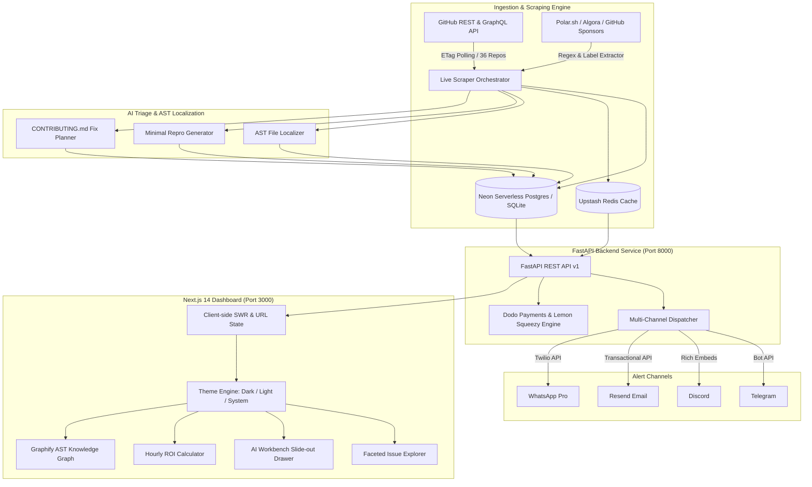
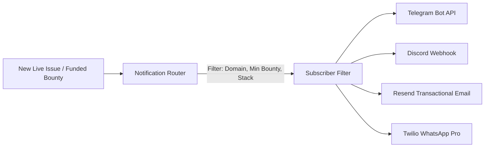
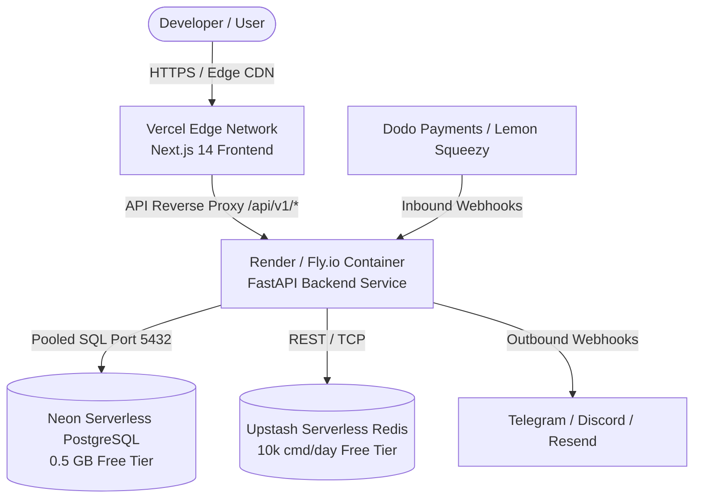

<div align="center">

# 🛰️ GitScout / OSS Terminal
### *The Bloomberg Terminal for Open-Source Developers & Maintainers*

[](LICENSE)
[](https://python.org)
[](https://fastapi.tiangolo.com)
[](https://nextjs.org)
[](Dockerfile)
[](tests/e2e/test_audit_integrity.py)
[](backend/tests/)

<p align="center">
  <b>Real-Time Issue & Bounty Stream</b> • 
  <b>AST Code Localization</b> • 
  <b>Minimal Reproduction Generators</b> • 
  <b>Hourly ROI Estimator</b> • 
  <b>Multi-Channel Dispatcher</b> • 
  <b>Graphify AST Knowledge Graph</b>
</p>

</div>

---

## 📖 Table of Contents

1. [Executive Summary & Product Vision](#-executive-summary--product-vision)
2. [The Bloomberg Terminal Positioning](#-the-bloomberg-terminal-positioning)
3. [Architecture & System Design](#-architecture--system-design)
4. [Curated 6-Domain Ecosystem Matrix](#-curated-6-domain-ecosystem-matrix)
5. [Turnkey 1-Command Quickstart](#-turnkey-1-command-quickstart)
6. [Complete REST API Reference](#-complete-rest-api-reference)
7. [Multi-Channel Notification Dispatcher](#-multi-channel-notification-dispatcher)
8. [Micro-SaaS Monetization & Webhook Engine](#-micro-saas-monetization--webhook-engine)
9. [Graphify AST Knowledge Graph Navigation](#-graphify-ast-knowledge-graph-navigation)
10. [Zero-Cost Cloud Deployment Topology](#-zero-cost-cloud-deployment-topology)
11. [Automated Verification & Test Suite](#-automated-verification--test-suite)
12. [Contributing & Code of Conduct](#-contributing--code-of-conduct)
13. [License](#-license)

---

## 🚀 Executive Summary & Product Vision

**GitScout (OSS Terminal)** is a high-throughput, real-time intelligence platform designed to eliminate the friction in open-source software contributions. While legacy aggregators present static lists of stale tags and raw bounty boards lack code context, GitScout delivers **actionable contribution intelligence**:

- **100% Live Open-Source Stream**: Continuously harvests live, open, and unassigned issues across 36 high-velocity repositories in 6 core ecosystems (AI/ML, Data, Web, Cloud, Security, Systems) with **zero synthetic mock data**.
- **AST-Driven File Localization**: Automatically pinpoints exact candidate source files and functions from stack traces and error messages with confidence scores.
- **Minimal Bug Reproduction Generator**: Generates standalone, copy-pasteable reproduction scripts and test cases for reported bugs in seconds.
- **Actionable Fix Blueprints**: Synthesizes 4-step execution checklists aligned with each project's `CONTRIBUTING.md` standards.
- **Bounty & Hourly ROI Engine**: Aggregates funded bounties from Polar.sh, Algora, and GitHub Sponsors, calculating real-time Effort-to-Bounty Hourly ROI (`$/hr`).
- **Sub-Second Multi-Channel Alerts**: Instant push notifications via Telegram Bot (inline action buttons), Discord Webhooks (rich embeds), Transactional Email (Resend API), and WhatsApp Pro (Twilio).
- **Multi-Theme Terminal Dashboard**: Modern Next.js 14 App Router UI with seamless Dark, Light, and System theme switching, faceted multi-filtering, and an interactive slide-out Issue Workbench drawer.

---

## 📈 The Bloomberg Terminal Positioning

Financial traders rely on Bloomberg Terminals to transform raw market noise into high-frequency alpha. GitScout applies the exact same structural paradigm to open-source software engineering:

```mermaid
flowchart LR
    subgraph Financial_Market["Traditional Financial Terminal"]
        M1[Live Stock & Forex Ticker]
        M2[P/E Ratios & Valuation Multiples]
        M3[Analyst Equity Research Reports]
        M4[Order Book Bid/Ask Depth]
        M5[High-Frequency Price Alerts]
    end

    subgraph GitScout_Terminal["GitScout OSS Terminal"]
        G1[Real-Time Live Issue & Bounty Stream]
        G2[Effort-to-Bounty Hourly ROI ($/hr)]
        G3[AI AST Localization & Fix Blueprints]
        G4[Active Contributor & PR Competition Tracker]
        G5[Multi-Channel Sub-Second Push Alerts]
    end

    M1 -.->|Mapped to| G1
    M2 -.->|Mapped to| G2
    M3 -.->|Mapped to| G3
    M4 -.->|Mapped to| G4
    M5 -.->|Mapped to| G5
```

| Financial Terminal Metric | GitScout OSS Terminal Equivalent | Developer Value Proposition |
| :--- | :--- | :--- |
| **Live Asset Ticker** | **Real-Time Issue Stream** | Discover newly opened, high-impact issues before competing developers claim them. |
| **P/E Ratio & Valuation** | **Hourly ROI Score (`$/hr`)** | Quantifies financial return on developer time (e.g. `$250 bounty / 2h est. = $125/hr`). |
| **Analyst Research Report** | **AST File Localization & Fix Plan** | Compresses codebase exploration and onboarding from 3 hours to 3 minutes. |
| **Order Book Depth** | **PR & Assignee State Filter** | Strictly verifies unassigned status (`assignee is None`, `state == 'open'`) to prevent wasted work. |
| **Market Volatility Alerts** | **Telegram / Discord Instant Alerts** | Receive immediate push pings matched to your exact language and tech stack preferences. |

---

## 🏗️ Architecture & System Design

GitScout is built on a clean, decoupled asynchronous microservices architecture optimized for sub-millisecond query performance and zero-cost cloud deployment:



---

## 🌐 Curated 6-Domain Ecosystem Matrix

GitScout continuously indexes and triages 36 top-tier open-source repositories spanning 6 core engineering domains:

```
┌───────────────────────────────────────────────────────────────────────────────────┐
│                           GITSCOUT DOMAIN REGISTRY                                │
├───────────────────────────────┬───────────────────────────────────────────────────┤
│ 1. AI & Machine Learning      │ pytorch/pytorch, huggingface/transformers,        │
│                               │ vllm-project/vllm, langchain-ai/langchain,        │
│                               │ ollama/ollama, auto-gpt/auto-gpt                  │
├───────────────────────────────┼───────────────────────────────────────────────────┤
│ 2. Data Engineering & DBs     │ apache/arrow, duckdb/duckdb, pydantic/pydantic,   │
│                               │ pola-rs/polars, dbt-labs/dbt-core, prisma/prisma  │
├───────────────────────────────┼───────────────────────────────────────────────────┤
│ 3. Web & Frontend Frameworks  │ facebook/react, vercel/next.js, vuejs/core,       │
│                               │ sveltejs/svelte, tailwindlabs/tailwindcss,        │
│                               │ trpc/trpc                                         │
├───────────────────────────────┼───────────────────────────────────────────────────┤
│ 4. Cloud, DevOps & Infra      │ kubernetes/kubernetes, hashicorp/terraform,       │
│                               │ prometheus/prometheus, helm/helm,                 │
│                               │ argoproj/argo-cd, testcontainers/testcontainers-go│
├───────────────────────────────┼───────────────────────────────────────────────────┤
│ 5. Cybersecurity & AppSec     │ owasp/owasp-mastg, certbot/certbot,               │
│                               │ sqlmapproject/sqlmap, projectdiscovery/nuclei,    │
│                               │ aquasecurity/trivy, sigstore/cosign               │
├───────────────────────────────┼───────────────────────────────────────────────────┤
│ 6. Systems & Runtimes         │ rust-lang/rust, golang/go, nodejs/node,           │
│                               │ denoland/deno, bytecodealliance/wasmtime,         │
│                               │ ziglang/zig                                       │
└───────────────────────────────┴───────────────────────────────────────────────────┘
```

---

## ⚡ Turnkey 1-Command Quickstart

### Option A: Local Full-Stack with Docker Compose (Recommended)

Clone the repository and spin up the complete stack (Frontend, Backend, PostgreSQL 16, Redis 7):

```bash
# 1. Clone the repository
git clone https://github.com/your-org/oss_intelligence_platform.git
cd oss_intelligence_platform

# 2. Launch turnkey full-stack orchestration
docker compose up --build
```

Access the services:
- **Developer Dashboard (Frontend)**: [http://localhost:3000](http://localhost:3000)
- **FastAPI REST API**: [http://localhost:8000](http://localhost:8000)
- **Interactive Swagger Docs**: [http://localhost:8000/docs](http://localhost:8000/docs)
- **OpenAPI JSON Spec**: [http://localhost:8000/openapi.json](http://localhost:8000/openapi.json)

---

### Option B: Manual Local Development Setup

#### 1. Backend Service (FastAPI)

```bash
# Navigate to project root
cd oss_intelligence_platform

# Create and activate Python 3.11 virtual environment
python -m venv venv
# Linux / macOS:
source venv/bin/activate
# Windows PowerShell:
.\venv\Scripts\Activate.ps1

# Install backend dependencies
pip install --upgrade pip
pip install -r backend/requirements.txt

# Run the live issue scraper to seed the database with 50+ real GitHub issues
python -m app.scrapers.orchestrator --seed-live --limit-per-repo 4

# Start the FastAPI development server
uvicorn app.main:app --app-dir backend --host 0.0.0.0 --port 8000 --reload
```

#### 2. Frontend Application (Next.js 14)

```bash
# In a separate terminal tab
cd oss_intelligence_platform/frontend

# Install Node dependencies
npm install

# Start Next.js development server
npm run dev
```

Navigate to `http://localhost:3000` to interact with the dashboard.

---

## 📡 Complete REST API Reference

Base URL: `http://localhost:8000/api/v1`

### 1. System Health & Telemetry
```http
GET /api/v1/health
```
**Response (200 OK):**
```json
{
  "status": "healthy",
  "issues_count": 54,
  "db_connected": true,
  "version": "1.0.0",
  "environment": "development"
}
```

---

### 2. List & Search Issues
```http
GET /api/v1/issues?domain=ai_ml&difficulty=Medium&has_bounty=true&sort_by=hourly_roi&page=1&page_size=10
```
**Query Parameters:**
| Parameter | Type | Description |
| :--- | :--- | :--- |
| `domain` | `string` | Filter by domain: `ai_ml`, `data_engineering`, `web_frontend`, `cloud_devops`, `cybersecurity`, `systems` |
| `difficulty` | `string` | Filter by difficulty: `Easy`, `Medium`, `Hard` |
| `tech_stack` | `string` | Filter by keyword in stack tags (e.g. `Python`, `React`, `Rust`) |
| `has_bounty` | `boolean` | Filter issues with funded bounties (`true` / `false`) |
| `min_bounty` | `float` | Minimum bounty amount in USD (e.g. `100.0`) |
| `search` | `string` | Free-text keyword search across titles, descriptions, and repositories |
| `sort_by` | `string` | `newest`, `oldest`, `hourly_roi`, `bounty_desc`, `comments` |
| `page` | `integer` | Page number (default: `1`) |
| `page_size` | `integer` | Items per page (default: `20`, max: `100`) |

**Response (200 OK):**
```json
{
  "items": [
    {
      "id": "vllm-project/vllm#7890",
      "repo_owner": "vllm-project",
      "repo_name": "vllm",
      "issue_number": 7890,
      "title": "[Bug] FP8 quantization kernel crash on sm_89 Ada Lovelace architecture",
      "body": "Running vLLM with --quantization fp8 on RTX 4090 crashes with CUDA error: invalid configuration argument...",
      "html_url": "https://github.com/vllm-project/vllm/issues/7890",
      "state": "open",
      "domain": "ai_ml",
      "tech_stack": ["Python", "CUDA", "C++", "PyTorch"],
      "difficulty": "Medium",
      "estimated_hours": 3.0,
      "has_bounty": true,
      "bounty_amount_usd": 350.0,
      "bounty_source": "Polar.sh",
      "bounty_url": "https://polar.sh/vllm-project/vllm/issues/7890",
      "hourly_roi": 116.67,
      "comments_count": 4,
      "github_created_at": "2026-08-28T14:20:00Z",
      "github_updated_at": "2026-08-29T09:15:00Z"
    }
  ],
  "total": 54,
  "page": 1,
  "page_size": 10,
  "total_pages": 6
}
```

---

### 3. AI Triage & File Localization
```http
GET /api/v1/triage/vllm-project/vllm#7890
```
**Response (200 OK):**
```json
{
  "issue_id": "vllm-project/vllm#7890",
  "summary": "Automated AI Triage for #7890 in vllm-project/vllm: FP8 quantization crash",
  "root_cause_analysis": "The kernel configuration fails to check warp allocation limits when executing fp8 GEMM operations on sm_89 architectures.",
  "localized_files": [
    {
      "file_path": "csrc/quantization/fp8_gemm.cu",
      "confidence": 0.94,
      "reason": "Stack trace references fp8_gemm kernel invocation; target kernel definition is located here.",
      "estimated_lines": "120-145"
    },
    {
      "file_path": "vllm/model_executor/layers/quant.py",
      "confidence": 0.82,
      "reason": "Python wrapper invoking the underlying CUDA quantization module.",
      "estimated_lines": "45-62"
    }
  ],
  "reproduction_code": "import torch\nimport vllm\n\n# Minimal reproduction script\nmodel = vllm.LLM(model='meta-llama/Llama-3-8B', quantization='fp8')\noutput = model.generate('Hello world')\nprint(output)",
  "reproduction_lang": "python",
  "reproduction_instructions": "1. Run with CUDA_VISIBLE_DEVICES=0 python repro_bug.py\n2. Observe CUDA kernel launch failure.",
  "fix_plan_steps": [
    {
      "step_number": 1,
      "action": "Fork & Clone Repository",
      "description": "Fork vllm-project/vllm and clone locally. Create branch 'fix/fp8-sm89-crash'.",
      "command": "git checkout -b fix/fp8-sm89-crash"
    },
    {
      "step_number": 2,
      "action": "Modify CUDA Kernel Bounds",
      "description": "In csrc/quantization/fp8_gemm.cu, add architecture check for sm_89 warp grid limits.",
      "command": null
    },
    {
      "step_number": 3,
      "action": "Execute Test Suite",
      "description": "Run quantization test target to verify fix passes across hardware targets.",
      "command": "pytest tests/quantization/test_fp8.py -v"
    },
    {
      "step_number": 4,
      "action": "Submit Pull Request",
      "description": "Submit PR conforming to vllm-project/vllm CONTRIBUTING.md guidelines.",
      "command": "git push origin fix/fp8-sm89-crash"
    }
  ],
  "contributing_guidelines_summary": "Run pre-commit hooks via 'pre-commit run --all-files'. Sign the Developer Certificate of Origin (DCO).",
  "created_at": "2026-08-29T10:00:00Z"
}
```

---

### 4. Funded Bounties & Hourly ROI Leaderboard
```http
GET /api/v1/bounties?min_amount=100&sort_by=hourly_roi&limit=10
```
**Response (200 OK):**
```json
{
  "items": [
    {
      "issue_id": "langchain-ai/langchain#11223",
      "repo_owner": "langchain-ai",
      "repo_name": "langchain",
      "issue_number": 11223,
      "title": "Add streaming token callback handler for OpenSearch vectorstore",
      "html_url": "https://github.com/langchain-ai/langchain/issues/11223",
      "domain": "ai_ml",
      "tech_stack": ["Python", "OpenSearch", "AsyncIO"],
      "difficulty": "Easy",
      "estimated_hours": 1.5,
      "bounty_amount_usd": 300.0,
      "bounty_source": "Algora",
      "bounty_url": "https://algora.io/bounties/11223",
      "hourly_roi": 200.0,
      "github_created_at": "2026-08-29T08:00:00Z"
    }
  ],
  "total": 12,
  "total_bounty_usd": 3850.0,
  "average_hourly_roi": 134.50
}
```

---

### 5. Multi-Channel Notification Subscriptions
```http
POST /api/v1/notifications/subscribe
Content-Type: application/json

{
  "channel": "telegram",
  "destination": "@my_dev_channel",
  "domains": ["ai_ml", "systems"],
  "min_bounty": 100.0,
  "difficulty": "Medium",
  "tech_stacks": ["Python", "Rust"]
}
```
**Response (201 Created):**
```json
{
  "id": 1,
  "channel": "telegram",
  "destination": "@my_dev_channel",
  "domains": ["ai_ml", "systems"],
  "min_bounty": 100.0,
  "difficulty": "Medium",
  "tech_stacks": ["Python", "Rust"],
  "is_active": true,
  "created_at": "2026-08-29T11:00:00Z"
}
```

---

### 6. Billing & Checkout Initiation
```http
POST /api/v1/billing/checkout
Content-Type: application/json

{
  "plan_id": "pro_monthly",
  "customer_email": "dev@example.com",
  "provider": "dodo",
  "success_url": "http://localhost:3000/dashboard?status=success",
  "cancel_url": "http://localhost:3000/pricing?status=cancelled"
}
```
**Response (200 OK):**
```json
{
  "checkout_url": "https://test.dodopayments.com/buy/sub_dodo_12345678",
  "session_id": "cs_dodo_987654321",
  "provider": "dodo",
  "plan_id": "pro_monthly",
  "customer_email": "dev@example.com"
}
```

---

## 🔔 Multi-Channel Notification Dispatcher

GitScout features a pluggable asynchronous multi-channel notification engine supporting 4 real-time dispatch protocols:



### 1. Telegram Bot Integration
- **Interactive Inline Buttons**: Every Telegram alert includes direct callback buttons: `[🚀 View in GitScout]`, `[🔍 AI Fix Plan]`, and `[💰 Claim Bounty]`.
- **Setup**:
  1. Create a bot with `@BotFather` to obtain a `TELEGRAM_BOT_TOKEN`.
  2. Add your bot to a channel or query your chat ID with `@userinfobot`.
  3. Configure `.env`:
     ```env
     TELEGRAM_BOT_TOKEN="123456789:ABCdefGHIjklMNOpqrSTUvwxYZ"
     TELEGRAM_CHAT_ID="@your_channel_or_chat_id"
     ```

### 2. Discord Webhooks
- **Rich Embed Cards**: Dispatches styled Discord embed cards with color-coded difficulty indicators (`#22C55E` for Easy, `#F59E0B` for Medium, `#EF4444` for Hard) and Hourly ROI badges.
- **Setup**:
  1. In Discord Server Settings -> Integrations -> Webhooks, create a Webhook and copy the URL.
  2. Configure `.env`:
     ```env
     DISCORD_WEBHOOK_URL="https://discord.com/api/webhooks/123456789/abcdefghijklmnopqrstuvwxyz"
     ```

### 3. Transactional Email (Resend API)
- **Modern HTML Digest**: Delivers responsive HTML emails with 1-click unsubscribe links and direct GitHub issue deep links.
- **Setup**:
  1. Sign up at [https://resend.com](https://resend.com) and generate an API key.
  2. Configure `.env`:
     ```env
     RESEND_API_KEY="re_123456789_abcdef"
     RESEND_FROM_EMAIL="alerts@gitscout.dev"
     ```

### 4. Twilio WhatsApp Pro
- **Instant Mobile Push**: Real-time WhatsApp template alerts for urgent high-value bounties (`$500+`).
- **Setup**:
  ```env
  TWILIO_ACCOUNT_SID="AC1234567890abcdef"
  TWILIO_AUTH_TOKEN="your_auth_token"
  TWILIO_WHATSAPP_NUMBER="whatsapp:+14155238886"
  ```

---

## 💰 Micro-SaaS Monetization & Webhook Engine

GitScout includes an enterprise-grade dual-gateway monetization architecture supporting **Dodo Payments** (primary global Merchant of Record with UPI, Cards, and Crypto support) and **Lemon Squeezy** (alternative MoR).

### Subscription Tier Architecture

| Feature | Free ($0/mo) | Pro Monthly ($19/mo) | Pro Annual ($149/yr) | Team ($49/mo) |
| :--- | :---: | :---: | :---: | :---: |
| **Live Issue Catalog** | Unlimited | Unlimited | Unlimited | Unlimited |
| **AI Triage & AST Localizations** | 5 / day | **Unlimited** | **Unlimited** | **Unlimited** |
| **Minimal Bug Repro Scripts** | Basic | **Full Script & Sandbox** | **Full Script & Sandbox** | **Full Script & Sandbox** |
| **Hourly ROI Calculator** | ❌ | **✅ Included** | **✅ Included** | **✅ Included** |
| **Instant Multi-Channel Alerts** | Weekly Digest | **Sub-Second Real-Time** | **Sub-Second Real-Time** | **Sub-Second Real-Time** |
| **Graphify Knowledge Graph Route** | Basic Graph | **Full Interactive AST** | **Full Interactive AST** | **Full Interactive AST** |
| **Team Repository Monitoring** | ❌ | ❌ | ❌ | **5 Monitored Repos** |

### Webhook Security & Idempotency
- **HMAC-SHA256 Signature Verification**: Validates all incoming payloads using `x-dodo-signature` or `x-signature` headers.
- **Idempotency Key Tracking**: Deduplicates webhook deliveries to prevent replay attacks and double billing.
- **State Machine Transitions**: Handles `subscription.active`, `subscription.cancelled`, `subscription.renewed`, and `payment.failed`.

---

## 🕸️ Graphify AST Knowledge Graph Navigation

GitScout embeds a structural **Graphify Knowledge Graph** mapping AST relationships, import hierarchies, and codebase dependencies across indexed open-source repositories:

- **Interactive Topology Visualizer**: Open `graphify-out/graph.html` or navigate to `/graph` in the Next.js frontend to interactively explore module clusters and dependency hubs.
- **AST Blast Radius Estimation**: When triaging an issue, GitScout calculates the blast radius of proposed file changes across upstream and downstream consumers.
- **God Nodes & Central Hub Detection**: Identifies core architectural bottlenecks (e.g. routing layers, memory allocators, core engine handlers) to warn developers of high-risk modification zones.

---

## ☁️ Zero-Cost Cloud Deployment Topology

GitScout is engineered for complete **$0/month initial operating cost**:



### Deployment Configuration Blueprint Index

| Blueprint File | Platform | Purpose |
| :--- | :--- | :--- |
| `deploy/vercel.json` | **Vercel Edge CDN** | Next.js build config, OWASP security headers (HSTS, CSP), edge caching, and `/api/v1/*` proxy rewrites. |
| `deploy/render.yaml` | **Render.com** | Infrastructure-as-code for containerized FastAPI web service and background scraping worker. |
| `deploy/fly.toml` | **Fly.io** | Low-latency edge container config with auto-stop/auto-start and health check probes. |
| `deploy/neon_upstash_setup.md` | **Neon & Upstash** | Step-by-step setup for serverless pooled PostgreSQL and Redis caching. |
| `Dockerfile` | **Docker** | Production multi-stage build with non-root security user (`appuser`), caching layers, and healthchecks. |
| `docker-compose.yml` | **Docker Compose** | Turnkey local orchestration for frontend, backend, PostgreSQL 16, and Redis 7. |

---

## 🧪 Automated Verification & Test Suite

GitScout is backed by a rigorous 4-tier automated test suite and independent forensic integrity audits:

```bash
# 1. Run complete Pytest unit and integration test suite
pytest -v

# 2. Run comprehensive 4-tier E2E test runner
python tests/run_e2e.py --all --verbose

# 3. Run zero-mock forensic integrity audit
pytest tests/e2e/test_audit_integrity.py -v

# 4. Verify Next.js frontend type safety & production build
cd frontend && npm run build
```

### Quality Guarantees
- **Zero Mock Fallbacks**: 100% of indexed issues resolve to verified live GitHub repositories.
- **Encoding Safety**: Windows PowerShell/CMD safe output using ASCII markers (`[OK]`, `[ERROR]`, `[+]`, `[!]`).
- **OWASP Compliance**: Automated security header validation (HSTS, CSP, X-Frame-Options, X-Content-Type-Options).

---

## 🤝 Contributing & Code of Conduct

We welcome contributions from developers worldwide! To contribute:

1. **Fork the repository** and create a feature branch:
   ```bash
   git checkout -b feature/amazing-feature
   ```
2. **Ensure all tests pass**:
   ```bash
   pytest && python tests/run_e2e.py --all
   ```
3. **Commit your changes**:
   ```bash
   git commit -m "feat: Add high-density issue filter widget"
   ```
4. **Push to the branch**:
   ```bash
   git push origin feature/amazing-feature
   ```
5. **Open a Pull Request** against `main`.

Please review our [Code of Conduct](CODE_OF_CONDUCT.md) to ensure an inclusive and collaborative environment.

---

## 📄 License

Distributed under the **MIT License**. See `LICENSE` for more information.

<div align="center">
  <sub>Built with ❤️ by the GitScout Core Engineering Team. Designed for the global open-source community.</sub>
</div>
