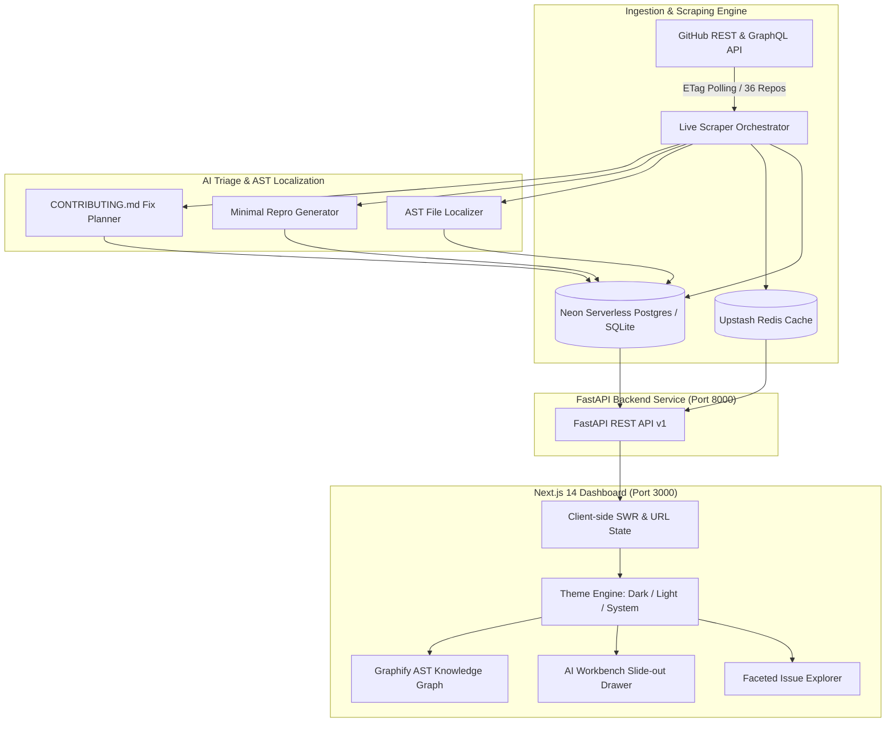
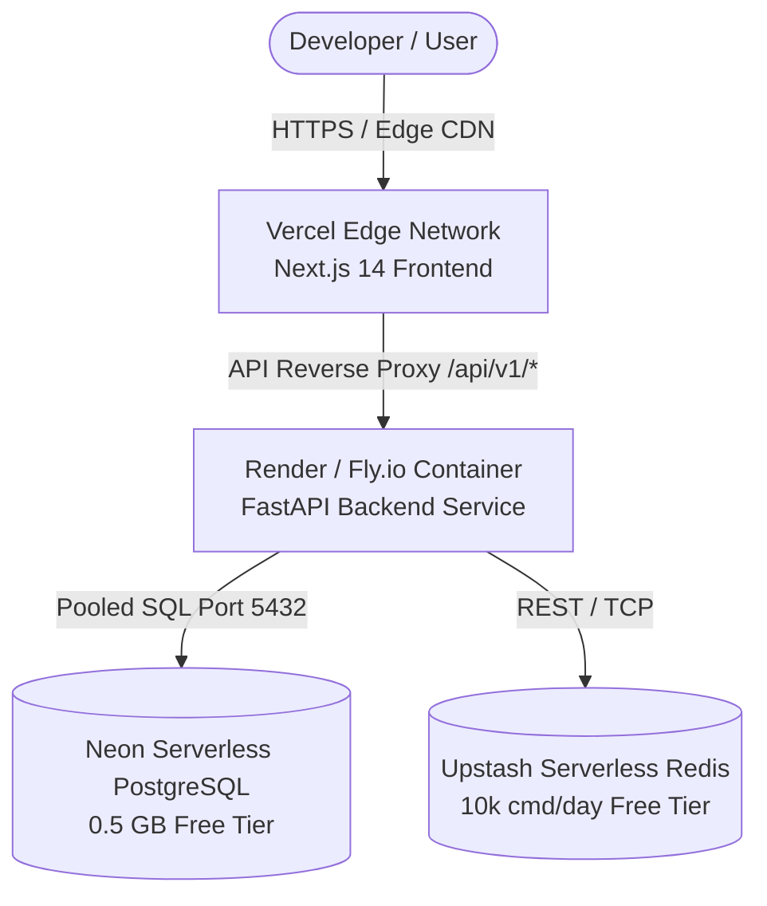

<div align="center">

# Developer Mission Control

### A contributor's agent that defers to the maintainer.

[](LICENSE)
[](https://python.org)
[](https://fastapi.tiangolo.com)
[](https://nextjs.org)
[](Dockerfile)

</div>

Open-source maintainers are drowning in unreviewed, AI-generated pull requests. This project is
built as the opposite of that. It helps a *person* find an issue, understand it, and contribute a
reviewed fix, and it stops wherever the project does not want AI-assisted work.

**Consent first.** Before any work, the agent reads the project's CONTRIBUTING file and PR template.
If the project bans or restricts AI-assisted contributions, the agent refuses to clone it, quotes the
rule, and leaves the decision to you. If the project asks for disclosure, or says nothing, the draft
PR says that an AI assistant helped prepare it and that the author reviewed and ran it.

**A human approves every write.** Reading is automatic. Cloning, editing, running tests, committing,
opening a pull request and sending email each pause for your approval, one step at a time. You see
the exact diff before you say yes. Only the signed-in owner of the conversation can approve.

**Proof, not volume.** Tests run before and after the change. A pull request is opened only if they
pass, only as a draft, and never against the base branch. Work happens in a throwaway sandbox of the
repository.

**You stay the author.** Ask for a terminal instead of a fix and you get a sandbox where *you* do the
work; the assistant explains the issue and gives hints, not the finished answer.

---

## 📖 Table of Contents

1. [How it works](#how-it-works)
2. [What it will not do](#what-it-will-not-do)
3. [Status](#status)
4. [Architecture & System Design](#-architecture--system-design)
5. [Curated 6-Domain Ecosystem Matrix](#-curated-6-domain-ecosystem-matrix)
6. [Quickstart](#-turnkey-1-command-quickstart)
7. [REST API Reference](#-complete-rest-api-reference)
8. [Graphify AST Knowledge Graph Navigation](#-graphify-ast-knowledge-graph-navigation)
9. [Deployment Topology](#-zero-cost-cloud-deployment-topology)
10. [Automated Verification & Test Suite](#-automated-verification--test-suite)
11. [Contributing & Code of Conduct](#-contributing--code-of-conduct)
12. [License](#-license)

---

## How it works

You speak or type to an Alexa+-style client. An agent planner turns the request into tool calls over
the Model Context Protocol (Streamable HTTP, spec 2025-11-25):

- **GitScout MCP**: finds and explains open issues.
- **Git/CI MCP**: sandboxed clone, read, edit, test, commit, draft PR, CI status. Token-protected and
  pinned to a throwaway repository.
- **Email MCP**: reads a demo inbox; each send is its own approval, to your confirmed address only.

An approval gate sits in front of every write, and sign-in sits in front of the gate.

## What it will not do

- Work on a project that says it does not accept AI-assisted contributions.
- Open a pull request whose tests fail, or a non-draft pull request.
- Act without your approval, or approve in bulk.
- Rank issues by payout or optimise for bounties.

## Status

| Capability | State |
| :--- | :--- |
| Approval gate on every write; only the signed-in owner can approve | Live |
| Draft PRs only; base branch never pushed; diff shown before approval | Live |
| Tests run first; a PR is opened only if they pass | Live |
| Saved work per branch; email summary to your confirmed address | Live |
| Reading the project's AI policy; refusing banned projects; PR disclosure line | In review, not yet deployed |
| Sandbox terminal where you do the work | Infrastructure deployed to AWS; no launch proven, no browser terminal yet |
| Duplicate-work / competing-PR check before starting | Not built |
| Amazon Bedrock (Nova) reasoning | Blocked by an account restriction; Gemini is used meanwhile |

---

## 🏗️ Architecture & System Design

GitScout, the issue-intelligence service behind Mission Control, is a decoupled asynchronous service built for low-cost cloud deployment:


```mermaid
flowchart TD
    subgraph Ingestion["Ingestion & Scraping Engine"]
        GH["GitHub REST & GraphQL API"] -->|ETag Polling / 36 Repos| SCRAPER["Live Scraper Orchestrator"]
        SCRAPER --> DB[("Neon Serverless Postgres / SQLite")]
        SCRAPER --> CACHE[("Upstash Redis Cache")]
    end

    subgraph Intelligence["AI Triage & AST Localization"]
        SCRAPER --> AST["AST File Localizer"]
        SCRAPER --> REPRO["Minimal Repro Generator"]
        SCRAPER --> FIX["CONTRIBUTING.md Fix Planner"]
        AST --> DB
        REPRO --> DB
        FIX --> DB
    end

    subgraph Backend["FastAPI Backend Service (Port 8000)"]
        DB --> API["FastAPI REST API v1"]
        CACHE --> API
    end

    subgraph Frontend["Next.js 14 Dashboard (Port 3000)"]
        API --> SWR["Client-side SWR & URL State"]
        SWR --> THEME["Theme Engine: Dark / Light / System"]
        THEME --> EXPLORER["Faceted Issue Explorer"]
        THEME --> DRAWER["AI Workbench Slide-out Drawer"]
        THEME --> GRAPH["Graphify AST Knowledge Graph"]
    end
```

---

## 🌐 Curated 6-Domain Ecosystem Matrix

GitScout continuously indexes and triages 36 top-tier open-source repositories spanning 6 core engineering domains:

```
┌───────────────────────────────────────────────────────────────────────────────────┐
│                           GITSCOUT DOMAIN REGISTRY                                │
├───────────────────────────────┬───────────────────────────────────────────────────┤
│ 1. AI & Machine Learning      │ pytorch/pytorch, huggingface/transformers,        │
│                               │ vllm-project/vllm, langchain-ai/langchain,        │
│                               │ ollama/ollama, auto-gpt/auto-gpt                  │
├───────────────────────────────┼───────────────────────────────────────────────────┤
│ 2. Data Engineering & DBs     │ apache/arrow, duckdb/duckdb, pydantic/pydantic,   │
│                               │ pola-rs/polars, dbt-labs/dbt-core, prisma/prisma  │
├───────────────────────────────┼───────────────────────────────────────────────────┤
│ 3. Web & Frontend Frameworks  │ facebook/react, vercel/next.js, vuejs/core,       │
│                               │ sveltejs/svelte, tailwindlabs/tailwindcss,        │
│                               │ trpc/trpc                                         │
├───────────────────────────────┼───────────────────────────────────────────────────┤
│ 4. Cloud, DevOps & Infra      │ kubernetes/kubernetes, hashicorp/terraform,       │
│                               │ prometheus/prometheus, helm/helm,                 │
│                               │ argoproj/argo-cd, testcontainers/testcontainers-go│
├───────────────────────────────┼───────────────────────────────────────────────────┤
│ 5. Cybersecurity & AppSec     │ owasp/owasp-mastg, certbot/certbot,               │
│                               │ sqlmapproject/sqlmap, projectdiscovery/nuclei,    │
│                               │ aquasecurity/trivy, sigstore/cosign               │
├───────────────────────────────┼───────────────────────────────────────────────────┤
│ 6. Systems & Runtimes         │ rust-lang/rust, golang/go, nodejs/node,           │
│                               │ denoland/deno, bytecodealliance/wasmtime,         │
│                               │ ziglang/zig                                       │
└───────────────────────────────┴───────────────────────────────────────────────────┘
```

---

## ⚡ Turnkey 1-Command Quickstart

### Option A: Local Full-Stack with Docker Compose (Recommended)

Clone the repository and spin up the complete stack (Frontend, Backend, PostgreSQL 16, Redis 7):

```bash
# 1. Clone the repository
git clone https://github.com/your-org/oss_intelligence_platform.git
cd oss_intelligence_platform

# 2. Launch turnkey full-stack orchestration
docker compose up --build
```

Access the services:
- **Developer Dashboard (Frontend)**: [http://localhost:3000](http://localhost:3000)
- **FastAPI REST API**: [http://localhost:8000](http://localhost:8000)
- **Interactive Swagger Docs**: [http://localhost:8000/docs](http://localhost:8000/docs)
- **OpenAPI JSON Spec**: [http://localhost:8000/openapi.json](http://localhost:8000/openapi.json)

---

### Option B: Manual Local Development Setup

#### 1. Backend Service (FastAPI)

```bash
# Navigate to project root
cd oss_intelligence_platform

# Create and activate Python 3.11 virtual environment
python -m venv venv
# Linux / macOS:
source venv/bin/activate
# Windows PowerShell:
.\venv\Scripts\Activate.ps1

# Install backend dependencies
pip install --upgrade pip
pip install -r backend/requirements.txt

# Run the live issue scraper to seed the database with 50+ real GitHub issues
python -m app.scrapers.orchestrator --seed-live --limit-per-repo 4

# Start the FastAPI development server
uvicorn app.main:app --app-dir backend --host 0.0.0.0 --port 8000 --reload
```

#### 2. Frontend Application (Next.js 14)

```bash
# In a separate terminal tab
cd oss_intelligence_platform/frontend

# Install Node dependencies
npm install

# Start Next.js development server
npm run dev
```

Navigate to `http://localhost:3000` to interact with the dashboard.

---

## 📡 Complete REST API Reference

Base URL: `http://localhost:8000/api/v1`

### 1. System Health & Telemetry
```http
GET /api/v1/health
```
**Response (200 OK):**
```json
{
  "status": "healthy",
  "issues_count": 54,
  "db_connected": true,
  "version": "1.0.0",
  "environment": "development"
}
```

---

### 2. List & Search Issues
```http
GET /api/v1/issues?domain=ai_ml&difficulty=Medium&sort_by=newest&page=1&page_size=10
```
**Query Parameters:**
| Parameter | Type | Description |
| :--- | :--- | :--- |
| `domain` | `string` | Filter by domain: `ai_ml`, `data_engineering`, `web_frontend`, `cloud_devops`, `cybersecurity`, `systems` |
| `difficulty` | `string` | Filter by difficulty: `Easy`, `Medium`, `Hard` |
| `tech_stack` | `string` | Filter by keyword in stack tags (e.g. `Python`, `React`, `Rust`) |
| `search` | `string` | Free-text keyword search across titles, descriptions, and repositories |
| `sort_by` | `string` | `newest`, `oldest`, `comments` |
| `page` | `integer` | Page number (default: `1`) |
| `page_size` | `integer` | Items per page (default: `20`, max: `100`) |

**Response (200 OK):**
```json
{
  "items": [
    {
      "id": "vllm-project/vllm#7890",
      "repo_owner": "vllm-project",
      "repo_name": "vllm",
      "issue_number": 7890,
      "title": "[Bug] FP8 quantization kernel crash on sm_89 Ada Lovelace architecture",
      "body": "Running vLLM with --quantization fp8 on RTX 4090 crashes with CUDA error: invalid configuration argument...",
      "html_url": "https://github.com/vllm-project/vllm/issues/7890",
      "state": "open",
      "domain": "ai_ml",
      "tech_stack": ["Python", "CUDA", "C++", "PyTorch"],
      "difficulty": "Medium",
      "estimated_hours": 3.0,
      "comments_count": 4,
      "github_created_at": "2026-08-28T14:20:00Z",
      "github_updated_at": "2026-08-29T09:15:00Z"
    }
  ],
  "total": 54,
  "page": 1,
  "page_size": 10,
  "total_pages": 6
}
```

---

### 3. AI Triage & File Localization
```http
GET /api/v1/triage/vllm-project/vllm#7890
```
**Response (200 OK):**
```json
{
  "issue_id": "vllm-project/vllm#7890",
  "summary": "Automated AI Triage for #7890 in vllm-project/vllm: FP8 quantization crash",
  "root_cause_analysis": "The kernel configuration fails to check warp allocation limits when executing fp8 GEMM operations on sm_89 architectures.",
  "localized_files": [
    {
      "file_path": "csrc/quantization/fp8_gemm.cu",
      "confidence": 0.94,
      "reason": "Stack trace references fp8_gemm kernel invocation; target kernel definition is located here.",
      "estimated_lines": "120-145"
    },
    {
      "file_path": "vllm/model_executor/layers/quant.py",
      "confidence": 0.82,
      "reason": "Python wrapper invoking the underlying CUDA quantization module.",
      "estimated_lines": "45-62"
    }
  ],
  "reproduction_code": "import torch\nimport vllm\n\n# Minimal reproduction script\nmodel = vllm.LLM(model='meta-llama/Llama-3-8B', quantization='fp8')\noutput = model.generate('Hello world')\nprint(output)",
  "reproduction_lang": "python",
  "reproduction_instructions": "1. Run with CUDA_VISIBLE_DEVICES=0 python repro_bug.py\n2. Observe CUDA kernel launch failure.",
  "fix_plan_steps": [
    {
      "step_number": 1,
      "action": "Fork & Clone Repository",
      "description": "Fork vllm-project/vllm and clone locally. Create branch 'fix/fp8-sm89-crash'.",
      "command": "git checkout -b fix/fp8-sm89-crash"
    },
    {
      "step_number": 2,
      "action": "Modify CUDA Kernel Bounds",
      "description": "In csrc/quantization/fp8_gemm.cu, add architecture check for sm_89 warp grid limits.",
      "command": null
    },
    {
      "step_number": 3,
      "action": "Execute Test Suite",
      "description": "Run quantization test target to verify fix passes across hardware targets.",
      "command": "pytest tests/quantization/test_fp8.py -v"
    },
    {
      "step_number": 4,
      "action": "Submit Pull Request",
      "description": "Submit PR conforming to vllm-project/vllm CONTRIBUTING.md guidelines.",
      "command": "git push origin fix/fp8-sm89-crash"
    }
  ],
  "contributing_guidelines_summary": "Run pre-commit hooks via 'pre-commit run --all-files'. Sign the Developer Certificate of Origin (DCO).",
  "created_at": "2026-08-29T10:00:00Z"
}
```

---

## 🕸️ Graphify AST Knowledge Graph Navigation

GitScout embeds a structural **Graphify Knowledge Graph** mapping AST relationships, import hierarchies, and codebase dependencies across indexed open-source repositories:

- **Interactive Topology Visualizer**: Open `graphify-out/graph.html` or navigate to `/graph` in the Next.js frontend to interactively explore module clusters and dependency hubs.
- **AST Blast Radius Estimation**: When triaging an issue, GitScout calculates the blast radius of proposed file changes across upstream and downstream consumers.
- **God Nodes & Central Hub Detection**: Identifies core architectural bottlenecks (e.g. routing layers, memory allocators, core engine handlers) to warn developers of high-risk modification zones.

---

## ☁️ Zero-Cost Cloud Deployment Topology

GitScout runs on free tiers of managed services:


```mermaid
graph TD
    User([Developer / User]) -->|HTTPS / Edge CDN| Vercel[Vercel Edge Network\nNext.js 14 Frontend]
    Vercel -->|API Reverse Proxy /api/v1/*| Backend[Render / Fly.io Container\nFastAPI Backend Service]
    Backend -->|Pooled SQL Port 5432| Neon[(Neon Serverless PostgreSQL\n0.5 GB Free Tier)]
    Backend -->|REST / TCP| Upstash[(Upstash Serverless Redis\n10k cmd/day Free Tier)]
```

### Deployment Configuration Blueprint Index

| Blueprint File | Platform | Purpose |
| :--- | :--- | :--- |
| `deploy/vercel.json` | **Vercel Edge CDN** | Next.js build config, OWASP security headers (HSTS, CSP), edge caching, and `/api/v1/*` proxy rewrites. |
| `deploy/render.yaml` | **Render.com** | Infrastructure-as-code for containerized FastAPI web service and background scraping worker. |
| `deploy/fly.toml` | **Fly.io** | Low-latency edge container config with auto-stop/auto-start and health check probes. |
| `deploy/neon_upstash_setup.md` | **Neon & Upstash** | Step-by-step setup for serverless pooled PostgreSQL and Redis caching. |
| `Dockerfile` | **Docker** | Production multi-stage build with non-root security user (`appuser`), caching layers, and healthchecks. |
| `docker-compose.yml` | **Docker Compose** | Turnkey local orchestration for frontend, backend, PostgreSQL 16, and Redis 7. |

---

## 🧪 Automated Verification & Test Suite

GitScout is backed by a rigorous 4-tier automated test suite and independent forensic integrity audits:

```bash
# 1. Run complete Pytest unit and integration test suite
pytest -v

# 2. Run comprehensive 4-tier E2E test runner
python tests/run_e2e.py --all --verbose

# 3. Run the data-integrity audit
pytest tests/e2e/test_audit_integrity.py -v

# 4. Verify Next.js frontend type safety & production build
cd frontend && npm run build
```

### Quality Guarantees
- **Live data**: indexed issues come from the GitHub API, not synthetic fixtures.
- **Encoding Safety**: Windows PowerShell/CMD safe output using ASCII markers (`[OK]`, `[ERROR]`, `[+]`, `[!]`).
- **OWASP Compliance**: Automated security header validation (HSTS, CSP, X-Frame-Options, X-Content-Type-Options).

---

## 🤝 Contributing & Code of Conduct

We welcome contributions. If an AI assistant helped you write a change, say so in the pull request, and make sure you have read, run and can explain every line.

To contribute:

1. **Fork the repository** and create a feature branch:
   ```bash
   git checkout -b feature/amazing-feature
   ```
2. **Ensure all tests pass**:
   ```bash
   pytest && python tests/run_e2e.py --all
   ```
3. **Commit your changes**:
   ```bash
   git commit -m "feat: Add high-density issue filter widget"
   ```
4. **Push to the branch**:
   ```bash
   git push origin feature/amazing-feature
   ```
5. **Open a Pull Request** against `main`.

Please review our [Code of Conduct](CODE_OF_CONDUCT.md) to ensure an inclusive and collaborative environment.

---

## 📄 License

Distributed under the **MIT License**. See `LICENSE` for more information.

<div align="center">
  <sub>Built for the AWS Hackathon, Alexa+ track.</sub>
</div>
