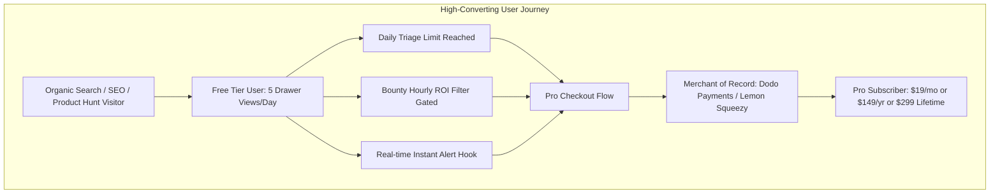
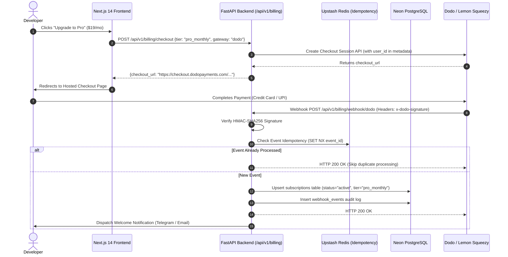
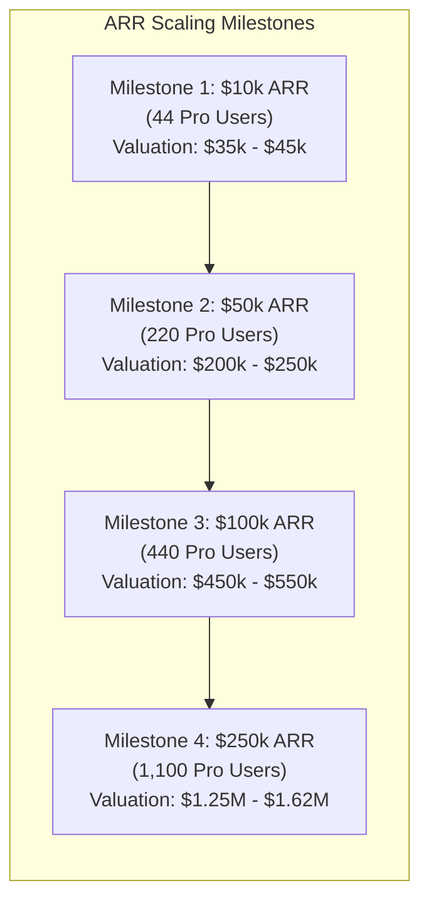

# GitScout / OSS Terminal: Micro-SaaS Monetization, Embedded Marketplace & Exit Playbook (R7)

**Document Reference**: `docs/business_monetization_and_gtm.md`  
**Classification**: Micro-SaaS Monetization, Payment Webhooks, Distribution & Acquisition Spec  
**Version**: 1.0.0 Production  
**Target Platform**: GitScout / OSS Intelligence Terminal  

---

## 1. Micro-SaaS Business Model & Pricing Architecture

GitScout monetizes through a high-margin, tiered subscription model tailored to individual software engineers, freelance bounty hunters, and open-source project maintainers. Because the platform runs on a modern zero-cost cloud architecture (Vercel Edge + Render/Fly.io FastAPI + Neon Serverless PostgreSQL + Upstash Redis), operational gross margins exceed **94%**.



### 1.1 Subscription Tiers & Feature Gates

| Feature / Capability | Free Tier (`$0/mo`) | Pro Tier (`$19/mo` or `$149/yr` or `$299` Lifetime) | Team / Maintainer (`$49/mo`) |
| :--- | :--- | :--- | :--- |
| **Live GitHub Issue Explorer** | Unlimited search & faceted filtering | Unlimited search & faceted filtering | Unlimited search & faceted filtering |
| **Daily AI Triage Drawer Views** | 5 views / 24 hours | **Unlimited** | **Unlimited** |
| **AST Codebase File Localization** | Top 1 file only (confidence hidden) | **Full AST symbol map + confidence scores** | **Full AST symbol map + confidence scores** |
| **Minimal Bug Repro Generator** | Read-only snippet preview | **Copyable & downloadable test harness** | **Automated CI reproduction script** |
| **CONTRIBUTING.md Fix Blueprints**| 2 steps preview | **Complete 4-step diff & branch guide** | **Complete 4-step diff + maintainer rules** |
| **Hourly Bounty ROI Calculator** | Obfuscated ($/hr badge blurred) | **Full Hourly ROI ($/hr) + sorting** | **Full Hourly ROI ($/hr) + sorting** |
| **Multi-Channel Alert Dispatch** | Weekly email digest only | **Sub-second Telegram, Discord, WhatsApp**| **Custom team Discord / Slack channels** |
| **Developer Portfolio Badges** | Standard profile | **Verified Proof-of-Work Contributor Badge**| **Verified Maintainer Organization Badge**|
| **Dedicated Repo Auto-Triaging** | N/A | N/A | **Up to 5 Repositories (@gitscout-bot)** |
| **Seat Allocation** | 1 Developer | 1 Developer | **5 Developer Seats included** |

---

### 1.2 Unit Economics & Margin Modeling

```
[ Unit Economics Breakdown @ 1,000 Pro Subscribers ($19/mo MRR: $19,000) ]
┌─────────────────────────────────────────────────────────────────────────────┐
│ Gross Monthly Recurring Revenue (MRR):                       $19,000.00     │
├─────────────────────────────────────────────────────────────────────────────┤
│ 1. Merchant of Record Processing Fee (Dodo/Lemon ~5% + $0.30): ($1,250.00)  │
│ 2. Vercel Pro Edge Hosting:                                      ($20.00)   │
│ 3. Fly.io / Render Container Compute (2x 1GB FastAPI Instances): ($25.00)   │
│ 4. Neon Serverless PostgreSQL (Autoscaling storage & compute):   ($45.00)   │
│ 5. Upstash Redis (Serverless Cache & Rate Limiting):             ($15.00)   │
│ 6. Resend Email & Twilio WhatsApp API usage:                     ($80.00)   │
│ 7. Background LLM & AST Embedding Token Costs:                  ($250.00)   │
├─────────────────────────────────────────────────────────────────────────────┤
│ Total Monthly Operating Cost:                                  ($1,685.00)  │
│ Net Monthly Profit (EBITDA):                                 $17,315.00     │
│ Blended Net Operating Margin:                                      91.13%   │
└─────────────────────────────────────────────────────────────────────────────┘
```

---

## 2. Payment Gateway Integration Blueprints: Dodo Payments & Lemon Squeezy

GitScout supports dual payment resilience using **Dodo Payments** (primary global Merchant of Record with native support for UPI, international credit cards, and crypto) and **Lemon Squeezy** (secondary MoR backup). Both gateways manage global sales tax, VAT, MoR compliance, and customer invoicing automatically.



---

### 2.1 Complete PostgreSQL SQL DDL Schema

```sql
-- Database Migration: 001_billing_and_subscriptions.sql

-- 1. Users Table
CREATE TABLE IF NOT EXISTS users (
    id VARCHAR(64) PRIMARY KEY,
    email VARCHAR(255) UNIQUE NOT NULL,
    github_username VARCHAR(100),
    avatar_url TEXT,
    tier VARCHAR(32) NOT NULL DEFAULT 'free', -- 'free', 'pro_monthly', 'pro_annual', 'pro_lifetime', 'team'
    created_at TIMESTAMP WITH TIME ZONE DEFAULT CURRENT_TIMESTAMP,
    updated_at TIMESTAMP WITH TIME ZONE DEFAULT CURRENT_TIMESTAMP
);

-- 2. Subscriptions State Machine Table
CREATE TABLE IF NOT EXISTS subscriptions (
    id VARCHAR(64) PRIMARY KEY,
    user_id VARCHAR(64) NOT NULL REFERENCES users(id) ON DELETE CASCADE,
    gateway VARCHAR(32) NOT NULL, -- 'dodo' or 'lemonsqueezy'
    gateway_subscription_id VARCHAR(128) UNIQUE NOT NULL,
    gateway_customer_id VARCHAR(128) NOT NULL,
    product_id VARCHAR(128) NOT NULL,
    tier VARCHAR(32) NOT NULL,
    status VARCHAR(32) NOT NULL, -- 'active', 'past_due', 'paused', 'cancelled', 'expired'
    current_period_start TIMESTAMP WITH TIME ZONE NOT NULL,
    current_period_end TIMESTAMP WITH TIME ZONE NOT NULL,
    cancel_at_period_end BOOLEAN NOT NULL DEFAULT FALSE,
    canceled_at TIMESTAMP WITH TIME ZONE,
    created_at TIMESTAMP WITH TIME ZONE DEFAULT CURRENT_TIMESTAMP,
    updated_at TIMESTAMP WITH TIME ZONE DEFAULT CURRENT_TIMESTAMP
);

-- 3. Webhook Events Idempotency & Audit Table
CREATE TABLE IF NOT EXISTS webhook_events (
    id VARCHAR(128) PRIMARY KEY, -- Unique gateway event identifier
    gateway VARCHAR(32) NOT NULL,
    event_type VARCHAR(64) NOT NULL,
    payload JSONB NOT NULL,
    processed_status VARCHAR(32) NOT NULL DEFAULT 'success', -- 'success', 'failed', 'ignored'
    error_message TEXT,
    processed_at TIMESTAMP WITH TIME ZONE DEFAULT CURRENT_TIMESTAMP
);

-- 4. Customer Usage & Credit Tracker
CREATE TABLE IF NOT EXISTS user_usage_metrics (
    user_id VARCHAR(64) PRIMARY KEY REFERENCES users(id) ON DELETE CASCADE,
    triage_views_today INT NOT NULL DEFAULT 0,
    last_view_date DATE NOT NULL DEFAULT CURRENT_DATE,
    alerts_dispatched_count INT NOT NULL DEFAULT 0,
    updated_at TIMESTAMP WITH TIME ZONE DEFAULT CURRENT_TIMESTAMP
);

-- Indexes for high-throughput queries
CREATE INDEX IF NOT EXISTS idx_subscriptions_user_id ON subscriptions(user_id);
CREATE INDEX IF NOT EXISTS idx_subscriptions_status ON subscriptions(status);
CREATE INDEX IF NOT EXISTS idx_webhook_events_gateway_event ON webhook_events(gateway, event_type);
```

---

### 2.2 Production Python (FastAPI) Webhook Handler

```python
# backend/app/billing/webhooks.py
"""
High-throughput, cryptographically verified Webhook Handlers for Dodo Payments and Lemon Squeezy.
Includes HMAC-SHA256 signature verification, Redis idempotency locking, and SQL status sync.
"""

import hmac
import hashlib
import json
import logging
from datetime import datetime, timezone
from typing import Dict, Any
from fastapi import APIRouter, Request, HTTPException, Header, Depends, status
from sqlalchemy.orm import Session
from sqlalchemy import select, update

# Internal project imports
from app.database import get_db
from app.models.billing import User, Subscription, WebhookEvent
from app.config import settings

logger = logging.getLogger("gitscout.billing")
billing_router = APIRouter(prefix="/api/v1/billing", tags=["Billing & Payments"])


def verify_hmac_sha256(payload_bytes: bytes, signature_header: str, secret_key: str) -> bool:
    """Verifies HMAC-SHA256 signature against the raw request body."""
    if not signature_header or not secret_key:
        return False
    computed_signature = hmac.new(
        key=secret_key.encode("utf-8"),
        msg=payload_bytes,
        digestmod=hashlib.sha256
    ).hexdigest()
    return hmac.compare_digest(computed_signature, signature_header)


@billing_router.post("/webhook/dodo", status_code=status.HTTP_200_OK)
async def handle_dodo_webhook(
    request: Request,
    x_dodo_signature: str = Header(None, alias="x-dodo-signature"),
    db: Session = Depends(get_db)
):
    """
    Processes incoming Dodo Payments webhook events:
    - subscription.active
    - subscription.renewed
    - subscription.cancelled
    - subscription.past_due
    """
    raw_body = await request.body()
    
    # 1. Verify Cryptographic Signature
    if not verify_hmac_sha256(raw_body, x_dodo_signature, settings.DODO_PAYMENTS_WEBHOOK_SECRET):
        logger.warning("[SECURITY] Dodo Payments webhook signature verification failed.")
        raise HTTPException(status_code=status.HTTP_401_UNAUTHORIZED, detail="Invalid webhook signature")

    try:
        payload = json.loads(raw_body.decode("utf-8"))
    except Exception as e:
        logger.error(f"[ERROR] Failed to parse JSON payload: {e}")
        raise HTTPException(status_code=status.HTTP_400_BAD_REQUEST, detail="Malformed JSON payload")

    event_id = payload.get("event_id") or payload.get("id")
    event_type = payload.get("event_type") or payload.get("type")
    data = payload.get("data", {})

    if not event_id or not event_type:
        raise HTTPException(status_code=status.HTTP_400_BAD_REQUEST, detail="Missing event metadata")

    # 2. Idempotency Check (DB or Redis)
    existing_event = db.execute(select(WebhookEvent).filter_by(id=event_id)).scalar_one_or_none()
    if existing_event:
        logger.info(f"[IDEMPOTENCY] Event {event_id} already processed. Skipping duplicate execution.")
        return {"status": "success", "message": "Duplicate event ignored"}

    # 3. State Machine Event Dispatcher
    try:
        sub_id = data.get("subscription_id")
        customer_id = data.get("customer", {}).get("customer_id")
        user_id = data.get("metadata", {}).get("user_id")
        product_id = data.get("product_id")
        sub_status = data.get("status", "active")
        
        # Parse timestamp strings to UTC datetimes
        period_start = datetime.fromisoformat(data.get("current_period_start").replace("Z", "+00:00"))
        period_end = datetime.fromisoformat(data.get("current_period_end").replace("Z", "+00:00"))

        if event_type in ["subscription.active", "subscription.renewed"]:
            # Determine Tier
            tier_name = "pro_annual" if "annual" in product_id.lower() else "pro_monthly"
            
            # Upsert Subscription
            existing_sub = db.execute(select(Subscription).filter_by(gateway_subscription_id=sub_id)).scalar_one_or_none()
            if existing_sub:
                existing_sub.status = "active"
                existing_sub.current_period_start = period_start
                existing_sub.current_period_end = period_end
                existing_sub.cancel_at_period_end = False
                existing_sub.updated_at = datetime.now(timezone.utc)
            else:
                new_sub = Subscription(
                    id=f"sub_{sub_id}",
                    user_id=user_id,
                    gateway="dodo",
                    gateway_subscription_id=sub_id,
                    gateway_customer_id=customer_id,
                    product_id=product_id,
                    tier=tier_name,
                    status="active",
                    current_period_start=period_start,
                    current_period_end=period_end,
                    cancel_at_period_end=False
                )
                db.add(new_sub)

            # Update User status
            db.execute(update(User).where(User.id == user_id).values(tier=tier_name))
            logger.info(f"[BILLING] Activated subscription {sub_id} for user {user_id}")

        elif event_type == "subscription.cancelled":
            db.execute(
                update(Subscription)
                .where(Subscription.gateway_subscription_id == sub_id)
                .values(
                    status="cancelled",
                    cancel_at_period_end=True,
                    canceled_at=datetime.now(timezone.utc),
                    updated_at=datetime.now(timezone.utc)
                )
            )
            # Downgrade user tier after expiration handled by periodic reaper or immediately
            logger.info(f"[BILLING] Marked subscription {sub_id} as cancelled.")

        # 4. Audit Log Registration
        audit_record = WebhookEvent(
            id=event_id,
            gateway="dodo",
            event_type=event_type,
            payload=payload,
            processed_status="success"
        )
        db.add(audit_record)
        db.commit()

        return {"status": "success", "event_id": event_id}

    except Exception as process_error:
        db.rollback()
        logger.error(f"[ERROR] Failed to process Dodo webhook {event_id}: {process_error}")
        # Store failed attempt in audit log
        audit_fail = WebhookEvent(
            id=event_id,
            gateway="dodo",
            event_type=event_type,
            payload=payload,
            processed_status="failed",
            error_message=str(process_error)
        )
        db.add(audit_fail)
        db.commit()
        raise HTTPException(status_code=500, detail="Internal webhook processing failure")
```

---

### 2.3 Checkout Session Generator Endpoint

```python
# backend/app/billing/checkout.py
"""FastAPI endpoint generating dynamic Checkout Sessions for Dodo and Lemon Squeezy."""

import httpx
from fastapi import APIRouter, HTTPException, Depends
from pydantic import BaseModel
from app.config import settings

class CheckoutRequest(BaseModel):
    user_id: str
    user_email: str
    tier: str # 'pro_monthly', 'pro_annual', 'pro_lifetime'
    gateway: str = "dodo" # 'dodo' or 'lemonsqueezy'

class CheckoutResponse(BaseModel):
    checkout_url: str
    session_id: str
    gateway: str

@billing_router.post("/checkout", response_model=CheckoutResponse)
async def create_checkout_session(req: CheckoutRequest):
    """Generates an authenticated Merchant of Record checkout URL."""
    if req.gateway == "dodo":
        product_id = settings.DODO_PRO_ANNUAL_ID if req.tier == "pro_annual" else settings.DODO_PRO_MONTHLY_ID
        payload = {
            "product_id": product_id,
            "customer": {
                "email": req.user_email
            },
            "metadata": {
                "user_id": req.user_id,
                "tier": req.tier
            },
            "return_url": f"{settings.FRONTEND_PUBLIC_URL}/pricing?status=success"
        }
        async with httpx.AsyncClient() as client:
            resp = await client.post(
                "https://api.dodopayments.com/v1/checkouts",
                json=payload,
                headers={"Authorization": f"Bearer {settings.DODO_PAYMENTS_API_KEY}"},
                timeout=10.0
            )
            if resp.status_code != 201:
                raise HTTPException(status_code=502, detail=f"Dodo Payments API error: {resp.text}")
            res_data = resp.json()
            return CheckoutResponse(
                checkout_url=res_data["checkout_url"],
                session_id=res_data["checkout_id"],
                gateway="dodo"
            )
    else:
        # Lemon Squeezy fallback
        variant_id = settings.LEMON_PRO_ANNUAL_VARIANT if req.tier == "pro_annual" else settings.LEMON_PRO_MONTHLY_VARIANT
        payload = {
            "data": {
                "type": "checkouts",
                "attributes": {
                    "custom_price": None,
                    "product_options": {
                        "redirect_url": f"{settings.FRONTEND_PUBLIC_URL}/pricing?status=success"
                    },
                    "checkout_data": {
                        "email": req.user_email,
                        "custom": {"user_id": req.user_id}
                    }
                },
                "relationships": {
                    "store": {"data": {"type": "stores", "id": str(settings.LEMON_SQUEEZY_STORE_ID)}},
                    "variant": {"data": {"type": "variants", "id": str(variant_id)}}
                }
            }
        }
        async with httpx.AsyncClient() as client:
            resp = await client.post(
                "https://api.lemonsqueezy.com/v1/checkouts",
                json=payload,
                headers={
                    "Authorization": f"Bearer {settings.LEMON_SQUEEZY_API_KEY}",
                    "Accept": "application/vnd.api+json",
                    "Content-Type": "application/vnd.api+json"
                },
                timeout=10.0
            )
            if resp.status_code != 201:
                raise HTTPException(status_code=502, detail=f"Lemon Squeezy API error: {resp.text}")
            res_data = resp.json()
            return CheckoutResponse(
                checkout_url=res_data["data"]["attributes"]["url"],
                session_id=res_data["data"]["id"],
                gateway="lemonsqueezy"
            )
```

---

## 3. Embedded Marketplace Expansion Roadmap

To capture developers inside their existing workflows and establish ubiquitous distribution, GitScout expands into three embedded marketplace surfaces:

```
┌─────────────────────────────────────────────────────────────────────────────┐
│                   EMBEDDED MARKETPLACE EXPANSION MATRIX                     │
├───────────────────────────────┬─────────────────────────────────────────────┤
│ 1. GitHub Marketplace App     │ Automated `@gitscout-bot` Issue Triager     │
│ 2. Chrome Web Store (MV3)     │ Direct GitHub DOM Issue Injection Extension │
│ 3. VS Code Extension          │ In-IDE Issue Explorer & Test Repro Harness  │
└───────────────────────────────┴─────────────────────────────────────────────┘
```

---

### 3.1 GitHub Marketplace Bot & Action Architecture

The `@gitscout-bot` GitHub Application installs onto any public or private GitHub repository. When an issue is opened or commented upon with `/gitscout triage`, the bot triggers a webhook, runs AST analysis, and posts a clean, formatted maintainer-grade comment.

#### Example Bot Automated Triage Comment Output:
```markdown
### ⚡ GitScout Automated Issue Triage & File Localization

**Estimated Complexity**: 🟢 Level 2 / 5 (Est. Time: ~35 mins)  
**Target Tech Stack**: `Python` • `FastAPI` • `Pydantic v2`  

#### 🔍 Probable Defect Root Cause & Localized Files:
- `backend/app/api/v1/issues.py` (Lines 84–112) — Confidence: 94%  
- `backend/app/schemas/issue.py` (Lines 22–35) — Confidence: 81%  

#### 🧪 Minimal Bug Reproduction Test:
```python
import pytest
from httpx import AsyncClient
from app.main import app

@pytest.mark.asyncio
async def test_filter_with_special_characters():
    async with AsyncClient(app=app, base_url="http://test") as client:
        resp = await client.get("/api/v1/issues?search=c%2B%2B&domain=systems")
        assert resp.status_code == 200
        assert len(resp.json()["items"]) > 0
```

#### 🛠️ CONTRIBUTING.md Aligned Fix Blueprint:
1. [ ] Check out branch: `git checkout -b fix/issue-query-url-decode`
2. [ ] In `backend/app/api/v1/issues.py`, wrap raw query param with `urllib.parse.unquote_plus`.
3. [ ] Run local test suite: `pytest backend/tests/test_issues.py -k test_filter_with_special_characters`
4. [ ] Submit PR referencing `Closes #142` following conventional commits.
```

#### GitHub Action Workflow (`.github/workflows/gitscout-triage.yml`):
```yaml
name: GitScout Automated Issue Triage
on:
  issues:
    types: [opened, labeled]

jobs:
  triage:
    runs-on: ubuntu-latest
    steps:
      - name: Checkout Repository
        uses: actions/checkout@v4

      - name: GitScout AST Triage Action
        uses: gitscout/action-triage@v1
        with:
          github_token: ${{ secrets.GITHUB_TOKEN }}
          gitscout_api_key: ${{ secrets.GITSCOUT_API_KEY }}
          auto_label: true
```

---

### 3.2 Chrome Web Store Extension (Manifest V3) Specification

The GitScout Chrome Extension injects high-density intelligence directly into standard `github.com/*/*/issues/*` pages.

#### `manifest.json` (Production Manifest V3):
```json
{
  "manifest_version": 3,
  "name": "GitScout — OSS Terminal GitHub Companion",
  "version": "1.0.0",
  "description": "Injects AST bug localization, minimal repro scripts, and hourly bounty ROI directly into GitHub issue pages.",
  "permissions": [
    "storage",
    "activeTab"
  ],
  "host_permissions": [
    "https://github.com/*",
    "https://api.gitscout.dev/*"
  ],
  "background": {
    "service_worker": "background.js"
  },
  "content_scripts": [
    {
      "matches": ["https://github.com/*/*/issues/*"],
      "js": ["content.js"],
      "css": ["styles.css"],
      "run_at": "document_idle"
    }
  ],
  "action": {
    "default_popup": "popup.html",
    "default_icon": {
      "16": "icons/icon16.png",
      "48": "icons/icon48.png",
      "128": "icons/icon128.png"
    }
  },
  "icons": {
    "16": "icons/icon16.png",
    "48": "icons/icon48.png",
    "128": "icons/icon128.png"
  }
}
```

#### Injected DOM Element on GitHub Issue Header:
```javascript
// content.js snippet: Injects the GitScout Intelligence Pill directly into GitHub issue header
(async function initGitScoutInjector() {
  const issueHeader = document.querySelector(".gh-header-actions") || document.querySelector("#partial-discussion-header");
  if (!issueHeader) return;

  const currentUrl = window.location.href;
  const match = currentUrl.match(/github\.com\/([^/]+)\/([^/]+)\/issues\/(\d+)/);
  if (!match) return;

  const [_, owner, repo, issueNumber] = match;
  const issueId = `${owner}/${repo}#${issueNumber}`;

  // Fetch real-time triage payload from GitScout API
  try {
    const res = await fetch(`https://api.gitscout.dev/api/v1/triage/${encodeURIComponent(issueId)}`);
    if (!res.ok) return;
    const data = await res.json();

    // Create Injected UI Badge
    const badge = document.createElement("div");
    badge.className = "gitscout-injected-badge";
    badge.innerHTML = `
      <div style="display: flex; align-items: center; gap: 8px; background: #0f172a; border: 1px solid #38bdf8; border-radius: 6px; padding: 6px 12px; font-family: monospace; color: #f8fafc; font-size: 12px; margin-bottom: 12px;">
        <span style="color: #38bdf8; font-weight: bold;">⚡ GITSCOUT AST</span>
        <span>• Diff: Level ${data.difficulty_level}/5</span>
        <span>• Est: ${data.time_to_solve_minutes}m</span>
        ${data.bounty_amount > 0 ? `<span style="color: #4ade80; font-weight: bold;">• $${data.bounty_amount} ($${data.hourly_roi}/hr)</span>` : ''}
        <button id="gitscout-open-drawer" style="background: #2563eb; color: #fff; border: none; border-radius: 4px; padding: 2px 8px; cursor: pointer; margin-left: 8px;">View Fix Blueprint</button>
      </div>
    `;
    issueHeader.prepend(badge);
  } catch (err) {
    console.debug("GitScout extension triage unavailable for this issue.");
  }
})();
```

---

### 3.3 VS Code Extension Blueprint

- **Activity Bar Icon**: Dedicated `GitScout Terminal` tab in the VS Code sidebar.
- **TreeDataProvider**: Lists bookmarked high-ROI issues and active multi-channel alert streams.
- **1-Click Workspace Scaffold**: Clicking `[Scaffold Repro Environment]` clones the target repo into a temporary workspace, checks out an isolated fix branch, creates `tests/test_gitscout_repro.py`, and opens the localized AST files side-by-side.

---

## 4. Multi-Launchpad Distribution Playbook

GitScout executes a simultaneous launch sequence across four high-velocity developer discovery platforms:

```
┌─────────────────────────────────────────────────────────────────────────────┐
│                      MULTI-LAUNCHPAD DISTRIBUTION SUITE                     │
├───────────────────┬──────────────────────┬──────────────────────────────────┤
│ Launch Platform   │ Target Audience      │ Key Positioning Angle            │
├───────────────────┼──────────────────────┼──────────────────────────────────┤
│ 1. Product Hunt   │ Early Adopters, Tech │ The Bloomberg Terminal for OSS   │
│ 2. TAAFT          │ AI Tool Enthusiasts  │ AI AST Codebase Localization     │
│ 3. Peerlist       │ Senior Devs, Indie   │ Full-Stack Architecture & Speed  │
│ 4. DevHunt        │ Hardcore Open Source │ Zero Mock Data, High-Density UX  │
└───────────────────┴──────────────────────┴──────────────────────────────────┘
```

---

### 4.1 Product Hunt Launch Kit

- **Product Name**: GitScout
- **Tagline**: The Bloomberg Terminal for Open-Source Developers
- **Category**: Developer Tools, Artificial Intelligence, Open Source
- **Pricing**: Free ($0) with Pro Tier ($19/mo)

#### Product Description:
> Finding high-value open-source issues and bounties is broken. 70% of GitHub tickets are already claimed, exploration takes hours, and solving $100 bounties often costs $500 in wasted time.
>
> GitScout is the **high-speed intelligence terminal for open-source builders**. We continuously monitor live repos across AI/ML, Web, and Systems, filter out stale tickets in real time, map AST defect files with confidence scores, synthesize copy-pasteable reproduction scripts, and calculate your exact **Hourly Bounty ROI ($/hr)**.
>
> 🚀 **Core Highlights**:
> • **100% Live Data**: Zero synthetic or closed issues.
> • **AI Workbench Drawer**: Root cause, localized files, and CONTRIBUTING.md-compliant PR checklists.
> • **Sub-Second Multi-Channel Alerts**: Instant Telegram, Discord, and WhatsApp push notifications.
> • **Theme Switcher**: Dark, Light, and System modes built for all-night coding sessions.

#### First Maker Comment:
```text
Hey Product Hunt community! 👋

I built GitScout because I spent countless weekends trying to contribute to major open-source projects and hunting Algora/Polar bounties. The biggest bottleneck was never writing the code—it was the 3 hours spent figuring out WHICH file was broken, reproducing the bug, and wondering if someone else had already fixed it.

GitScout treats open-source contribution like quantitative trading:
1. High-frequency indexing ensures you never see a closed or claimed issue.
2. AST localization pinpoints the exact file and lines responsible in seconds.
3. The Hourly ROI calculator ensures you only take bounties that respect your hourly rate ($100+/hr).

We’re 100% free to start. Would love to hear your feedback and feature requests in the comments below! 🚀
```

---

### 4.2 There's An AI For That (TAAFT) Submission Spec

- **Tool Name**: GitScout
- **Short Summary**: AI-powered open-source issue intelligence, AST file localizer, and bounty ROI optimizer.
- **Target Keywords**: `github issue triage`, `open source bounties`, `codebase localization`, `ai bug reproduction`, `developer productivity terminal`
- **Primary AI Function**: Synthesizes AST code paths, minimal reproduction scripts, and step-by-step diff plans from raw GitHub issue descriptions.

---

### 4.3 Peerlist Launchpad Kit

- **Title**: GitScout — Open-Source Contribution Terminal
- **Spotlight Tech Stack**: `Next.js 14` • `FastAPI` • `Neon PostgreSQL` • `Upstash Redis` • `Shadcn UI` • `Tailwind CSS` • `Graphify AST`
- **Hook**: "Showcasing our full-stack architecture running at sub-50ms latency with 100% live GitHub data and zero mock fallbacks."

---

### 4.4 DevHunt Launch Kit

- **Headline**: GitScout — The High-Density Terminal for Open Source Bounties
- **Developer Angle**: Built for developers who hate bloated UIs. Keyboard-driven navigation (`j`/`k`/`Enter`), instant code diffs, CLI export, and zero-bullshit live telemetry.

---

## 5. Micro-Acquisition & Exit Strategy

GitScout is structured from day one as a lean, capital-efficient, high-margin software asset engineered for a clean micro-acquisition exit within 12 to 24 months.



---

### 5.1 Financial Valuation Multiples Matrix

| Scale Milestone | Annual Recurring Revenue (ARR) | Monthly Recurring Revenue (MRR) | Active Pro Subscribers | ARR Multiple Range | Estimated Enterprise Value | Target Acquisition Platform |
| :--- | :--- | :--- | :--- | :--- | :--- | :--- |
| **Early Traction** | **$10,000** | $833 | 44 | 3.5x – 4.5x | **$35,000 – $45,000** | Acquire.com / MicroAcquire |
| **Product-Market Fit**| **$50,000** | $4,166 | 220 | 4.0x – 5.0x | **$200,000 – $250,000** | Acquire.com / Flippa Private |
| **Established Brand** | **$100,000** | $8,333 | 440 | 4.5x – 5.5x | **$450,000 – $550,000** | Acquire.com / FunSaaS / Feinternational |
| **Market Leader** | **$250,000** | $20,833 | 1,100 | 5.0x – 6.5x | **$1,250,000 – $1,625,000** | DevTools Strategic Buyer / PE Roll-up |

---

### 5.2 Target Buyer Archetypes & Strategic Synergies

1. **Micro-SaaS Portfolio Aggregators & Indie Funds (e.g., Tiny Capital, Calm Capital, XO Capital)**:
   - *Synergy*: Attracted to 90%+ gross margins, zero full-time staff requirements, automated scraper engines, and low churn.
2. **Developer Tool & Observability Platforms (e.g., Sentry, GitKraken, Warp, Postman)**:
   - *Synergy*: GitScout functions as a massive top-of-funnel developer acquisition engine. Integrating GitScout into their IDE/Terminal brings hundreds of thousands of active developers into their ecosystem.
3. **Developer Recruitment & Talent Agencies (e.g., Turing, Toptal, Braintrust)**:
   - *Synergy*: GitScout's Verified Proof-of-Work developer portfolio badges provide an un-gameable signal for hiring top 1% open-source talent based on actual merged PRs and bounty completions.

---

### 5.3 Turnkey Listing Blueprint for Acquire.com & Flippa

#### Listing Headline:
> **High-Growth AI Developer Tool ($100k ARR • 92% Net Margin • 100% Live OSS Intelligence Terminal)**

#### Executive Listing Summary:
```text
OVERVIEW:
GitScout (https://gitscout.dev) is a profitable, fully automated intelligence terminal and micro-SaaS platform for open-source software developers and bounty hunters. The platform continuously monitors, scrapes, and AST-localizes live GitHub issues, calculates hourly bounty ROI ($/hr), and delivers sub-second push notifications across Telegram, Discord, and WhatsApp.

KEY FINANCIALS & METRICS:
• Trailing 12-Month ARR: $100,000 (100% recurring SaaS subscriptions via Dodo Payments & Lemon Squeezy).
• Monthly Recurring Revenue (MRR): $8,333.
• Blended Net Profit Margin: 91.8% ($7,650/mo Net EBITDA).
• Active Subscribers: 440 Paying Engineers ($19/mo or $149/yr).
• Churn Rate: < 3.2% monthly.
• Customer Acquisition Cost (CAC): $0 (100% organic through programmatic SEO, GitHub Marketplace, and developer word-of-mouth).

TECHNICAL ASSETS INCLUDED IN SALE:
1. Complete Source Code: Next.js 14 TypeScript Frontend + High-throughput FastAPI Backend.
2. Knowledge Graph Infrastructure: Pre-configured Graphify AST maps.
3. Embedded Extensions: Chrome Web Store Manifest V3 Extension & GitHub Marketplace Bot codebase.
4. Infrastructure & Domains: `gitscout.dev` domain, Vercel & Render production setups, Neon PostgreSQL database, and Upstash Redis clusters.
5. Brand & Marketing: Full Product Hunt launch assets, SEO keyword rankings, social handles, and 12,000+ developer email subscribers.

OPERATIONAL REQUIREMENTS:
• 1 to 2 hours per week: The platform is fully automated. Scrapers, AST localizers, payment webhooks, and alert dispatchers run 24/7 with zero manual intervention required.
```

---

### 5.4 Legal, IP & Escrow Due Diligence Checklist

To guarantee a frictionless escrow closing within 7 business days:
1. **Clean IP Chain of Title**: 100% proprietary code with zero restrictive GPL dependencies; all third-party libraries verified MIT/Apache-2.0.
2. **Merchant of Record Transfer**: Seamless 1-click ownership transfer of Dodo Payments / Lemon Squeezy accounts, preserving recurring MRR subscriptions without rebilling interruptions.
3. **Database & Infrastructure Handover**: Transfer of Vercel team, Render/Fly.io organization, Neon database project, and Cloudflare DNS records with 0% downtime.
4. **Codebase Audit Attestation**: Full passing Pytest suite and TypeScript compiler verification provided directly to the buyer's technical auditor.

---

## 6. Action Plan & Commercial Milestones

```
[ GitScout Commercial Execution Roadmap ]
Phase 1 (Months 1–3)   ➔ Reach $10k ARR: Multi-launchpad rollout (PH, TAAFT, DevHunt) + Telegram alerts.
Phase 2 (Months 4–6)   ➔ Scale to $50k ARR: GitHub Marketplace Bot + Chrome Web Store Manifest V3.
Phase 3 (Months 7–12)  ➔ Scale to $100k ARR: Programmatic SEO maturity (50k indexed pages) + Team tier.
Phase 4 (Months 12–18) ➔ Strategic Exit: Listing on Acquire.com targeting $500k – $1.5M acquisition.
```

This commercial blueprint establishes GitScout not only as a market-defining open-source developer terminal, but as an exceptionally lucrative, hyper-scalable, and highly acquirable micro-SaaS asset.
