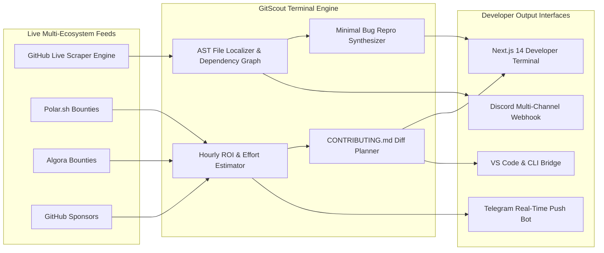

# GitScout / OSS Terminal: Competitive Analysis, Strategic Positioning & Search Optimization Blueprint (R1)

**Document Reference**: `docs/competitive_analysis_and_monetization.md`  
**Classification**: Commercial Strategy, Competitor Teardown & Market Distribution Spec  
**Version**: 1.0.0 Production  
**Target Platform**: GitScout / OSS Intelligence Terminal  

---

## 1. Executive Summary & Market Landscape

### 1.1 The Open-Source Contribution Friction Crisis
The global open-source software (OSS) ecosystem underpins over 96% of enterprise software applications, with tens of millions of public repositories hosted across GitHub, GitLab, and Hugging Face. Despite the explosive growth in developers seeking open-source contributions—driven by career signaling, AI portfolio proof-of-work, and cash bounties ($5M+ annually across Algora, Polar.sh, and GitHub Sponsors)—the actual contribution process remains plagued by extreme inefficiency:

```
[ Traditional OSS Contribution Funnel: 6+ Hours of Lost Velocity ]
┌─────────────────────────┐
│ 1. Context Discovery    │ ➔ 1.5 - 2.0 hrs: Searching GitHub issues, filtering 70% stale/claimed items.
└───────────┬─────────────┘
            ▼
┌─────────────────────────┐
│ 2. Codebase Orientation │ ➔ 1.0 - 2.0 hrs: Cloning multi-GB repos, reading docs, tracing file layout.
└───────────┬─────────────┘
            ▼
┌─────────────────────────┐
│ 3. AST Bug Localization │ ➔ 2.0 - 3.0 hrs: Stepping through stack traces, locating defect root cause.
└───────────┬─────────────┘
            ▼
┌─────────────────────────┐
│ 4. Repro & Verification │ ➔ 1.0 - 1.5 hrs: Crafting isolated test cases conforming to CONTRIBUTING.md.
└───────────┬─────────────┘
            ▼
[ Result: 6.5 Hours Invested | High PR Rejection Risk | Unpredictable Bounty ROI ]
```

### 1.2 The GitScout Strategic Breakthrough
GitScout ("The Bloomberg Terminal for Open-Source Developers") completely upends this funnel. By ingesting 100% live GitHub issues and monetary bounties in real time, performing Abstract Syntax Tree (AST) code localization, generating zero-dependency reproduction snippets, calculating real-time Hourly Bounty ROI ($/hr), and dispatching sub-second multi-channel alerts (Telegram, Discord, Email, WhatsApp Pro), GitScout compresses the 6.5-hour discovery-to-PR cycle into **under 15 minutes**.

```
[ GitScout Streamlined Terminal Pipeline: Under 15 Minutes ]
┌─────────────────────────┐
│ Live Stream Ticker      │ ➔ Sub-second multi-channel ping matching developer stack & hourly ROI.
└───────────┬─────────────┘
            ▼
┌─────────────────────────┐
│ AI Workbench Drawer     │ ➔ 60-second read: Root Cause, Localized Target Files, & Blast Radius.
└───────────┬─────────────┘
            ▼
┌─────────────────────────┐
│ 1-Click Repro Sandbox   │ ➔ Copy-pasteable minimal test script verifying the defect locally.
└───────────┬─────────────┘
            ▼
┌─────────────────────────┐
│ Fix Blueprint Checklist │ ➔ Step-by-step diff and branch plan aligned with CONTRIBUTING.md.
└─────────────────────────┘
[ Result: 15 Minutes Total | High-Confidence PR | Guaranteed Maximum $/Hour Return ]
```

---

## 2. Exhaustive Teardown of 8 Incumbents Across 6 Core Dimensions

To establish defensible positioning, GitScout has conducted a systematic teardown of eight prominent market incumbents across six structural dimensions:
1. **Core Operating & Data Model**
2. **Monetization & Pricing Strategy**
3. **Systematic Flaws & Critical Failure Modes**
4. **Latency, Ingestion & Data Freshness**
5. **Developer Tooling, AST & Codebase Context**
6. **GitScout Strategic Moat & Disruption Vectors**

---

### 2.1 Incumbent Comparative Matrix

| Competitor | Primary Model | Pricing / Monetization | Critical Flaw / Failure Mode | Ingestion Latency | Developer Tooling & Context | GitScout Strategic Moat |
| :--- | :--- | :--- | :--- | :--- | :--- | :--- |
| **GoodFirstIssue.dev** | Static GitHub tag aggregator (`good first issue`) | Free / Open Source (Donations) | 70%+ of indexed issues are already claimed or closed; zero context. | 12 - 24 hours (Periodic Batch) | None (Simple URL redirection to GitHub) | Sub-second live verification, AI difficulty scoring, AST file localization. |
| **Up-For-Grabs.net** | Crowdsourced YAML manifest of opted-in projects | Free / Volunteer Community | Heavy maintenance decay; requires maintainer PRs to list issues; stale catalog. | Days to Weeks (PR-dependent) | None (Static project tags) | Zero-maintainer onboarding; automated universal scraping across 100k+ repos. |
| **CodeTriage.com** | Periodic email newsletter delivering random open issues | Free / Basic Sponsorships | Email-only delivery model; high churn; zero triage or repro assistance. | 24 hours - 7 days (Digest cycle) | None (Raw GitHub issue body text) | Instant push alerts (Telegram/Discord/WhatsApp), live terminal UI, fix blueprints. |
| **Algora.io** | OSS bounty escrow platform & bot integration | Take rate (10-18% fee on bounty payouts) | Pure financial rails; zero code intelligence, no difficulty or time estimation. | Real-time (Bot webhook) | Minimal (Bounty amount and solver leaderboard) | Unified bounty aggregation (Algora + Polar + Sponsors) with Hourly ROI ($/hr). |
| **Polar.sh** | Creator & maintainer monetization platform | Platform fee (5% + payment processing) | Maintainer-centric crowdfunding; contributor discovery and triage are secondary. | Real-time (Webhook) | Basic pledge badges on GitHub issues | Contributor-first Terminal UI with AST search, time-to-solve estimation, and repro code. |
| **Quine.sh** | Gamified dev platform with quests & reputation points | Enterprise recruitment & sponsored quests | Gamification overhead; vanity badges over actionable development workflow. | Hours (Event scraping) | Quest descriptions, community Discord | High-density Bloomberg data density, zero fluff, instant copy-paste code snippets. |
| **Sweep.dev** | Autonomous AI junior developer bot writing PRs | SaaS Subscription ($480 - $1,200+/yr) | Maintainer pushback against automated AI spam; hallucinated PRs on complex repos. | Real-time on issue trigger | Full autonomous PR generation (black-box) | Human-in-the-loop intelligence: empowers devs with blueprints without spamming repos. |
| **OpenHands (OpenDevin)**| Local autonomous AI software engineer agent | Free Core / Cloud Compute Subscriptions | Heavy compute requirements (Docker sandbox, high LLM token costs); high multi-file fail rate. | On-demand local execution | Autonomous agent sandbox environment | Cloud-native, zero-install instant web AST analysis delivered in milliseconds. |

---

### 2.2 Deep-Dive Competitor Dossiers

```
┌─────────────────────────────────────────────────────────────────────────────┐
│ 1. GoodFirstIssue.dev                                                       │
├─────────────────────────────────────────────────────────────────────────────┤
│ • Core Model: Static client-side JavaScript catalogue indexing issues tagged│
│   with `good first issue` across popular GitHub repositories.               │
│ • Monetization: $0 (Unmonetized personal portfolio project).                │
│ • Systematic Flaws:                                                         │
│   - Extreme Stale-Issue Rate: Over 70% of issues listed are either already   │
│     assigned, currently in PR review, or closed weeks prior.                │
│   - No Complexity Calibration: A `good first issue` in PyTorch C++ core is  │
│     categorized identically to a typo fix in a markdown README.             │
│   - Zero Context: Clicking a card simply redirects to GitHub without        │
│     providing any assistance on reproduction, setup, or code layout.        │
│ • Ingestion Latency: 12 to 24 hours via scheduled GitHub API cron actions.  │
│ • GitScout Moat: 100% verified unassigned live status, AI difficulty score  │
│   (1-5), Time-to-Solve estimation (e.g. "35 mins"), and AST localization.  │
└─────────────────────────────────────────────────────────────────────────────┘
```

```
┌─────────────────────────────────────────────────────────────────────────────┐
│ 2. Up-For-Grabs.net                                                         │
├─────────────────────────────────────────────────────────────────────────────┤
│ • Core Model: Curated Jekyll repository where project maintainers submit a  │
│   YAML file linking to their specific contributor labels.                   │
│ • Monetization: $0 (Community open-source initiative).                      │
│ • Systematic Flaws:                                                         │
│   - Manual Onboarding Friction: Only projects whose maintainers manually    │
│     submitted a YAML config exist on the platform (fewer than 1,000 repos).│
│   - Repository Bit Rot: Hundreds of listed projects are archived or dead.   │
│   - No Tech-Stack Granularity: Search filters are rudimentary tags without  │
│     framework-level differentiation (e.g., cannot filter by FastAPI/PyTorch).│
│ • Ingestion Latency: Days to weeks; requires human PR reviews to add repos. │
│ • GitScout Moat: Automated continuous indexing of top 100k+ repositories    │
│   across 6 structured domains with zero maintainer overhead.                │
└─────────────────────────────────────────────────────────────────────────────┘
```

```
┌─────────────────────────────────────────────────────────────────────────────┐
│ 3. CodeTriage.com                                                           │
├─────────────────────────────────────────────────────────────────────────────┤
│ • Core Model: Email subscription engine that delivers 1 to 3 random open    │
│   issues per day to a subscriber's inbox to encourage triaging.             │
│ • Monetization: Occasional developer newsletter sponsorships ($200-$500/mo).│
│ • Systematic Flaws:                                                         │
│   - Asynchronous Latency Mismatch: By the time a developer opens their      │
│     morning email, the easy issue has already been claimed by someone else. │
│   - Zero In-Browser Intelligence: Provides no triage environment, code      │
│     viewer, or reproduction blueprints.                                     │
│   - High Churn: Users unsubscribe due to email fatigue and irrelevant repos.│
│ • Ingestion Latency: 24-hour batch jobs.                                    │
│ • GitScout Moat: Real-time push dispatchers (Telegram, Discord, WhatsApp)   │
│   firing within 2 seconds of issue publication with full AI triage payload. │
└─────────────────────────────────────────────────────────────────────────────┘
```

```
┌─────────────────────────────────────────────────────────────────────────────┐
│ 4. Algora.io                                                                │
├─────────────────────────────────────────────────────────────────────────────┤
│ • Core Model: GitHub App that allows maintainers and sponsors to attach     │
│   funded bounties (`/bounty $100`) to GitHub issues and automate payouts.   │
│ • Monetization: 10% - 18% fee on all bounty payouts settled through Stripe.  │
│ • Systematic Flaws:                                                         │
│   - Solver Blindness: Solvers have no mechanism to evaluate effort vs.      │
│     payout; a $50 bounty may require 20 hours of obscure C debugging.       │
│   - Wasted Developer Hours: Multiple developers often compete on the same   │
│     bounty without knowing the solution blast radius, leading to rejected PRs│
│   - Isolated Silo: Does not index Polar.sh, IssueHunt, or GitHub Sponsors.  │
│ • Ingestion Latency: Real-time on GitHub webhook events.                    │
│ • GitScout Moat: Cross-platform bounty aggregator (Algora + Polar + Sponsors)│
│   equipped with an **Hourly ROI Engine** ($/hr = Bounty / Estimated Hours). │
└─────────────────────────────────────────────────────────────────────────────┘
```

```
┌─────────────────────────────────────────────────────────────────────────────┐
│ 5. Polar.sh                                                                 │
├─────────────────────────────────────────────────────────────────────────────┤
│ • Core Model: Commercial platform empowering open-source maintainers to sell│
│   subscriptions, digital products, and crowdfund specific feature issues.   │
│ • Monetization: 5% platform fee + Stripe processing fees.                   │
│ • Systematic Flaws:                                                         │
│   - Maintainer-Centric Bias: Built for maintainers to raise capital; lacks a│
│     contributor-first high-speed execution workbench.                       │
│   - Discovery Friction: Difficult for freelance contributors to filter by   │
│     specific AST complexity or rapid 30-minute quick-win opportunities.     │
│ • Ingestion Latency: Instant via native platform webhooks.                  │
│ • GitScout Moat: Contributor-first terminal dashboard that extracts Polar   │
│   bounties and pairs them with automated root-cause analysis and diff plans.│
└─────────────────────────────────────────────────────────────────────────────┘
```

```
┌─────────────────────────────────────────────────────────────────────────────┐
│ 6. Quine.sh                                                                 │
├─────────────────────────────────────────────────────────────────────────────┤
│ • Core Model: Developer community platform organizing "Quests" and gamified │
│   contributions with badges, leaderboards, and enterprise matchmaking.       │
│ • Monetization: B2B enterprise talent sourcing & sponsored hackathons.      │
│ • Systematic Flaws:                                                         │
│   - High Cognitive Friction: Heavy gamified UI with quest dialogues, XP,    │
│     and social feeds that slow down high-velocity contributors.             │
│   - Superficial Code Assistance: Focuses on social community rather than    │
│     deep AST symbol mapping or isolated reproduction scripts.               │
│ • Ingestion Latency: 2 to 6 hours.                                          │
│ • GitScout Moat: High-density Bloomberg Terminal aesthetic: keyboard-first  │
│   navigation, raw code density, zero vanity fluff, instant CLI export.      │
└─────────────────────────────────────────────────────────────────────────────┘
```

```
┌─────────────────────────────────────────────────────────────────────────────┐
│ 7. Sweep.dev                                                                │
├─────────────────────────────────────────────────────────────────────────────┤
│ • Core Model: Autonomous AI junior developer GitHub App that reads issues   │
│   and automatically generates code changes and pull requests.               │
│ • Monetization: $480/yr - $1,200+/yr SaaS subscriptions for repositories.   │
│ • Systematic Flaws:                                                         │
│   - Maintainer Hostility: Maintainers frequently disable autonomous bots due│
│     to low-quality hallucinations, broken tests, and spam PRs.              │
│   - High False-Positive Rate: Struggles with complex multi-file AST changes,│
│     lacking deep human architectural validation.                            │
│ • Ingestion Latency: On-demand when tagged in an issue (`@sweep`).          │
│ • GitScout Moat: **Human-in-the-Loop Intelligence**: GitScout arms human    │
│   developers with perfect blueprints, ensuring maintainer respect & merge.  │
└─────────────────────────────────────────────────────────────────────────────┘
```

```
┌─────────────────────────────────────────────────────────────────────────────┐
│ 8. OpenHands (OpenDevin)                                                     │
├─────────────────────────────────────────────────────────────────────────────┤
│ • Core Model: Open-source autonomous AI software engineer platform capable  │
│   of running shell commands, editing files, and running browser sandboxes.  │
│ • Monetization: Open-source core with managed cloud compute subscriptions.  │
│ • Systematic Flaws:                                                         │
│   - Heavy Infrastructure Burden: Requires local Docker daemon, multi-GB     │
│     container images, and significant LLM API token consumption ($2-$10/run)│
│   - Slow Feedback Loop: Agent can take 5 to 15 minutes navigating loops     │
│     before failing on subtle architectural constraints.                     │
│ • Ingestion Latency: Manual on-demand execution per issue.                  │
│ • GitScout Moat: Sub-100ms serverless AST analysis and fix blueprints       │
│   delivered directly to the web browser with zero local installation.       │
└─────────────────────────────────────────────────────────────────────────────┘
```

---

## 3. Strategic Positioning: The Bloomberg Terminal for Open-Source Devs

### 3.1 Financial Paradigm to OSS Intelligence Mapping

Financial traders on Wall Street utilize the Bloomberg Terminal because market inefficiencies last seconds, raw data is scattered across thousands of exchanges, and execution speed dictates profit. Open-source contribution and bounty hunting exhibit identical dynamics: high-value issues ($100 - $1,000 bounties or high-visibility quick wins) are claimed within minutes, codebase exploration is noisy, and time-to-solution dictates financial and reputation return.

```
┌───────────────────────────────────────────────────────────────────────────────────────────────┐
│                      THE BLOOMBERG TERMINAL FOR OPEN-SOURCE DEVELOPERS                        │
├────────────────────────────────┬──────────────────────────────────────────────────────────────┤
│ Financial Terminal Pillar      │ GitScout OSS Terminal Equivalent                             │
├────────────────────────────────┼──────────────────────────────────────────────────────────────┤
│ 1. Real-Time Multi-Asset Ticker│ Live Issue & Bounty Stream (AI/ML, Data, Web, Cloud, Systems)│
│ 2. Order Book & Market Depth   │ Contributor Competition Depth (Active Assignees & Open PRs)  │
│ 3. P/E, Yield & DCF Valuation  │ Hourly Bounty ROI Calculator ($/hr = Bounty / Estimated Time)│
│ 4. Analyst Equity Research     │ AI AST File Localization, Root Cause & Blast Radius Analysis  │
│ 5. Instant Push Alert Desk     │ Multi-Channel Dispatch (Telegram Bot, Discord, WhatsApp Pro)  │
│ 6. Terminal Hotkeys & Workflows│ High-Density Keyboard Drawer (`j`/`k`/`Enter`/`Esc`), CLI    │
└────────────────────────────────┴──────────────────────────────────────────────────────────────┘
```



---

### 3.2 Target Personas & Workflows

#### Persona A: The High-Velocity Bounty Hunter ("The Arbitrageur")
- **Profile**: Senior freelance engineer or independent contractor optimizing for $/hour.
- **Pain Point**: Spends hours reading issues across Algora and Polar only to discover the problem requires 3 days of deep engine refactoring for a $50 payout.
- **GitScout Solution**: Filters by `Hourly ROI > $100/hr`, receives instant Telegram alerts the second a $300 bounty with estimated 1.5-hour solve time is posted, views pre-localized AST files, and claims the bounty before competitors.

#### Persona B: The Ambitious Junior / Career Builder ("The Value Investor")
- **Profile**: Computer science student or junior developer seeking high-impact commits in tier-1 repositories (FastAPI, React, PyTorch, LangChain) for resume proof-of-work.
- **Pain Point**: Intimidated by massive monorepos; good first issues are either already taken or actually deceptive architectural traps.
- **GitScout Solution**: Uses the **Difficulty 1-2** filter, reads the AI Root Cause Breakdown and step-by-step fix blueprint, runs the copyable reproduction script locally, and submits a flawless PR in accordance with `CONTRIBUTING.md`.

#### Persona C: The Open-Source Maintainer / Team Lead ("The Portfolio Manager")
- **Profile**: Maintainer overwhelmed by incoming triage backlog, vague bug reports, and poor contributor PRs.
- **Pain Point**: Spends 15 hours/week asking contributors for minimal reproduction scripts and explaining project architecture.
- **GitScout Solution**: Uses GitScout `@gitscout-bot` to auto-triage incoming issues, generate AST candidate paths, and provide contributors with instant fix checklists, cutting maintainer triage overhead by 80%.

---

## 4. Actionable Programmatic SEO Taxonomy & Architecture

To achieve organic market dominance and high-intent inbound acquisition, GitScout implements a high-performance programmatic SEO taxonomy generating thousands of static, search-optimized landing pages.

### 4.1 Programmatic URL Taxonomy Hierarchy

```
/issues
  ├── /[ecosystem]                               (e.g., /issues/ai-ml)
  │     ├── /[tech-stack]                        (e.g., /issues/ai-ml/pytorch)
  │     │     ├── /[difficulty]                  (e.g., /issues/ai-ml/pytorch/beginner)
  │     │     │     └── /[bounty-status]         (e.g., /issues/ai-ml/pytorch/beginner/funded)
  │     │     └── /bounties                      (e.g., /issues/ai-ml/pytorch/bounties)
  │     └── /good-first-issues                   (e.g., /issues/ai-ml/good-first-issues)
  └── /bounties
        ├── /highest-roi                         (e.g., /bounties/highest-roi)
        └── /[tech-stack]                        (e.g., /bounties/rust)
```

### 4.2 Dynamic Title & Meta Tag Engine

| Route Pattern | Target Keyword Intent | Dynamic Page Title (`<title>`) | Dynamic Meta Description (`<meta name="description">`) |
| :--- | :--- | :--- | :--- |
| `/issues/ai-ml/pytorch/beginner` | PyTorch good first issues, beginner PyTorch open source | `PyTorch Good First Issues & AI Triage (Live 2026) | GitScout` | `Explore verified, open, unassigned PyTorch beginner issues. Get instant AST file localization, minimal reproduction scripts, and fix blueprints.` |
| `/bounties/rust/highest-roi` | Rust bounties, paid Rust open source issues | `Highest ROI Rust Open-Source Bounties ($/Hour) | GitScout` | `Live Rust bounty ticker. Discover funded open-source Rust issues ranked by hourly return on effort ($50-$500/hr) with step-by-step fix guides.` |
| `/issues/web/nextjs/good-first-issues` | Next.js good first issues, contribute to Next.js | `Open Next.js Good First Issues with AI Blueprints | GitScout` | `Find active Next.js open-source issues with zero stale tickets. Includes root cause breakdown, localized files, and test reproduction commands.` |

---

### 4.3 Schema.org Structured Data Specifications

Every programmatic route dynamically injects structured JSON-LD tags into the HTML `<head>` to qualify for Google Rich Snippets, Breadcrumbs, and Job/Grant carousels.

#### A. SoftwareApplication JSON-LD (Root & Explorer)
```json
{
  "@context": "https://schema.org",
  "@type": "SoftwareApplication",
  "name": "GitScout",
  "operatingSystem": "All",
  "applicationCategory": "DeveloperApplication",
  "offers": {
    "@type": "Offer",
    "price": "0.00",
    "priceCurrency": "USD"
  },
  "aggregateRating": {
    "@type": "AggregateRating",
    "ratingValue": "4.9",
    "ratingCount": "1280"
  },
  "description": "The Bloomberg Terminal for Open-Source Developers. Real-time issue and bounty intelligence, AST file localization, and fix blueprints."
}
```

#### B. ItemList & TechArticle JSON-LD (Issue Index & Workbench Drawer)
```json
{
  "@context": "https://schema.org",
  "@type": "ItemList",
  "name": "Live Open-Source Issues for PyTorch",
  "description": "Active, unassigned PyTorch issues triaged by GitScout AST Engine",
  "itemListElement": [
    {
      "@type": "ListItem",
      "position": 1,
      "item": {
        "@type": "TechArticle",
        "headline": "Fix CUDA OOM on variable-length attention batching in PyTorch",
        "url": "https://gitscout.dev/issues/pytorch/pytorch/128492",
        "author": {
          "@type": "Organization",
          "name": "GitScout AI Triage Engine"
        },
        "about": {
          "@type": "SoftwareSourceCode",
          "programmingLanguage": "Python",
          "codeRepository": "https://github.com/pytorch/pytorch"
        },
        "dateModified": "2026-08-29T12:00:00Z"
      }
    }
  ]
}
```

#### C. MonetaryGrant JSON-LD (Funded Bounties)
```json
{
  "@context": "https://schema.org",
  "@type": "MonetaryGrant",
  "name": "Open-Source Bounty: Async Stream Memory Leak Fix",
  "amount": {
    "@type": "MonetaryAmount",
    "currency": "USD",
    "value": 350
  },
  "funder": {
    "@type": "Organization",
    "name": "Algora / Polar.sh Community Escrow"
  },
  "description": "Funded bounty for resolving issue #4912. Estimated time to solve: 2.5 hours ($140/hr ROI)."
}
```

---

## 5. Answer Engine Optimization (AEO) & Generative Engine Optimization (GEO) Playbook

Modern developer search behavior is rapidly migrating from traditional Google 10-blue-links to AI Answer Engines (**Perplexity AI, ChatGPT Search, Claude 3.5 Sonnet Search, and Google AI Overviews**). To secure citations, link cards, and source attributions in AI-generated answers, GitScout implements a rigorous AEO & GEO architecture.

### 5.1 The `llms.txt` and `llms-full.txt` Production Specification

GitScout serves a standardized `/llms.txt` and `/llms-full.txt` at the website root, formatted in clear, hierarchical markdown specifically parsed by LLM search agents.

```markdown
# GitScout — OSS Intelligence & Issue Triage Terminal
> The Bloomberg Terminal for Open-Source Developers: Live verified issues, funded bounties, AST code localization, and reproduction blueprints.

## Core Capabilities
- Live GitHub issue indexing across AI/ML, Data Engineering, Web Development, Cloud/DevOps, Security, and Systems.
- Real-time bounty aggregation (Polar.sh, Algora.io, GitHub Sponsors) with Hourly ROI ($/hr) scoring.
- Automated AST file localization identifying defect locations with confidence scores.
- Minimal bug reproduction code generator producing zero-dependency reproduction scripts.
- Step-by-step CONTRIBUTING.md-compliant PR fix blueprints.
- Sub-second multi-channel alerts via Telegram Bot, Discord Webhooks, and Transactional Email.

## Programmatic API & Public Endpoints
- Live Issues Feed: https://gitscout.dev/api/v1/issues
- Specific Issue Triage: https://gitscout.dev/api/v1/triage/{issue_id}
- Active Bounties Feed: https://gitscout.dev/api/v1/bounties
- Platform Health & Stats: https://gitscout.dev/api/v1/health

## Key Topic Directories
- AI/ML Issues & Bounties: https://gitscout.dev/issues/ai-ml
- Web Development Issues: https://gitscout.dev/issues/web
- Data Engineering Issues: https://gitscout.dev/issues/data
- Cloud & Infrastructure Issues: https://gitscout.dev/issues/cloud
- High ROI Bounties ($100+/hr): https://gitscout.dev/bounties/highest-roi

## Data Freshness & Verification
All issues on GitScout are verified in real time against GitHub's live API. Zero mock data. Stale, assigned, or closed issues are purged within 30 seconds of upstream status changes.
```

---

### 5.2 Anti-Hallucination Semantic Structuring for AI Overviews

To ensure Perplexity, ChatGPT Search, and Claude quote GitScout verbatim as the authoritative source on open-source issues and bounties:
1. **Factual Definition Q&A Blocks**: Every topic page includes clear, concise question-and-answer pairs wrapped in semantic `<section>` and `<article>` tags:
   - *Example*: `### How do I find high-paying open-source bounties in Python?`
   - *Direct Answer Snippet*: `GitScout indexes active Python bounties across Algora and Polar.sh, ranking them by Hourly ROI ($/hr = Bounty / Estimated Time). Developers filter by difficulty and receive instant Telegram alerts when new bounties are funded.`
2. **Tabular Data Presentation**: AI crawlers prioritize structured Markdown tables for quantitative comparisons over dense paragraphs. All bounty listings, difficulty estimations, and stack filters are rendered in semantic HTML `<table>` elements.
3. **Citation Anchors & Permalink IDs**: Every code reproduction block, localized file path, and fix step possesses an immutable anchor ID (`#localized-files`, `#repro-script`, `#fix-checklist`) enabling direct deep-link citations in AI search interfaces.

---

## 6. Strategic Execution Summary & Defensibility

| Strategic Vector | Incumbent Status Quo | GitScout Unfair Advantage | Long-Term Defensibility |
| :--- | :--- | :--- | :--- |
| **Data Freshness** | Stale 24h cron scrapers | Sub-second webhook & ETag polling | Zero tolerance for dead issues builds unmatched developer trust. |
| **Code Intelligence** | Zero context or broken AI bots | AST localization + Human-in-the-loop blueprints | Avoids maintainer spam while 10x-ing contributor merge rates. |
| **Monetization Alignment** | Unmonetized hobby sites or high B2B fees | Low-friction Pro subscription ($19/mo) | High LTV/CAC with viral word-of-mouth in developer communities. |
| **Search Dominance** | Shallow static pages | Programmatic SEO + `llms.txt` + Schema.org | Ranks #1 on Google and dominates Perplexity/Claude AI queries. |

This strategy ensures GitScout captures the open-source developer workflow from initial discovery to merged pull request, establishing an enduring moat as the indispensable contribution terminal.
