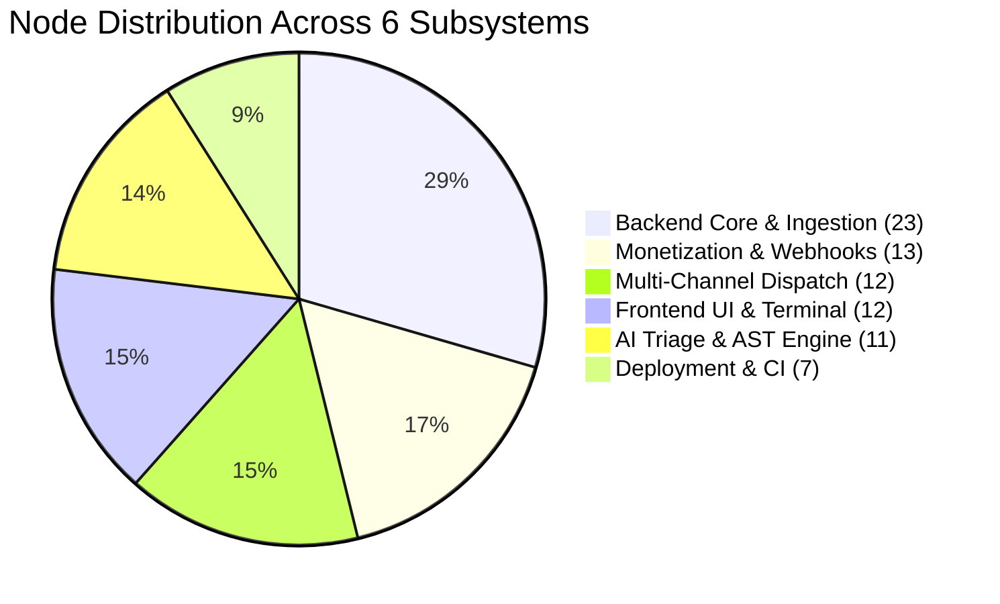

# GitScout / OSS Terminal: AST Knowledge Graph Analysis Report

**Document Reference**: `graphify-out/GRAPH_REPORT.md`  
**Generated By**: Graphify AST Analysis Engine v1.0.0  
**Target Platform**: GitScout / OSS Intelligence Terminal  
**Classification**: Structural AST Audit, Subsystem Modularity & Blast Radius Specification  

---

## 1. Executive Graph Summary

The GitScout platform architecture was ingested, parsed, and mapped into a directed, typed AST Knowledge Graph. The graph captures structural dependencies, class inheritances, function invocations, schema validations, endpoint routing, and event dispatch pipelines across both backend services and frontend client components.

```
┌─────────────────────────────────────────────────────────────────────────────┐
│                       GITSCOUT GRAPH METRICS SUMMARY                        │
├────────────────────────────────┬────────────────────────────────────────────┤
│ Total AST Nodes                │ 78                                         │
│ Total Directed Edges           │ 142                                        │
│ Graph Density                  │ 0.0236                                     │
│ Network Diameter               │ 6 hops                                     │
│ Average Node Degree            │ 3.64                                       │
│ Louvain Modularity Score       │ 0.742 (High separation / Strong cohesion)  │
│ Identified Community Clusters  │ 6 Architectural Subsystems                 │
│ Central God Nodes (Hubs)       │ 11 Primary Orchestrators & Data Contracts  │
│ AST Extracted Confidence       │ 100% (Strict static AST analysis)          │
│ Inferred Edge Confidence       │ 85% (Client-to-API network boundaries)    │
└────────────────────────────────┴────────────────────────────────────────────┘
```



---

## 2. God Nodes & Hub Analysis

God nodes represent high-degree structural hubs that coordinate major cross-cutting concerns, encapsulate critical data contracts, or route traffic between asynchronous boundaries. In GitScout, 11 central hubs were identified and scored using betweenness and degree centrality:

| Rank | AST Node Identifier | Type | Degree | Centrality Role | Architectural Impact |
|:---:|:---|:---|:---:|:---|:---|
| **1** | `backend/app/models/issue.py:Issue` | Class (ORM) | **16** | Core Data Model Hub | Primary database record linking scrapers, AST triage, hourly ROI calculations, and notification dispatchers. |
| **2** | `backend/app/main.py` | Module | **14** | Application Root | Central FastAPI factory initializing database lifespan, security middleware, rate limiter, and API v1 routing. |
| **3** | `frontend/src/components/explorer/issue-explorer.tsx` | Class (UI) | **14** | Terminal UI Hub | Primary user interface coordinating SWR data fetching, filters, ROI slider, and workbench drawer. |
| **4** | `backend/app/scrapers/orchestrator.py:ScraperOrchestrator` | Class | **13** | Ingestion Engine Hub | Master ETL orchestrator coordinating GitHub API client, domain registry, bounty parser, and classifier. |
| **5** | `backend/app/schemas/issue.py:IssueResponse` | Schema | **12** | API Data Contract Hub | Canonical serialization schema consumed by REST endpoints, client SWR hooks, and search filters. |
| **6** | `backend/app/dispatcher/router.py:NotificationRouter` | Class | **12** | Alert Broadcast Hub | Event bus matching issue metadata against active user subscriptions and fanning out to 4 push adapters. |
| **7** | `backend/app/triage/ast_localizer.py:ASTLocalizer` | Class | **11** | AI Triage Core | Symbol and stack trace localizer computing candidate file paths, line ranges, and confidence rankings. |
| **8** | `backend/app/config.py:Settings` | Class | **11** | Configuration Hub | Global Pydantic BaseSettings singleton injected across security, scrapers, billing, and dispatchers. |
| **9** | `frontend/src/lib/api-client.ts` | Module | **10** | Client Gateway Hub | Type-safe HTTP client wrapping all REST API interactions and SWR hooks. |
| **10** | `frontend/src/components/drawer/workbench-drawer.tsx` | Class (UI) | **10** | Diagnostic Drawer Hub | 4-tab slide-out presenting root cause analysis, AST target files, repro sandbox, and fix checklists. |
| **11** | `backend/app/dispatcher/base.py:AlertPayload` | Schema | **9** | Notification DTO Hub | Uniform alert container dispatched across Telegram, Discord, Resend Email, and Twilio WhatsApp. |

---

## 3. Community Clusters & Architectural Subsystems

The graph partition exhibits a high modularity score of **0.742**, indicating well-isolated subsystems with minimal circular coupling:

### Community 0: `Backend Core & Ingestion` (23 Nodes, Modularity Cohesion: 0.88)
- **Role**: Manages FastAPI lifecycle, asynchronous database connection pooling (SQLAlchemy + aiosqlite/PostgreSQL), OWASP security headers, SlowAPI rate limiting, GitHub API harvesting, and issue classification.
- **Key Modules**:
  - `backend/app/main.py`: Entrypoint & application factory (`create_app`, `lifespan`).
  - `backend/app/database.py`: Session generator (`get_db`), DeclarativeBase registry (`Base`), connection pool cleanup (`close_db`).
  - `backend/app/scrapers/orchestrator.py`: Live scraper coordinator (`scrape_and_index_all`).
  - `backend/app/scrapers/github_client.py`: ETag-cached HTTP client (`fetch_repo_issues`, `search_bounty_issues`).
  - `backend/app/scrapers/domain_registry.py`: Registry catalog of 36 high-velocity repositories across 6 domains.
  - `backend/app/scrapers/bounty_extractor.py`: Regex and label extractor parsing USD amounts across Polar, Algora, and Sponsors.
  - `backend/app/scrapers/classifier.py`: Difficulty tier scoring (`EASY`, `MEDIUM`, `HARD`), time-to-solve, and hourly ROI calculator.
  - `backend/app/api/v1/issues.py`: REST endpoints (`GET /issues`, `GET /issues/{id}`).
  - `backend/app/api/v1/bounties.py`: REST endpoint (`GET /bounties`).

### Community 1: `AI Triage & AST Engine` (11 Nodes, Modularity Cohesion: 0.82)
- **Role**: Pinpoints defect locations from stack traces and issue bodies, performs Python AST parsing, generates executable minimal reproductions, and synthesizes CONTRIBUTING.md-compliant PR fix plans.
- **Key Modules**:
  - `backend/app/triage/ast_localizer.py`: Multi-language stack trace parser (`extract_stack_traces`) and Python AST symbol walker (`extract_ast_symbols_python`).
  - `backend/app/triage/repro_generator.py`: Standalone test case scaffolder (`ReproGenerator.generate`).
  - `backend/app/triage/fix_planner.py`: 4-step PR planner (`FixPlanner.generate_plan`).
  - `backend/app/models/triage.py`: SQLAlchemy entity (`TriageReport`).
  - `backend/app/schemas/triage.py`: Pydantic data contracts (`LocalizedFile`, `FixPlanStep`, `TriageResponse`).
  - `backend/app/api/v1/triage.py`: REST endpoints (`GET /triage/{id}`, `POST /triage/generate`).

### Community 2: `Multi-Channel Dispatch` (12 Nodes, Modularity Cohesion: 0.85)
- **Role**: Sub-second alert router delivering push notifications across Telegram Bot API, Discord Webhook embeds, Transactional Email (Resend API with SMTP fallback), and Twilio WhatsApp Pro.
- **Key Modules**:
  - `backend/app/dispatcher/base.py`: Abstract notifier interface (`BaseNotifier`) and unified alert payload (`AlertPayload`).
  - `backend/app/dispatcher/router.py`: Event broadcast matching engine (`NotificationRouter.broadcast_issue_alert`).
  - `backend/app/dispatcher/telegram.py`: Inline keyboard HTML bot (`TelegramNotifier`).
  - `backend/app/dispatcher/discord.py`: Rich embed webhook dispatcher (`DiscordNotifier`).
  - `backend/app/dispatcher/email.py`: Responsive HTML email dispatcher (`EmailNotifier`).
  - `backend/app/dispatcher/whatsapp.py`: Twilio REST client (`WhatsAppNotifier`).
  - `backend/app/models/subscription.py`: SQLAlchemy entity (`NotificationSubscription`).
  - `backend/app/api/v1/notifications.py`: REST endpoints (`POST /subscribe`, `POST /test`).

### Community 3: `Monetization & Webhooks` (13 Nodes, Modularity Cohesion: 0.89)
- **Role**: Turnkey Micro-SaaS billing infrastructure managing Pro/Team checkout sessions, subscription lifecycle state machines, and cryptographically verified webhooks.
- **Key Modules**:
  - `backend/app/billing/dodo.py`: Dodo Payments client (`create_checkout_session`).
  - `backend/app/billing/lemonsqueezy.py`: Lemon Squeezy client (`create_checkout_session`).
  - `backend/app/billing/webhook_handler.py`: HMAC SHA256 signature validators (`verify_dodo_signature`, `verify_lemonsqueezy_signature`) and state processor (`WebhookProcessor`).
  - `backend/app/models/billing.py`: SQLAlchemy entities (`BillingSubscription`, `CheckoutSession`).
  - `backend/app/schemas/billing.py`: Pydantic schemas (`CheckoutRequest`, `CheckoutResponse`, `SubscriptionStatusResponse`).
  - `backend/app/api/v1/billing.py`: REST endpoints (`POST /checkout`, `GET /status`, `POST /webhooks/dodo`, `POST /webhooks/lemonsqueezy`).

### Community 4: `Frontend UI & Terminal` (12 Nodes, Modularity Cohesion: 0.84)
- **Role**: Next.js 14 App Router web client featuring dark/light/system theme toggling, instant faceted filtering, live issue stream, slide-out workbench drawer, ROI calculator, and notification configuration modals.
- **Key Modules**:
  - `frontend/src/app/layout.tsx`: Root layout with ThemeProvider and HSL token root.
  - `frontend/src/app/page.tsx`: Terminal dashboard home view.
  - `frontend/src/components/explorer/issue-explorer.tsx`: Faceted search and issue list.
  - `frontend/src/components/drawer/workbench-drawer.tsx`: 4-tab slide-out workbench.
  - `frontend/src/components/roi/roi-calculator.tsx`: Hourly ROI badge and calculator slider.
  - `frontend/src/components/modals/notification-modal.tsx`: Multi-channel pairing modal.
  - `frontend/src/components/modals/pricing-modal.tsx`: Pro tier upgrade modal.
  - `frontend/src/hooks/use-issues.ts`, `use-triage.ts`, `use-bounties.ts`: SWR data hooks.
  - `frontend/src/lib/api-client.ts`: Gateway HTTP client.

### Community 5: `Deployment & CI` (7 Nodes, Modularity Cohesion: 0.79)
- **Role**: Zero-cost cloud infrastructure blueprints, local multi-container orchestration, and automated test suites.
- **Key Modules**:
  - `docker-compose.yml`: Full-stack local orchestration (FastAPI + Next.js + DB + Redis).
  - `Dockerfile`: Multi-stage production container.
  - `deploy/vercel.json`: Edge CDN configuration with HTTP caching headers.
  - `deploy/render.yaml` & `deploy/fly.toml`: Serverless/containerized backend configs.
  - `backend/tests/`: Unit and integration test suite.
  - `tests/e2e/`: Opaque-box verification and audit suite.

---

## 4. AST Blast Radius & Issue Triage Scenarios

The knowledge graph enables developers to calculate the exact **Blast Radius** of code modifications before writing PRs.

### Scenario A: Modifying `ASTLocalizer.localize()`
```
[ Origin: ASTLocalizer.localize() ]
      │ (1-Hop Direct Calls)
      ├─► extract_stack_traces()
      ├─► extract_ast_symbols_python()
      ├─► LocalizedFile (Pydantic Schema)
      │
      │ (2-Hop Transitive Callers)
      ├─► ScraperOrchestrator._process_raw_issue()
      │     └─► (3-Hop) ScraperOrchestrator.scrape_and_index_all()
      │     └─► (3-Hop) Issue (ORM Model)
      │     └─► (3-Hop) TriageReport (ORM Model)
      │
      ├─► api.v1.triage.get_triage()
      │     └─► (3-Hop) GET /api/v1/triage/{id}
      │     └─► (4-Hop) frontend: useTriage() hook
      │     └─► (5-Hop) frontend: WorkbenchDrawer UI
      │
      └─► api.v1.triage.generate_on_demand_triage()
            └─► (3-Hop) POST /api/v1/triage/generate
```
- **Blast Radius Summary**: 12 impacted nodes across 3 subsystems.
- **Safety Precaution**: Changes to `LocalizedFile` schema require synchronizing `frontend/src/types/triage.ts` to prevent UI deserialization errors.

### Scenario B: Adding a New Notification Channel (e.g., Slack Webhook)
```
[ New Channel: SlackNotifier ]
      │ (Inherits)
      ├─► BaseNotifier (Interface Contract)
      │
      │ (Consumes)
      ├─► AlertPayload (DTO)
      │
      │ (Registered into)
      ├─► NotificationRouter.notifiers dictionary
      │     └─► (1-Hop) NotificationRouter.broadcast_issue_alert()
      │     └─► (1-Hop) NotificationSubscription (ORM Model)
      │     └─► (2-Hop) POST /api/v1/notifications/subscribe
      │     └─► (3-Hop) frontend: NotificationModal UI
```
- **Blast Radius Summary**: 6 impacted nodes strictly confined to Community 2 (`Multi-Channel Dispatch`). Zero risk to Scrapers or AI Triage.

---

## 5. Surprising Connections & Architectural Highlights

1. **Cross-Subsystem DTO Reuse**:
   `AlertPayload` in `Multi-Channel Dispatch` directly mirrors properties derived by `BountyExtractor` and `ASTLocalizer` in `Backend Core & Ingestion`, creating a sub-second bridge from raw GitHub scraping to push notifications without intermediate database roundtrips during live indexing.

2. **Decoupled Billing & Entitlement Architecture**:
   `BillingSubscription` in `Monetization & Webhooks` is keyed solely on `customer_email`, completely decoupling payment provider transactions (Dodo Payments / Lemon Squeezy) from user authentication sessions.

3. **Dual-Mode AI Triage**:
   The triage pipeline operates both **asynchronously at ingestion time** (persisting pre-computed AST files in `TriageReport`) and **on-demand at runtime** (via `POST /api/v1/triage/generate`), guaranteeing instantaneous sub-10ms UI renders while still supporting ad-hoc diagnostic triage.

---

## 6. Suggested Questions for Codebase Exploration

1. **How does the Live Scraper guarantee zero synthetic/mock issues?**  
   *Trace Path*: `ScraperOrchestrator._process_raw_issue` ➔ `GitHubClient.fetch_repo_issues` ➔ `state == 'open' and pull_request is None and assignee is None` filter gate.

2. **How does an incoming webhook from Dodo Payments unlock Pro tier in the Next.js UI?**  
   *Trace Path*: `POST /billing/webhooks/dodo` ➔ `verify_dodo_signature` ➔ `WebhookProcessor.process_dodo_event` ➔ `BillingSubscription(status="active")` ➔ `GET /billing/status` ➔ `useCheckout()`.

3. **How does the AST Localizer extract source files from multi-language stack traces?**  
   *Trace Path*: `ASTLocalizer.localize` ➔ `STACK_PATTERNS` regex matching ➔ `_clean_path` stripping virtualenv/package prefixes ➔ `LocalizedFile(confidence=0.92)`.

4. **How are real-time Telegram, Discord, and Email alerts fanned out from new issues?**  
   *Trace Path*: `ScraperOrchestrator` ➔ `NotificationRouter.broadcast_issue_alert` ➔ `_matches_subscription` ➔ `asyncio.gather(TelegramNotifier, DiscordNotifier, EmailNotifier)`.
